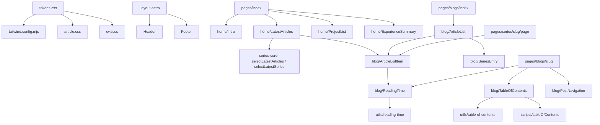

# 部落格全站介面重新設計 — Architecture Design

**Status:** Confirmed（使用者授權：設計決策一律採業界慣例，不另行確認）
**Source PRD:** `.sdd/2026-10-04-blog-ui-redesign/PRD.md`
**Tech context:** Astro 6（靜態輸出）· TypeScript strict · Tailwind 3 ＋ typography · Bun test · 純邏輯與框架分離（`series-core.ts` 模式）

---

## 1. Design Goal & Guiding Principle

- **In one sentence:** 以一套「編輯風」設計 token 取代手繪設計系統，重做所有頁面的呈現層；新增「閱讀時間」與「文章目錄」兩個純邏輯模組，並移除便利貼、作品集篩選、進站載入畫面——資料流、路由、SEO meta、草稿過濾與相鄰文章規則完全不動。
- **Guiding principle:** **視覺決策只住在一個地方（`src/styles/tokens.css`），業務規則只住在純函式模組（`src/utils/*`）**。元件只負責排版：要換配色或字體只改 token；要改閱讀速度或目錄層數只改一個常數，兩者都不需要碰任何元件。

---

## 2. Change Scope

| Area | Action | What / Why |
| :--- | :--- | :--- |
| `src/styles/tokens.css` | **Add** | 編輯風設計 token（色彩、字體、版寬、間距）＋深淺色兩組；全站唯一的視覺真相來源 |
| `src/styles/article.css` | **Add**（取代 `blog.css`） | 文章頁雙欄版面（文章頁與對談筆記頁共用）＋正文排版（標題、段落、程式碼、表格、引言、Mermaid 容器），全用 token |
| `src/styles/index.css` | **Modify** | 基礎樣式：body 背景／字色／字體、連結、焦點外框、減少動態效果 |
| `src/styles/handdrawn/**`、`blog.css`、`animations.css`、`theme.css` | **Remove** | 手繪設計系統與捲動揭示動畫；新風格不保留 |
| `tailwind.config.mjs` | **Modify** | 色彩／字體改對應新 token（`bg`、`surface`、`ink`、`muted`、`line`、`accent`）；typography 外掛改用 token |
| `src/utils/reading-time.ts` | **Add** | 閱讀時間估算（純函式，可單元測試） |
| `src/utils/table-of-contents.ts` | **Add** | 從文章標題清單建出兩層目錄（純函式，可單元測試） |
| `src/utils/series-core.ts` | **Modify** | 新增 `selectLatestArticles`（首頁最新文章） |
| `src/layouts/Layout.astro` | **Modify** | 換字型、移除載入畫面、主題初始化改為可容錯（瀏覽器不允許儲存時不壞）；SEO meta **原封不動** |
| `src/components/layouts/Header.astro`、`Footer.astro`、`NotFound.astro` | **Modify** | 重寫外觀 |
| `src/components/common/ThemeToggle.astro`、`src/scripts/theme.ts` | **Modify** | 新外觀；儲存失敗時本次仍生效 |
| `src/components/home/*` | **Add**（取代 `sections/Hero`、`Resume`、`portfolio/*`、`Project`） | 首頁四個區塊：`Intro`、`LatestArticles`、`ProjectList`、`ExperienceSummary` |
| `src/components/blog/*` | **Add**（取代 `sections/blog/*`） | `ArticleListItem`、`SeriesEntry`、`ArticleList`（含搜尋）、`PostNavigation`、`TableOfContents`、`ReadingTime` |
| `src/scripts/tableOfContents.ts` | **Add** | 目錄的目前位置標示（捲動偵測） |
| `src/pages/index.astro`、`blogs/index.astro`、`blogs/[...slug].astro`、`series.astro`、`series/[slug]/[...page].astro`、`404.astro` | **Modify** | 改用新元件；文章頁加入目錄與閱讀時間 |
| `src/pages/cv/[lang].astro`、`src/styles/cv.scss`、`src/styles/cv/*`、`src/components/cv/*` | **Modify** | 改用共用 token 與字體；畫面支援深淺色；列印強制淺色 |
| `src/pages/ai-redefines-software.astro` | **Modify** | 移除外部 Tailwind CDN 與自帶色票，改用 `Layout` 與 token |
| `src/components/common/StickyNotes.astro`、`src/scripts/stickyNotes.ts`、`PortfolioFilter.astro`、`LoadingScreen.astro`、`src/scripts/animations.ts`、`e2e/steps/sticky-notes.steps.ts`、`e2e/.features-gen/.gsi/article-sticky-notes/**` | **Remove** | PRD 決定移除的功能及其測試 |
| `src/scripts/mermaid.ts` | **Modify** | 圖表配色改讀 token 對應的色值 |
| `src/components/common/GiscusComments.astro` | **Modify** | 主題對應改為 `light`／`dark`，配合新配色 |
| `tests/build-output.test.ts` | **Modify** | 「載入遮罩 noscript 退路」改為「沒有載入遮罩」；新增目錄、閱讀時間、首頁、便利貼移除等產物檢查 |
| `src/utils/series.ts` 的資料取用、`content.config.ts`、`rss.xml.ts`、`slugify.ts`、`i18n.ts`、`remark-mermaid.mjs`、`astro.config.mjs` | **Not touched** | 草稿過濾、網址、RSS、slug、語系退回、建置管線都是既有契約，改版只動呈現層 |
| `src/config/*.json` | **Not touched** | PRD 明訂只改呈現、不改資料 |

---

## 3. New Classes / Modules

| Name | Kind | Responsibility (purpose) | Collaborators | Satisfies (PRD scenario) |
| :--- | :--- | :--- | :--- | :--- |
| `estimateReadingMinutes(markdown)` in `src/utils/reading-time.ts` | Pure function ＋ `READING_SPEED` 常數 | 把一篇文章的原始內文換算成「N 分鐘」：中文字 ÷ 400 ＋ 英文字 ÷ 200，無條件進位、最少 1；程式碼計入，連結網址與 HTML 標籤不計 | — | US-02 全部 |
| `buildTableOfContents(headings)` in `src/utils/table-of-contents.ts` | Pure function ＋ `TableOfContentsEntry` 型別 | 由文章標題清單（深度、錨點、文字）建出「章 → 節」兩層樹；章少於 2 個回傳空陣列；更深層與無所屬章的節捨棄 | Astro `render()` 的 `headings` | US-03：兩層、只有 1 章、2 章、深層不列 |
| `selectLatestArticles(blogs, limit)` in `series-core.ts` | Pure function | 依發布日期新到舊取前 N 篇（單篇與系列皆算） | 已發布文章 | US-05：最新 5 篇、草稿補足 |
| `tokens.css` | Design tokens | 定義兩組主題的語意色、字體堆疊、正文版寬 | Tailwind config、`article.css`、`cv.scss`、`mermaid.ts` | US-01 |
| `ReadingTime.astro` | Component | 接收文章內文，渲染「N 分鐘」；呼叫端不需知道算法 | `estimateReadingMinutes` | US-02（文章頁、列表、首頁、系列頁） |
| `TableOfContents.astro` | Component | 接收標題清單；無目錄時不輸出任何東西；寬螢幕為側欄、窄螢幕為 `
` 預設收合（沒有 JS 也可展開） | `buildTableOfContents`、`tableOfContents.ts` | US-03 |
| `src/scripts/tableOfContents.ts` | Browser script | 捲動時（`requestAnimationFrame` 節流）標出目前所在的章（`aria-current`）；捲到頁底時改標畫面上最後一章 | 目錄 DOM | US-03：捲動時標出目前位置 |
| `ThemeInit.astro` | Component | 首次繪製前決定深淺色（可容錯）；`Layout` 與履歷頁共用 | — | US-04 |
| `SiteFonts.astro` | Component | 非阻塞載入全站字型＋noscript 備援；`Layout` 與履歷頁共用 | — | US-01 |
| `ArticleListItem.astro` | Component | 單篇文章列：系列名（若有）、標題、摘要（若有）、日期、閱讀時間、封面（若有） | `ReadingTime` | US-02、US-05、US-07 |
| `SeriesEntry.astro` | Component（取代 `ParentItem`） | 系列入口：系列名、篇數、連結；屬性名改用「系列」語彙 | — | US-05、US-07 |
| `ArticleList.astro` | Component（取代 `BlogList`） | 文章列表＋搜尋；搜尋邏輯原樣搬移 | `ArticleListItem`、`SeriesEntry`、`SearchBar` | US-07：搜尋 |
| `Intro.astro`、`LatestArticles.astro`、`ProjectList.astro`、`ExperienceSummary.astro` | Components | 首頁四區塊；`ExperienceSummary` 取資料中前 3 段（資料以新到舊維護）並附完整履歷入口；`ProjectList` 全部列出、無篩選 | `introduce.json`、`selectLatestArticles`、`selectLatestSeries` | US-05 |

> 每個新的純函式都只有一個參數（或資料＋上限），呼叫端一次呼叫就拿到完整結果，沒有需要依序呼叫的步驟。

---

## 4. Modified Components

| Component | Current role | Change needed |
| :--- | :--- | :--- |
| `Layout.astro` | 頁面外框、SEO meta、字型、主題初始化、載入畫面 | 換字型為 Noto Sans TC ＋ Noto Serif TC（Google Fonts，維持 `media="print"` 非阻塞＋noscript 備援）；移除 `LoadingScreen`；主題初始化包 `try/catch`；SEO meta 不動 |
| `ThemeToggle.astro` ＋ `theme.ts` | 切換並寫入 localStorage | 寫入改 `try/catch`；外觀改為簡潔圖示鈕 |
| `blogs/[...slug].astro` | 文章頁 | 新版面：頁首（系列名→標題→摘要→日期·閱讀時間）、正文＋目錄雙欄、留言、上下篇；移除便利貼 |
| `series/[slug]/[...page].astro` | 系列頁分頁 | 改用 `ArticleListItem`（含閱讀時間）；分頁與 `rel=prev/next` 保留 |
| `cv/[lang].astro` ＋ `cv.scss` | 獨立履歷頁（僅淺色） | 加入主題初始化與切換鈕（不列印）；顏色改讀 token；`@media print` 強制淺色 token |
| `ai-redefines-software.astro` | 自帶 Tailwind CDN 的深色獨立頁 | 包進 `Layout`，自帶色票改為 token 類別；內容不動 |
| `mermaid.ts` | 手繪色票寫死在檔內 | 渲染當下讀取 `tokens.css` 解析後的色值與字體，不再自帶色票 |
| `tests/build-output.test.ts` | 產物驗收 | 見 §2 |

---

## 5. Component Relationships

---

## 6. Extensibility & Handoff Notes

- **Most likely next requirement:** (a) 換一組配色或字體；(b) 文章列表加上新的中繼資訊（如標籤、更新日期）；(c) 調整閱讀速度或目錄層數。
- **Where it lands:**
  - (a) 只改 `tokens.css`（Mermaid 圖表在渲染時讀取 token 的解析值，不需另改）。
  - (b) 只改 `ArticleListItem.astro`——首頁、文章列表、系列頁都用它。
  - (c) 只改 `READING_SPEED` 或 `table-of-contents.ts` 內的深度常數。
- **How to add it:** 新增 token 或常數、在單一元件加欄位；不需要在頁面間複製貼上。
- **Patterns applied & why:** 設計 token（視覺變更的單一來源）；純函式核心＋薄元件（沿用 `series-core.ts`，讓業務規則可被 `bun test` 直接測）；漸進增強（目錄用 `
`、主題用 inline script，沒有 JS 也能讀）。
- **Do not hardcode:** 色值不得寫在元件或 `article.css` 內，一律用 token；閱讀速度與目錄層數不得寫在元件內。
- **Known debt / deferred:**
  - `introduce.json` 與 `cv.json` 的資料重複未處理（PRD 範圍外）。
  - `ExperienceSummary` 依賴資料以新到舊排列；若日後資料順序不可靠，改為依 `years` 排序。

---

## 7. Traceability

| PRD Scenario | Fulfilled by |
| :--- | :--- |
| US-01 全站套用同一套編輯風格 | `tokens.css` ＋ `tailwind.config.mjs` ＋ 所有改寫元件；移除 `handdrawn/` |
| US-01 正文舒適閱讀寬度 | `article.css` 的正文最大寬度 token（`--measure`） |
| US-02 一般中文文章／無條件進位／最少 1 分鐘／中英混合 | `estimateReadingMinutes` ＋ `ReadingTime.astro` |
| US-03 寬螢幕兩層目錄 | `buildTableOfContents` ＋ `TableOfContents.astro`（側欄） |
| US-03 捲動時標出目前位置 | `scripts/tableOfContents.ts`（含頁底退路） |
| US-03 點目錄跳到該章 | 目錄連結指向標題錨點（Astro 自動產生的 heading id） |
| US-03 手機預設收合 | `TableOfContents.astro` 的 `
`（窄螢幕） |
| US-03 只有 1 章不顯示／2 章顯示／深層不列 | `buildTableOfContents` 規則 |
| US-04 依裝置設定（深／淺） | `Layout.astro` inline 主題初始化 |
| US-04 手動切換後記住 | `ThemeToggle.astro` 寫入偏好 ＋ 初始化讀取偏好 |
| US-04 瀏覽器不允許記住 | 初始化與切換的 `try/catch`：切換照常生效、讀取失敗則依裝置設定 |
| US-05 自我介紹＋系列入口＋最新 5 篇 | `Intro`、`LatestArticles`（`selectLatestSeries`、`selectLatestArticles`） |
| US-05 草稿不出現並補足 | `getPublishedBlogs` → `selectLatestArticles` |
| US-05 沒有系列時不顯示入口 | `LatestArticles`（`selectLatestSeries` 回傳 null） |
| US-05 作品集直接列出 | `ProjectList`（無篩選） |
| US-05 經歷精簡為 3 段＋完整履歷入口 | `ExperienceSummary` |
| US-06 便利貼不再出現 | 移除 `StickyNotes` 與腳本 |
| US-06 沒有載入畫面 | `Layout.astro` 移除 `LoadingScreen` |
| US-07 已上線網址有效 | 路由檔案不改名；`getStaticPaths` 不動；產物測試 |
| US-07 系列／單篇上一篇方向 | 既有 `findAdjacent`（不動）＋ `PostNavigation` |
| US-07 搜尋命中系列名／無結果 | `ArticleList.astro`（搜尋邏輯原樣） |
| US-07 草稿全站隱藏 | 既有 `getPublishedBlogs`（不動） |
| US-08 乾淨 PDF＋檔名 | `cv/[lang].astro` `.no-print` ＋ `<title>` 不變 |
| US-08 深色下 PDF 仍淺色 | `cv.scss` `@media print` 強制淺色 token |
| US-08 缺中文說明顯示英文 | 既有 `getLocalizedText`（不動） |

---

## 8. Risks & Open Decisions

- **Risks / trade-offs:**
  - 中文字型檔大：採 Google Fonts（自動 unicode-range 切片）＋ 非阻塞載入＋系統字型備援；首屏先以系統字型顯示。
  - 全面改寫可能改壞 SEO meta 與 DOM id：`Layout.astro` 的 meta 區塊不動，並以產物測試把關。
  - 移除捲動揭示動畫會讓首頁較「靜」：符合專注閱讀定位，接受。
- **Visual decisions（取代提問的業界慣例）：**
  - 字體：正文 Noto Sans TC（搭配系統 sans）；文章標題與頁面大標 Noto Serif TC；程式碼 系統等寬字型。
  - 配色：淺色——底 `#faf9f7`、表面 `#ffffff`、文字 `#1c1b19`、次要 `#6b6862`、線 `#e6e3dd`、強調 `#b7410e`；深色——底 `#141413`、表面 `#1c1c1a`、文字 `#ecebe7`、次要 `#a29f98`、線 `#2c2b28`、強調 `#f08a4b`。（文字與底對比皆 ≥ 4.5:1）
  - 正文版寬 `68ch`；頁面容器最大寬 `72rem`；文章頁寬螢幕（≥ 1024px）為「正文＋右側目錄 14rem」。
  - 動態效果：只保留 150ms 的顏色過渡，並尊重減少動態效果設定。
- **Open decisions (for implementation):** 無。
- **實作期間的調整（已同步本文件）：**
  - 目錄目前位置改用捲動事件＋`requestAnimationFrame`，而非 IntersectionObserver：「最後一個捲過閱讀線的章」用位置比較最直接，且需要頁底退路。
  - 主題初始化與字型載入抽成 `ThemeInit`、`SiteFonts` 兩個元件，因為履歷頁不走 `Layout` 也需要它們。
  - 深色 token 包在 `@media screen` 內，列印（含履歷 PDF）一律淺色——取代在 `cv.scss` 另寫一份淺色覆寫。
