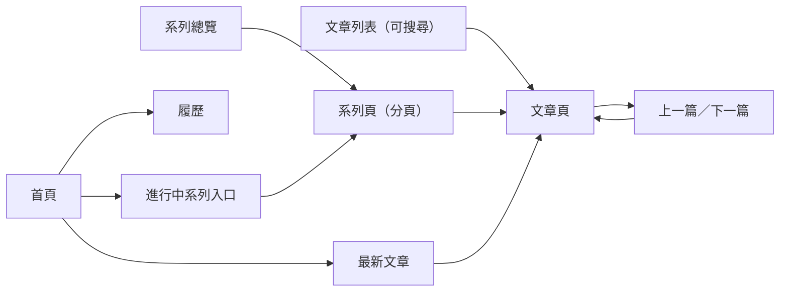

# Product Requirements Document (PRD) — 部落格全站介面重新設計

**Status:** Finalized
**Version:** v1.0
**Owner:** James Hsueh
**Stakeholders:** Engineering（個人專案）

---

## 1. Background & Goal (Why & Goal)

- **Problem Statement:** 目前整站採「手繪筆記本」風格（歪斜邊框、手寫字型、便利貼與麥克筆配色），風格搶眼但干擾長文閱讀；技術長文缺少目錄，讀者難以掌握結構與閱讀成本；部分功能（便利貼、作品集分類篩選、進站載入畫面）使用率低卻增加介面複雜度。
- **Expected Outcome:**
  - 全站（首頁、文章列表、文章頁、系列總覽、系列頁、履歷、找不到頁面、對談筆記頁）改為同一套「專注閱讀」的編輯風格。
  - 每篇文章都顯示預估閱讀時間；章節足夠的文章提供目錄。
  - 已上線網址零壞連結；草稿規則、上一篇／下一篇規則、搜尋行為與改版前一致。
  - 發布流程不變：推上主線即自動建置部署，且所有既有檢查全過。
- **Out of Scope:**
  - 文章內容、網址結構、草稿規則、發布流程。
  - 新增後端、帳號，或留言以外的互動功能。
  - 讀者既有便利貼的移轉或匯出（改版後直接消失）。
  - 履歷與作品集的資料內容本身（只改呈現）。

---

## 2. User Personas

- **Primary Role(s):**
  - **讀者**：繁體中文軟體工程師，閱讀單篇文章與系列文章。
  - **招募方**：瀏覽首頁自我介紹、作品集與履歷（中英兩版），可能存成 PDF。
  - **作者（維護者）**：發布文章、維護系列，不受改版影響。
- **Usage Context:** 桌機寬螢幕長時間閱讀技術長文；手機零碎時間閱讀；招募方多在桌機瀏覽並列印履歷。讀者可能使用深色或淺色裝置設定。

---

## 3. User Stories & Acceptance Criteria

### US-01 — 專注閱讀的整站風格 [priority: P0]
**As a** 讀者, **I want** 一個乾淨、字體講究、留白充足的閱讀介面, **so that** 我能專心讀完技術長文。

```gherkin
Scenario: 全站套用同一套編輯風格
  Given 首頁、文章列表、文章頁、系列總覽、系列頁、履歷、找不到頁面、對談筆記頁
  When 讀者依序瀏覽這些頁面
  Then 每一頁都使用同一套字體、配色與版面寬度
  And 任何頁面都不再出現手繪筆記本風格（歪斜邊框、手寫字型、便利貼黃與麥克筆紅）

Scenario: 文章正文維持舒適的閱讀寬度
  Given 讀者在寬螢幕打開一篇文章
  When 讀者閱讀正文
  Then 正文每行長度維持在適合閱讀的範圍，不會隨螢幕無限拉寬
```

### US-02 — 預估閱讀時間 [priority: P0]
**As a** 讀者, **I want** 在進入文章前後都看到預估閱讀時間, **so that** 我能決定現在讀還是之後再讀。

```gherkin
Scenario: 一般中文文章
  Given 一篇 3,200 字的中文文章
  When 讀者看該文章的文章頁或出現在列表中的項目
  Then 顯示「8 分鐘」

Scenario: 超過整分鐘時無條件進位
  Given 一篇 3,201 字的中文文章
  When 讀者看該文章的文章頁或列表項目
  Then 顯示「9 分鐘」

Scenario: 極短文章最少 1 分鐘
  Given 一篇 120 字的中文文章
  When 讀者看該文章的文章頁或列表項目
  Then 顯示「1 分鐘」

Scenario: 中英混合文章分開計算後加總
  Given 一篇含 2,000 個中文字與 400 個英文字的文章
  When 讀者看該文章的文章頁或列表項目
  Then 顯示「7 分鐘」
```

### US-03 — 文章目錄 [priority: P0]
**As a** 讀者, **I want** 文章有目錄並標出目前讀到哪, **so that** 我能掌握長文結構並跳到想看的段落。

```gherkin
Scenario: 寬螢幕在正文旁顯示兩層目錄
  Given 一篇有 5 個章、其中一章底下有 3 個節的文章
  When 讀者在寬螢幕打開該文章
  Then 正文旁固定一欄目錄，依序列出 5 個章
  And 3 個節縮排列在所屬的章下方

Scenario: 捲動時標出目前位置
  Given 同一篇文章已在寬螢幕打開
  When 讀者往下捲動到第 3 章
  Then 目錄中「第 3 章」被標示為目前位置

Scenario: 點目錄跳到該章
  Given 同一篇文章已打開
  When 讀者點目錄中的第 4 章
  Then 頁面跳到第 4 章的開頭

Scenario: 手機上目錄預設收合
  Given 同一篇文章
  And 讀者使用手機
  When 讀者打開該文章
  Then 目錄出現在文章開頭且預設收合
  And 讀者點開後列出所有章與節

Scenario: 只有 1 個章時不顯示目錄
  Given 一篇只有 1 個章的文章
  When 讀者打開該文章
  Then 頁面上沒有目錄

Scenario: 有 2 個章時顯示目錄
  Given 一篇有 2 個章的文章
  When 讀者打開該文章
  Then 頁面上顯示目錄，列出這 2 個章

Scenario: 比節更深的小標不列入目錄
  Given 一篇文章的某章底下有節，節底下還有更深一層的小標
  When 讀者打開該文章
  Then 目錄只列出章與節，不列出更深一層的小標
```

### US-04 — 深淺色主題 [priority: P0]
**As a** 讀者, **I want** 網站預設配合我的裝置主題且可手動切換, **so that** 我在任何光線下都讀得舒服。

```gherkin
Scenario: 裝置為深色時預設深色
  Given 讀者第一次來，且裝置設定為深色
  When 讀者打開任何頁面
  Then 頁面以深色顯示

Scenario: 裝置為淺色時預設淺色
  Given 讀者第一次來，且裝置設定為淺色
  When 讀者打開任何頁面
  Then 頁面以淺色顯示

Scenario: 手動切換後記住選擇
  Given 讀者裝置設定為深色
  And 讀者手動切換為淺色
  When 讀者之後再回到網站
  Then 頁面以淺色顯示

Scenario: 瀏覽器不允許記住設定
  Given 讀者的瀏覽器不允許網站記住任何設定
  When 讀者手動切換主題
  Then 本次瀏覽的頁面立即改用新主題
  And 讀者下次回來時依裝置設定顯示
```

### US-05 — 首頁：自我介紹與最新文章並重 [priority: P0]
**As a** 招募方或讀者, **I want** 首頁同時看到作者是誰與最近寫了什麼, **so that** 我能快速認識作者並找到值得讀的文章。

```gherkin
Scenario: 首頁呈現自我介紹、進行中的系列與最新文章
  Given 有一個進行中的系列，已發布文章共 12 篇
  When 讀者打開首頁
  Then 上半部顯示簡短自我介紹與前往履歷的入口
  And 下半部顯示進行中系列的入口，以及最新的 5 篇已發布文章

Scenario: 草稿不出現在首頁並往下補足
  Given 最新的一篇文章是草稿
  When 讀者打開首頁
  Then 該草稿不出現
  And 仍列出 5 篇已發布文章

Scenario: 沒有任何系列時不顯示系列入口
  Given 目前沒有任何系列文章
  When 讀者打開首頁
  Then 首頁沒有系列入口
  And 只列出最新的已發布文章

Scenario: 作品集直接列出、不再篩選
  Given 作品集有 9 個作品
  When 讀者看首頁的作品區
  Then 9 個作品全部直接列出
  And 作品區沒有分類篩選

Scenario: 經歷精簡呈現
  Given 履歷中有 5 段工作經歷
  When 讀者看首頁的經歷區
  Then 只列出最近的 3 段經歷
  And 提供前往完整履歷的入口
```

### US-06 — 精簡低使用率功能 [priority: P1]
**As a** 讀者, **I want** 介面上沒有多餘的功能, **so that** 頁面更清爽、載入更直接。

```gherkin
Scenario: 便利貼不再出現
  Given 讀者之前在某篇文章貼過 3 張便利貼
  When 改版後讀者回到該文章
  Then 頁面上沒有任何便利貼
  And 沒有新增便利貼的入口

Scenario: 進站不再出現載入畫面
  Given 讀者第一次打開網站
  When 頁面開始顯示
  Then 內容直接出現，沒有遮住畫面的載入畫面
```

### US-07 — 既有行為維持不變 [priority: P0]
**As a** 讀者, **I want** 改版後原本的連結與導覽方式都照常運作, **so that** 我的書籤與習慣不會失效。

```gherkin
Scenario: 已上線網址繼續有效
  Given 任一已上線的文章、系列或系列分頁網址
  When 讀者從舊連結或書籤進入
  Then 打開的是同一篇內容，不會出現找不到頁面

Scenario: 系列文章的上一篇是較早的一天
  Given 讀者在某系列的第 2 天
  When 讀者點「上一篇」
  Then 進到該系列的第 1 天

Scenario: 單篇文章的上一篇是較新的一篇
  Given 讀者在一篇單篇文章
  When 讀者點「上一篇」
  Then 進到發布日期比它新的那篇單篇文章

Scenario: 搜尋命中系列名稱
  Given 進行中系列的名稱含「Agent」
  When 讀者在文章列表搜尋「agent」
  Then 該系列入口與其文章都出現在結果中

Scenario: 搜尋沒有結果
  Given 沒有任何文章符合「xyz」
  When 讀者在文章列表搜尋「xyz」
  Then 顯示「沒有找到符合的文章」

Scenario: 草稿全站隱藏
  Given 一篇文章被標記為草稿
  When 讀者瀏覽任何列表、系列、上一篇／下一篇或訂閱來源
  Then 都看不到這篇文章
```

### US-08 — 履歷 [priority: P0]
**As a** 招募方, **I want** 履歷在新風格下仍能存成乾淨的 PDF, **so that** 我能轉給團隊或存檔。

```gherkin
Scenario: 存成乾淨的 PDF
  Given 讀者在中文版履歷
  When 讀者點「存成 PDF」
  Then 得到的履歷不含頁首、按鈕或主題切換
  And 建議檔名為「姓名 - 職稱 - CV」

Scenario: 深色主題下存成 PDF 仍為淺色
  Given 讀者正以深色主題瀏覽履歷
  When 讀者存成 PDF
  Then PDF 以淺色、適合列印的版面呈現

Scenario: 缺中文說明時顯示英文
  Given 某段經歷只有英文說明
  When 讀者看中文版履歷
  Then 該段經歷顯示英文說明，而不是空白
```

---

## 4. Business Flow & Logic

- **Flow Diagram:**



- **Core Business Rules:**
  - **閱讀時間**：中文字數 ÷ 400 ＋ 英文字數 ÷ 200，兩者相加後無條件進位，最少 1 分鐘；程式碼內容一併計入。文章頁、文章列表、首頁最新文章、系列頁的每一篇都顯示。
  - **目錄**：只列章與節兩層；章少於 2 個時不顯示目錄。寬螢幕為正文旁固定一欄、標示目前位置；手機在文章開頭、預設收合。
  - **主題**：讀者手動選擇優先；無手動選擇時依裝置設定；無法記住時僅本次有效。
  - **首頁最新文章**：已發布文章依發布日期新到舊取 5 篇（單篇與系列文章皆算）；進行中的系列沿用既有定義（最近更新的系列）。
  - **首頁經歷**：只列最近 3 段，其餘看完整履歷。
  - **相鄰文章、搜尋、草稿、網址**：完全沿用既有規則。
- **Edge Cases:**
  - 沒有任何系列：首頁與文章列表不顯示系列入口。
  - 文章沒有摘要：列表只顯示標題、日期與閱讀時間，不留空白區塊。
  - 文章沒有封面圖：版面不留空白圖位。
  - 讀者停用程式執行：文章、目錄（以展開清單呈現）、列表、履歷仍可完整閱讀；只失去搜尋、主題切換、目前位置標示等互動。

---

## 5. UI/UX Design & Interaction

- **Prototype Link:** 無設計稿；視覺參考來自 Mobbin：
  - 文章頁：[Substack](https://mobbin.com/screens/748e369a-1f0e-444f-a010-dd66dafd23bb)、[Matter](https://mobbin.com/screens/7cef07e7-04df-41f9-a5f9-21c378b078d1)
  - 正文旁目錄：[Codecademy](https://mobbin.com/screens/4685acfd-ce18-451f-8621-3b9958dda6ae)、[Obvious](https://mobbin.com/screens/48ebdb36-0d47-4585-8e92-fee7b45133f8)
  - 文章列表：[Substack](https://mobbin.com/screens/de1b3c40-9046-4a6a-9bfb-bc7c8476e7e3)、[Hashnode](https://mobbin.com/screens/5bb91bec-6f5a-40ab-a791-353c0c742fe3)
- **Key Interactions:**
  - 文章頁頂端：系列名稱（若有）→ 標題 → 摘要 → 發布日期與閱讀時間；正文下方依序為留言、上一篇／下一篇。
  - 目錄目前位置隨捲動更新；點目錄項目平順捲到該處。
  - 主題切換鈕位於頁首，切換即時生效、不閃爍。
  - 文章列表與首頁最新文章採單欄條列：標題、摘要、日期、閱讀時間。
  - 空狀態沿用既有文案：「沒有找到符合的文章」「目前沒有任何系列文章。」「此系列尚無文章。」
  - 不再有進站載入畫面；動畫克制，尊重讀者「減少動態效果」的系統設定。
- **視覺方向：** 單一中性底色、單一強調色、易讀的中英文字體搭配、清楚的層級與充足行距；具體色票與字體由架構階段決定。

---

## 6. Non-Functional Requirements

- **Performance:** 不設數字門檻；守住既有做法——字型不阻塞首屏、數學式於建置期呈現、圖片走外部儲存、沒有程式執行也能閱讀、手機寬度可用。
- **Security:** 不收集讀者資料；主題偏好只存在讀者自己的瀏覽器。
- **Compatibility:** 近兩年主流瀏覽器（桌機與手機）；寬度 360px 起可用、不出現橫向捲動。
- **Accessibility:** 文字與背景對比足夠（深淺色皆然）；鍵盤可操作所有互動；目錄、搜尋、主題切換具備可讀出的名稱。
- **Analytics / Tracking:** N/A。

---

## 7. Dependencies & Risks

- **External Dependencies:** 留言服務（需隨主題切換深淺色）、外部圖片儲存、網頁字型服務。
- **Known Risks:**
  - 全站重做範圍大，可能改壞既有的分享資訊、網址或草稿隱藏；需以既有的建置產物檢查全數通過為驗收門檻。
  - 讀者既有便利貼會消失（已接受）。
  - 中文字型檔案大，需確保不阻塞首屏。

---

## 8. Appendix

- 需求來源：同資料夾 `BRIEF.md`。
- 專案層級約束：`.sdd/PROJECT.md`。
- 領域詞彙：`.sdd/UL-MAP.md`。
- 決策紀錄（代替提問，採業界慣例）：
  - 進站載入畫面：移除（靜態部落格不需要，且延後內容出現）。
  - 首頁經歷：列最近 3 段，其餘導向完整履歷。
  - 系列頁每篇也顯示閱讀時間，與列表一致。
  - 具體配色、字體、間距：交由架構階段決定。
