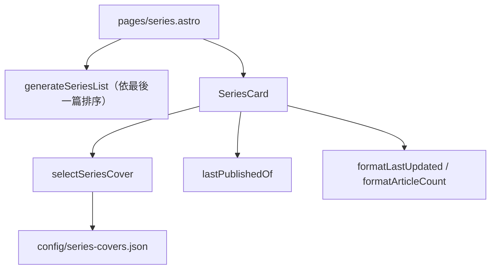

# 系列總覽封面卡片格 — Architecture Design

**Status:** Confirmed（使用者授權：設計決策採業界慣例）
**Source PRD:** `.sdd/2026-10-04-series-overview-cards/PRD.md`
**Tech context:** Astro 6 靜態輸出 · 延續 `series-core.ts` 純邏輯、`tokens.css`、`ui-language.ts` 介面語言

---

## 1. Design Goal & Guiding Principle

- **In one sentence:** 系列總覽改用一張張封面卡片；封面的決定規則（設定檔 → 最新有封面的文章 → 佔位）與最後更新日期都是 `series-core.ts` 裡的純函式，卡片元件只負責呈現。
- **Guiding principle:** **作者要改的東西只在設定檔裡，規則只在一個函式裡。** 換封面只改 `src/config/series-covers.json`；要改「退回哪一篇的封面」只改 `selectSeriesCover`。

---

## 2. Change Scope

| Area | Action | What / Why |
| :--- | :--- | :--- |
| `src/config/series-covers.json` | **Add** | 系列名稱 → 封面網址（未指定為 `null`），列出網站上所有系列 |
| `src/utils/series-core.ts` | **Modify** | 新增 `selectSeriesCover(series, configuredCovers)`、`lastPublishedOf(series)`；`ArticleLike` 加上選填的 `image`；`groupIntoSeries` 改用 `lastPublishedOf` 排序（行為不變） |
| `src/utils/ui-language.ts` | **Modify** | 新增 `formatLastUpdated`（「更新於 2026年10月14日」／「Updated Oct 14, 2026」） |
| `src/components/blog/SeriesCard.astro` | **Add** | 封面卡片：封面或佔位、系列名稱、篇數與最後更新日期 |
| `src/pages/series.astro` | **Modify** | 改為卡片格（寬螢幕兩欄、手機一欄） |
| `tests/build-output.test.ts` | **Modify** | 設定檔名稱必須對得到系列；卡片順序、資訊、封面來源 |
| 單一系列頁、首頁與文章列表的 `SeriesEntry` | **Not touched** | PRD 範圍外 |

---

## 3. New Classes / Modules

| Name | Kind | Responsibility (purpose) | Collaborators | Satisfies (PRD scenario) |
| :--- | :--- | :--- | :--- | :--- |
| `lastPublishedOf(series)` | Pure function | 系列中最新一篇文章的發布日期 | — | US-01 排序、卡片資訊 |
| `selectSeriesCover(series, configuredCovers)` | Pure function | 依「設定檔 → 最新一篇有封面的文章 → 無」決定封面網址；無則回傳 `null`（由卡片顯示佔位） | `series-covers.json` | US-02 前四個情境 |
| `formatLastUpdated(datetime, language)` | Pure function | 依語言格式化「更新於…」 | `formatPublishedDate` | US-01 中英卡片資訊 |
| `SeriesCard.astro` | Component | 一張系列卡片 | 上述三者、`UiText` | US-01、US-02 |

---

## 4. Modified Components

| Component | Current role | Change needed |
| :--- | :--- | :--- |
| `series.astro` | 單欄 `SeriesEntry` 條列 | 兩欄 `SeriesCard` 卡片格 |
| `groupIntoSeries` | 內部自算最新日期排序 | 改用 `lastPublishedOf`，排序結果不變 |

---

## 5. Component Relationships

---

## 6. Extensibility & Handoff Notes

- **Most likely next requirement:** 系列加上文字介紹；首頁或文章列表的系列入口也使用封面。
- **Where it lands:** 設定檔的值可由字串擴充為物件（`{ cover, description }`），`selectSeriesCover` 只讀其中的封面；其他入口直接重用 `SeriesCard` 或 `selectSeriesCover`。
- **Do not hardcode:** 封面網址只寫在設定檔；佔位封面的顏色只用 token。
- **Known debt / deferred:** 設定檔以系列名稱為鍵，改系列名稱時要同步改設定檔（建置檢查會擋下對不到的名稱）。

---

## 7. Traceability

| PRD Scenario | Fulfilled by |
| :--- | :--- |
| US-01 依最後一篇排序／只看最後一篇 | `groupIntoSeries` ＋ `lastPublishedOf` |
| US-01 中英卡片資訊 | `SeriesCard` ＋ `formatArticleCount` ＋ `formatLastUpdated` |
| US-01 點卡片進入系列頁 | `SeriesCard`（整張卡片為連結） |
| US-01 寬螢幕兩欄、手機一欄 | `series.astro` 格線 |
| US-02 設定檔封面／最新一篇封面／往前找／佔位 | `selectSeriesCover` ＋ `SeriesCard` |
| US-02 名稱打錯會被擋下 | `tests/build-output.test.ts`（比對設定檔名稱與建置出的系列） |

---

## 8. Risks & Open Decisions

- **Decisions：** 佔位封面為淡強調色底＋系列名稱首字（深淺色皆可讀）；封面為裝飾性圖片（`alt=""`）；首兩張卡片的封面立即載入，其餘延遲載入。
- **Open decisions：** 無。
