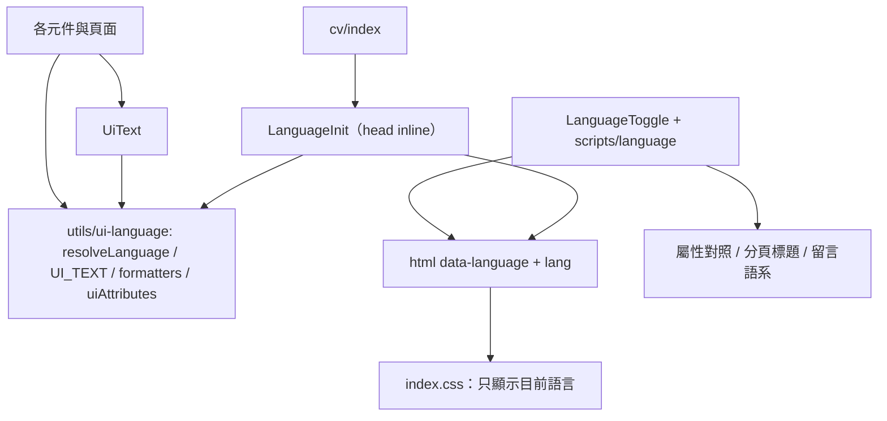

# 介面語言統一與預設語言 — Architecture Design

**Status:** Confirmed（使用者授權：設計決策採業界慣例）
**Source PRD:** `.sdd/2026-10-04-ui-language/PRD.md`
**Tech context:** Astro 6 靜態輸出 · TypeScript strict · 延續 `.sdd/2026-10-04-blog-ui-redesign/` 的 token 與主題機制

---

## 1. Design Goal & Guiding Principle

- **In one sentence:** 同一份靜態 HTML 同時帶著中英兩份介面文字，由 `<html data-language>` 在首次繪製前決定顯示哪一份；語言的決定規則、介面文字字典、日期與數量格式都集中在一個純邏輯模組。
- **Guiding principle:** **介面文字只住在字典裡，語言規則只住在一個純函式裡。** 元件只說「這裡放哪一句」（字典的鍵），不寫任何一種語言的字面文字；新增一句介面文字就是在字典加一行，新增一種語言就是在型別加一個值——不需要動任何元件的結構。

沿用主題切換已驗證的模式：inline script 在 `<head>` 裡決定語言並寫上 `<html>` 屬性，CSS 依屬性顯示對應文字，所以沒有閃爍、沒有 JS 時也有合理的預設（中文）。

---

## 2. Change Scope

| Area | Action | What / Why |
| :--- | :--- | :--- |
| `src/utils/ui-language.ts` | **Add** | 語言決定規則 `resolveLanguage`、介面文字字典 `UI_TEXT`、格式化（日期、閱讀時間、篇數、經歷期間）。純邏輯，可單元測試 |
| `src/components/common/UiText.astro` | **Add** | 輸出一句介面文字的中英兩份（各自帶 `lang`），由 CSS 依語言只顯示一份 |
| `src/components/common/LanguageInit.astro` | **Add** | `<head>` inline：首次繪製前決定語言，設定 `<html data-language>` 與 `lang`；規則直接序列化自 `resolveLanguage`，不重寫一份 |
| `src/components/common/LanguageToggle.astro`、`src/scripts/language.ts` | **Add** | 頁首切換鈕；切換、記住、套用（屬性文字、頁面標題、留言語系） |
| `src/styles/index.css` | **Modify** | 依 `data-language` 隱藏另一語言；沒有屬性時顯示中文 |
| `src/layouts/Layout.astro` | **Modify** | 引入 `LanguageInit`；`title` 可傳雙語，套用到分頁標題 |
| 所有含介面文字的元件與頁面 | **Modify** | 字面文字改為 `UiText`／字典；名稱與內文標上 `translate="no"` |
| `src/config/introduce.json` | **Modify** | 導覽文字、自我介紹、作品類型補上中文 |
| `src/pages/cv/index.astro` | **Modify** | 不帶語言的履歷網址依語言規則導向；沒有 JS 時導向中文版 |
| `src/pages/cv/[lang].astro`、`LanguageSwitcher.astro` | **Modify** | 返回連結依該版本語言；切換版本時記住語言選擇 |
| `src/components/common/GiscusComments.astro` | **Modify** | 留言介面語系跟著介面語言 |
| `src/pages/ai-redefines-software.astro` | **Modify** | 頁面自己的標示文字統一為中文（屬內容） |
| 文章內文、文章／系列／作品標題、`rss.xml.ts`、SEO meta | **Not touched** | PRD 明訂不翻譯；分享預覽與搜尋摘要維持中文 |
| 網址與路由 | **Not touched** | 同網址切換，已上線網址不變 |

---

## 3. New Classes / Modules

| Name | Kind | Responsibility (purpose) | Collaborators | Satisfies (PRD scenario) |
| :--- | :--- | :--- | :--- | :--- |
| `resolveLanguage(saved, preferredLanguage)` | Pure function | 決定介面語言：有效的已存選擇優先；否則首選語言以 `zh` 開頭為中文，其餘英文；兩者皆無時中文 | — | US-01 全部、US-02 |
| `UI_TEXT` ＋ `UiTextKey` | Dictionary | 每一句介面文字的中英版本；鍵即用途（如 `home.latestArticles`） | — | US-03 |
| `formatPublishedDate`、`formatReadingTime`、`formatArticleCount`、`localizePeriod` | Pure functions | 依語言格式化日期、閱讀時間、系列篇數、經歷期間的「至今」 | `reading-time.ts` | US-03 英文／中文介面、經歷期間 |
| `uiAttributes(attributes)` | Pure function | 產生「預設為中文的屬性＋另一語言的對照」，給無障礙名稱、佔位文字、履歷連結等不能用兩段文字表示的屬性 | `UI_TEXT` | US-03、US-04 |
| `UiText.astro` | Component | 依鍵（或直接給中英）輸出兩段帶 `lang` 的文字 | `UI_TEXT` | US-03 |
| `LanguageInit.astro` | Component（inline script） | 首次繪製前套用 `resolveLanguage` 的結果 | `resolveLanguage`（序列化） | US-01、US-02、NFR 無閃爍 |
| `LanguageToggle.astro` ＋ `scripts/language.ts` | Component ＋ script | 切換與記住語言；套用屬性對照、分頁標題、留言語系 | `uiAttributes` 的輸出 | US-02、US-03、US-04 |

---

## 4. Modified Components

| Component | Current role | Change needed |
| :--- | :--- | :--- |
| `Header`、`Footer`、`NotFound`、`ArticleList`、`ArticleMeta`、`SeriesEntry`、`PostNavigation`、`TableOfContents`、`BackToTop`、`ImageModal`、`SearchBar`、`ThemeToggle`、`home/*`、系列頁、系列總覽、404 | 寫死中文或英文 | 改用 `UiText`／`uiAttributes`／格式化函式；名稱與內文加 `translate="no"` |
| `ExperienceSummary` | 直接印期間字串 | 用 `localizePeriod` |
| `Intro`、`ExperienceSummary` 的履歷連結 | 指向 `/cv` | 預設 `/cv/zh`，英文對照 `/cv/en` |
| `cv/index.astro` | 永遠導向 `/cv/en` | 依語言規則導向；noscript 導向 `/cv/zh` |
| `cv/[lang].astro` | 返回連結固定「Home」 | 依該版本語言 |

---

## 5. Component Relationships

---

## 6. Extensibility & Handoff Notes

- **Most likely next requirement:** 新增一句介面文字；新增第三種語言；英文版另開網址讓搜尋引擎收錄。
- **Where it lands:**
  - 新增介面文字：`UI_TEXT` 加一個鍵，元件用 `UiText` 引用。
  - 第三種語言：`Language` 型別加值、字典每列補上、`resolveLanguage` 加一條前綴規則、CSS 加一組隱藏規則。
  - 分語言網址：字典與格式化函式可直接沿用，改的是路由與 `LanguageInit` 的導向。
- **Do not hardcode:** 元件內不得出現任何介面語言的字面文字；名稱與內文用 `translate="no"` 標示，不放進字典。
- **Known debt / deferred:**
  - 兩份文字都在 HTML 裡：頁面略大，搜尋引擎也會看到英文介面字。對個人網站可接受；若改為分語言網址即可消除。
  - 屬性（無障礙名稱、佔位文字、連結）在頁面解析後才換成英文，視覺上只有搜尋框佔位文字可能閃一下。

---

## 7. Traceability

| PRD Scenario | Fulfilled by |
| :--- | :--- |
| US-01 繁中／簡中／英文／其他語言／只看首選語言 | `resolveLanguage` ＋ `LanguageInit` |
| US-01 停用程式執行時為中文 | `index.css`（沒有 `data-language` 時顯示中文）＋ HTML 預設中文屬性 |
| US-02 切換後記住／不允許記住 | `scripts/language.ts` ＋ `resolveLanguage`（無效或讀不到的已存值視為沒有） |
| US-03 英文介面／中文介面 | `UI_TEXT` ＋ `UiText` ＋ `uiAttributes` ＋ 格式化函式；`translate="no"` 區分名稱 |
| US-03 名稱維持原文、類型依語言 | `introduce.json`（類型補中文）＋ `ProjectList` |
| US-03 經歷期間 | `localizePeriod` |
| US-03 自我介紹 | `introduce.json`（補中文）＋ `Intro` |
| US-04 前往對應語言的履歷 | `uiAttributes`（`href` 對照） |
| US-04 不帶語言的履歷網址 | `cv/index.astro` ＋ `LanguageInit` 的規則 |
| US-04 中文版返回連結 | `cv/[lang].astro` |
| US-04 在履歷切換也記住 | `LanguageSwitcher` ＋ `scripts/language.ts` |

---

## 8. Risks & Open Decisions

- **Risks / trade-offs:** 雙份文字讓 HTML 略增；以 CSS 隱藏的文字對螢幕閱讀器同樣隱藏（`display: none`），不會被讀兩次。
- **Decisions（業界慣例）：** 切換鈕顯示目標語言（中文介面顯示「EN」）；英文導覽為 About／Articles／Series；分享預覽與搜尋摘要維持中文；`<html lang>` 跟著介面語言。
- **Open decisions (for implementation):** 無。
