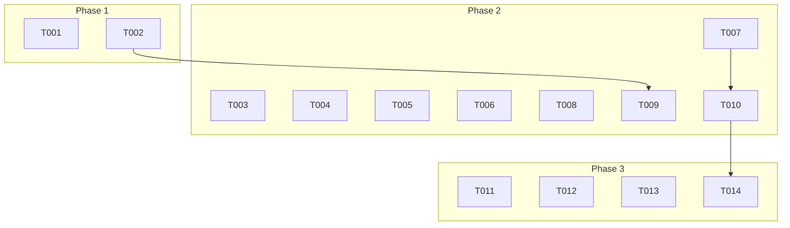

# 執行任務：文章頁面導覽按鈕

**分支**：`003-short-name-add` | **日期**：2025-10-19 | **計畫**：[plan.md](./plan.md)

## 總覽

此任務列表旨在實作文章頁面底部的「上一篇」與「下一篇」導覽功能。所有任務都圍繞著單一的使用者故事，目標是讓整個交付過程可以獨立測試與驗證。

---

## Phase 1: 基礎建設

*此階段建立所有使用者故事共享的核心邏輯。*

- [X] T001 在 `src/utils/series.ts` 中新增 `getAdjacentPosts` 函式，該函式接收目前文章的 slug，並返回前一篇與後一篇文章的物件。
- [X] T002 確保 `getAdjacentPosts` 函式能正確處理邊界情況（第一篇與最後一篇文章）。

---

## Phase 2: 使用者故事 1－讀者切換相鄰文章

*目標：讀者能在文章頁面底部看到並使用「上一篇」與「下一篇」按鈕進行導覽。*

**獨立測試標準**：
- 在有相鄰文章的頁面，導覽區塊與按鈕皆正確顯示。
- 在第一篇或最後一篇文章的頁面，對應的按鈕被隱藏。
- 點擊按鈕能成功跳轉至正確的文章。

### 任務

- [X] T003 [US1] 建立新的 Astro 元件 `src/components/sections/blog/PostNavigation.astro`。
- [X] T004 [P] [US1] 在 `PostNavigation.astro` 中，設計導覽區塊的 UI，包含左右兩個按鈕的容器。
- [X] T005 [P] [US1] 在 `PostNavigation.astro` 中，定義元件的 props，應接收 `prevPost` 與 `nextPost` 物件。
- [X] T006 [US1] 在 `PostNavigation.astro` 中，實作條件渲染邏輯：如果 `prevPost` 存在，則顯示「上一篇」按鈕；如果 `nextPost` 存在，則顯示「下一篇」按鈕。
- [X] T007 [US1] 在 `PostNavigation.astro` 的按鈕中，顯示文章標題與「« 上一篇」/「下一篇 »」標籤，並設定正確的連結。
- [X] T008 [US1] 開啟 `src/pages/blogs/[slug].astro` 檔案，準備整合新元件。
- [X] T009 [US1] 在 `src/pages/blogs/[slug].astro` 中，匯入 `PostNavigation` 元件並呼叫 `getAdjacentPosts` 函式以取得相鄰文章資料。
- [X] T010 [US1] 在 `src/pages/blogs/[slug].astro` 的文章內容區塊下方，渲染 `<PostNavigation />` 元件，並將相鄰文章資料傳入。

---

## Phase 3: 潤飾與最終確認

*此階段專注於程式碼品質、最終驗證與清理。*

- [X] T011 執行 `npm run lint` 並修復所有 ESLint 回報的問題。
- [X] T012 執行 `npm run check` 並確保 TypeScript 型別檢查通過。
- [X] T013 執行 `npm run build` 確保專案可以成功建置。
- [X] T014 根據 `quickstart.md` 中的驗證步驟，手動測試所有功能是否符合預期。

---

## 相依關係圖

- **Phase 1** 必須在 **Phase 2** 開始前完成。
- **Phase 2** 的任務（T003-T010）可以被視為一個整體，共同完成使用者故事。
- **Phase 3** 在所有實作完成後進行。

## 平行執行範例

- 在 **Phase 2** 中，`T004`（UI 設計）與 `T005`（Props 定義）可以同時進行，因為它們都屬於 `PostNavigation.astro` 元件的內部實作，且不互相依賴。

## 實作策略

此功能將作為一個完整的 MVP (Minimum Viable Product) 交付。由於只有一個核心使用者故事，所有任務將依序完成，以確保功能的完整性。完成後，將直接進入潤飾與驗收階段。