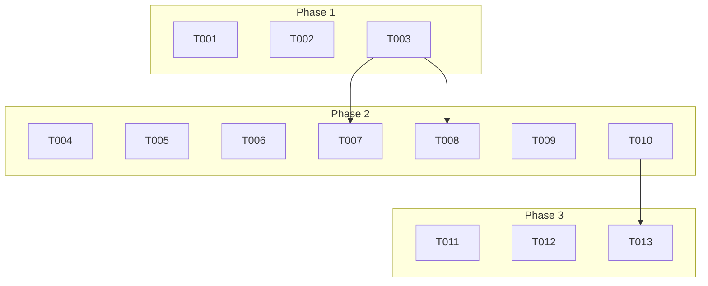

# 執行任務：雙模式文章導覽

**分支**：`004-short-name-dual` | **日期**：2025-10-19 | **計畫**：[plan.md](./plan.md)

## 總覽

此任務列表旨在為部落格文章實作一個雙模式的導覽功能，能根據文章是「單篇」還是「系列」文章，提供不同的「上一篇」/「下一篇」邏輯。

---

## Phase 1: 基礎建設

*此階段擴充核心導覽邏輯以支援雙模式。*

- [X] T001 在 `src/utils/series.ts` 中建立一個新的函式 `getAdjacentSeriesPosts`，該函式接收目前文章的 slug 和系列名稱，返回該系列內的相鄰文章。
- [X] T002 修改 `src/utils/series.ts` 中的 `getAdjacentPosts` 函式，使其只處理**非系列**文章的導覽邏輯。
- [X] T003 確保兩個函式都能正確處理各自模式下的邊界情況（例如系列的第一篇/最後一篇文章，或時間上最新/最舊的單篇文章）。

---

## Phase 2: 使用者故事 1 & 2－雙模式導覽實作

*目標：在文章頁面底部根據文章類型顯示正確的導覽按鈕。*

**獨立測試標準**：
- **單篇文章**：導覽按鈕的連結指向按時間排序的、正確的相鄰**單篇**文章。
- **系列文章**：導覽按鈕的連結指向同一系列中，按 `seriesIndex` 排序的、正確的相鄰文章。
- 兩種模式的邊界情況下，對應的按鈕皆被隱藏。

### 任務

- [X] T004 [US1, US2] 開啟 `src/pages/blogs/[slug].astro` 檔案，準備修改導覽邏輯。
- [X] T005 [US1, US2] 在 `[slug].astro` 中，匯入 `getAdjacentSeriesPosts` 函式。
- [X] T006 [US1, US2] 在 `[slug].astro` 的前端邏輯中，增加一個判斷，檢查 `blog.data.parent` 是否存在。
- [X] T007 [US2] 如果 `blog.data.parent` 存在，則呼叫 `getAdjacentSeriesPosts` 來獲取相鄰文章。
- [X] T008 [US1] 如果 `blog.data.parent` 不存在，則繼續呼叫 `getAdjacentPosts` 來獲取相鄰文章。
- [X] T009 [US1, US2] 將獲取到的 `prevPost` 和 `nextPost` 變數傳遞給 `<PostNavigation />` 元件。
- [X] T010 [US1, US2] 確認 `PostNavigation.astro` 元件無需修改，因為它只負責渲染傳入的 props。

---

## Phase 3: 潤飾與最終確認

*此階段專注於程式碼品質、最終驗證與清理。*

- [X] T011 執行 `npm run check` 並確保 TypeScript 型別檢查通過。
- [X] T012 執行 `npm run build` 確保專案可以成功建置。
- [X] T013 根據 `quickstart.md` 中的兩種情境，手動測試所有功能是否符合預期。

---

## 相依關係圖

- **Phase 1** 必須在 **Phase 2** 開始前完成。
- **Phase 2** 的任務共同完成兩個使用者故事的 UI 整合。
- **Phase 3** 在所有實作完成後進行。

## 平行執行範例

- 在 **Phase 1** 中，`T001` 和 `T002` 的開發可以平行進行，因為它們修改的是不同的函式。

## 實作策略

此功能將一次性交付兩個使用者故事，因為它們緊密耦合在同一個 UI 元件中。開發將首先擴充後端邏輯（Phase 1），然後在前端頁面中實現模式切換（Phase 2），最後進行全面的測試和驗證。
