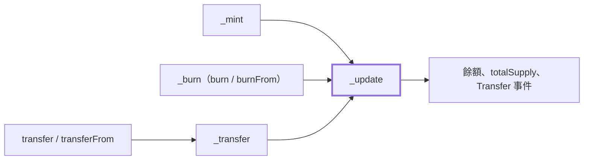
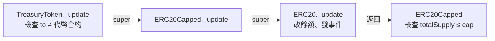

昨天手寫的 `MinimalToken` 七個測試全過，但其中兩個測試證明的是問題本身：轉給零地址會把代幣鎖死，改授權額度的空檔可以被搶先。今天換成 OpenZeppelin Contracts 重寫同一個代幣，看它替我們擋下了什麼，又有什麼是它也擋不了的。

先處理昨天的練習二。在 `_transfer` 加上 `require(to != address(0))` 之後，建構子的鑄造不受影響，原因是建構子根本沒有呼叫 `_transfer`，它直接寫 `balanceOf[msg.sender]`。這個答案其實透露了 `MinimalToken` 的一個結構問題：餘額有兩條修改路徑，任何檢查都要記得兩邊各加一次。等一下會看到 OpenZeppelin 怎麼把它收斂成一條。

## 1. 為什麼不自己寫

Web2 後端有幾件事是公認不要自己寫的：密碼雜湊用 bcrypt 或 argon2，JWT 驗證用成熟的函式庫，TLS 交給 OpenSSL。理由不是我們寫不出來，而是這類程式碼出錯的代價遠大於它省下的工夫，而且錯誤通常不會在功能測試裡出現。

智能合約把這個不對稱放得更大。Day 01 說過，合約部署之後程式碼不能改，已經發生的狀態轉移也不能撤回；代幣合約裡記的又直接是錢。後端服務有 bug，可以發 hotfix、可以從備份還原；代幣合約有 bug，損失會留在鏈上。

OpenZeppelin Contracts 是目前最廣泛使用的 Solidity 標準合約庫，它的可信度來自幾件可以查證的事：

- **每個版本都有審計紀錄。** repo 的 `audits/` 目錄列出每次審計的日期、版本、commit 與報告，從 2017 年的 v1.0.4 一路到 2026 年 2 月的 v5.6.0。
- **公開的漏洞賞金。** 透過 Immunefi 經營 bug bounty，找到漏洞的人有誘因回報，而不是拿去用。
- **大量的實戰部署。** 大量協議在主網上用同一份程式碼管理資產，等於持續被所有攻擊者檢驗。

這三件事是自己寫的合約沒辦法在短時間內補齊的。

### 審計過的版本，和最新的版本不是同一個

這裡有一個 Foundry 使用者容易忽略的細節。OpenZeppelin 用 npm tag 區分版本：`latest` 是審計過的版本，`dev` 是已定版、完整測試、在賞金範圍內，但**尚未審計**的版本。用 npm 安裝預設拿到 `latest`；用 Foundry 的 `forge install` 則是拿 git 上最新的 tag，不管它有沒有審計過。

寫這篇的時候，最新的 tag 是 v5.7.0，但 `audits/` 表格的最後一筆是 v5.6.0。另外 OpenZeppelin 的 README 也提醒：之後如果執行 `forge update`，會改抓 `master` 分支，那是開發中的程式碼。所以安裝時要明確固定版本：

```bash
forge install OpenZeppelin/openzeppelin-contracts@v5.6.1
```

v5.6.1 是 v5.6 線上的修補版本，只修了一個與 ERC-20 無關的解析函式。版本號會寫進 `foundry.lock`，團隊其他人拉下來的會是同一份。

接著設定 import 路徑。Foundry 會自動推導出 `@openzeppelin/contracts/` 的對應，但官方建議寫進 `remappings.txt`，讓設定明確可見：

```text
@openzeppelin/contracts/=lib/openzeppelin-contracts/contracts/
```

## 2. 用 OpenZeppelin 重寫

```solidity
// src/TreasuryToken.sol
// SPDX-License-Identifier: MIT
pragma solidity ^0.8.20;

import {ERC20} from "@openzeppelin/contracts/token/ERC20/ERC20.sol";
import {ERC20Burnable} from "@openzeppelin/contracts/token/ERC20/extensions/ERC20Burnable.sol";
import {ERC20Capped} from "@openzeppelin/contracts/token/ERC20/extensions/ERC20Capped.sol";

contract TreasuryToken is ERC20, ERC20Burnable, ERC20Capped {
    error TreasuryTokenTransferToTokenContract();

    constructor(uint256 initialSupply, uint256 maxSupply)
        ERC20("Treasury Token", "TT")
        ERC20Capped(maxSupply)
    {
        _mint(msg.sender, initialSupply);
    }

    function _update(address from, address to, uint256 value) internal override(ERC20, ERC20Capped) {
        if (to == address(this)) {
            revert TreasuryTokenTransferToTokenContract();
        }
        super._update(from, to, value);
    }
}
```

和昨天相比，這份合約沒有寫任何一個 ERC-20 函式。`transfer`、`approve`、`transferFrom`、`balanceOf` 全部繼承自 `ERC20`，我們只做了三件事：

- **組合兩個 extension。** `ERC20Burnable` 提供 `burn` 與 `burnFrom`，讓持有者銷毀自己的代幣；`ERC20Capped` 設定總發行量上限，任何鑄造只要讓 `totalSupply` 超過上限就 revert。目前只有建構子會鑄造，上限看起來用不到，但明天加上「誰可以增發」的權限之後，它就是增發的硬性天花板。
- **用建構子鏈傳入參數。** `ERC20("Treasury Token", "TT")` 與 `ERC20Capped(maxSupply)` 寫在建構子宣告上，父合約的建構子會先執行。
- **加一條自訂規則。** 覆寫 `_update`，擋下「把代幣轉給代幣合約本身」。這是實務上常見的誤操作：使用者把代幣地址貼進收款欄，代幣就卡在合約裡，而這份合約沒有任何取出的函式。

最後一項是今天的重點，第 4 節會拆開來看。

## 3. 逐項對照：MinimalToken 與 OpenZeppelin ERC20

| 項目                  | MinimalToken（Day 05）         | OpenZeppelin `ERC20` v5                         |
|:----------------------|:-------------------------------|:------------------------------------------------|
| 轉給零地址            | 成功，代幣鎖死                 | revert `ERC20InvalidReceiver(address(0))`       |
| 授權給零地址          | 成功                           | revert `ERC20InvalidSpender(address(0))`        |
| 錯誤格式              | 字串 `"insufficient balance"`  | ERC-6093 custom error，帶上下文參數             |
| 無限授權              | 每次 `transferFrom` 照樣扣額度 | 額度為 `type(uint256).max` 時不扣、不寫 Storage |
| `transferFrom` 的事件 | 只發 `Transfer`                | 只發 `Transfer`，扣額度時刻意不發 `Approval`    |
| 餘額修改路徑          | 建構子與 `_transfer` 兩條      | 鑄造、銷毀、轉帳全部經過 `_update`              |
| 狀態變數              | `public`，外部 getter 固定     | `private`，getter 是 `virtual` 函式，可覆寫     |
| 呼叫者                | 直接用 `msg.sender`            | 透過 `_msgSender()`，留給 meta-transaction 擴充 |

幾項值得展開說明。

### 零地址：區分「轉帳」和「鑄造、銷毀」

`ERC20` 的 `_transfer` 一開頭就檢查 `from` 與 `to` 都不能是零地址。這看起來和昨天練習二的寫法一樣，差別在於鑄造與銷毀**不走** `_transfer`：`_mint` 只檢查收款方不是零地址，然後呼叫 `_update(address(0), account, value)`；`_burn` 反過來呼叫 `_update(account, address(0), value)`。零地址在 `_update` 裡被當成「代幣的來源與去處」，所以轉帳路徑上禁止它，鑄造與銷毀路徑上專門用它。

這也順便解掉昨天坑一的另一半：真的要讓代幣消失，就用 `burn`，`totalSupply` 會跟著減少，帳面和實際流通量不會再對不上。

### 錯誤格式：ERC-6093

OpenZeppelin v5 的錯誤全部改成 custom error，格式來自 ERC-6093 這份標準：

```solidity
error ERC20InsufficientBalance(address sender, uint256 balance, uint256 needed);
error ERC20InsufficientAllowance(address spender, uint256 allowance, uint256 needed);
error ERC20InvalidReceiver(address receiver);
```

和昨天的字串相比有兩個好處。一是 revert 資料只有 4 bytes 的 selector 加上參數，不必把整串字串放進 bytecode 與回傳資料。二是錯誤帶了上下文：前端或監控服務解碼之後，可以直接知道「bob 的餘額是 0，需要 1」，不必去比對字串內容。這和 Web2 API 回傳結構化錯誤碼、而不是一段人類可讀訊息，是同一個考量。custom error 的細節 Day 09 會再談。

### 無限授權與不發出的 Approval

`transferFrom` 會先呼叫 `_spendAllowance`：

```solidity
// lib/openzeppelin-contracts/contracts/token/ERC20/ERC20.sol（節錄）
function _spendAllowance(address owner, address spender, uint256 value) internal virtual {
    uint256 currentAllowance = allowance(owner, spender);
    if (currentAllowance < type(uint256).max) {
        if (currentAllowance < value) {
            revert ERC20InsufficientAllowance(spender, currentAllowance, value);
        }
        unchecked {
            _approve(owner, spender, currentAllowance - value, false);
        }
    }
}
```

額度是 `type(uint256).max` 就整段跳過，連一次 Storage 寫入都省下來。`unchecked` 也值得注意：上一行已經確認 `currentAllowance >= value`，減法不可能下溢，所以關掉 0.8 的溢位檢查是安全的。這就是 Day 04 說的「確定安全才用 `unchecked`」的實際樣子。

最後一個參數 `false` 表示扣額度時不發出 `Approval` 事件。EIP-20 只要求 `approve` 成功時發出 `Approval`，沒有要求 `transferFrom` 也要發，OpenZeppelin 選擇省下這筆 log 的成本。代價是鏈下索引服務不能只靠 `Approval` 事件重建目前的額度，要搭配 `Transfer` 事件自己扣，或直接呼叫 `allowance()` 查詢。Day 08 談事件設計時會再碰到這種取捨。

## 4. Hook 與 Extension：不改原始碼也能擴充

標準合約庫要解決一個矛盾：程式碼要經過審計所以不能改，但每個專案又都有自己的規則。OpenZeppelin 的答案是 **hook**：預留一個 `virtual` 函式，讓繼承者覆寫它來插入自己的邏輯，原本的程式碼一行都不動。

### 唯一的 hook：_update

v5 的 `ERC20` 只有一個 hook，就是 `_update`。所有改變餘額的動作都會經過它：



圖中粗框的 `_update` 是唯一會碰到帳本的函式。`transfer` 與 `transferFrom` 先經過 `_transfer` 做零地址檢查，`_mint` 與 `_burn` 則各自檢查一側之後直接進 `_update`。

這個設計的好處是：**只要在 `_update` 加一條檢查，它就同時涵蓋轉帳、鑄造、銷毀三種情況**，不會發生昨天「建構子那條路忘了加」的問題。我們的 `TreasuryTokenTransferToTokenContract` 檢查就是如此，未來不管是誰鑄造給代幣合約本身，一樣會被擋下。

v4 的設計是 `_beforeTokenTransfer` 與 `_afterTokenTransfer` 兩個 hook，v5 把它們合併成 `_update`。網路上很多教學還停在 v4 的寫法，照抄到 v5 會編譯失敗，看到這兩個名字就知道是舊版本的範例。

### 多重繼承與 super 的順序

`TreasuryToken` 同時繼承了 `ERC20` 與 `ERC20Capped`，而 `ERC20Capped` 自己也覆寫了 `_update`。兩個父合約都有 `_update`，編譯器不會猜要用哪個，所以要寫 `override(ERC20, ERC20Capped)` 明確宣告。

那 `super._update` 會呼叫到誰？Solidity 用 C3 線性化決定順序，規則是 `is` 後面**越靠右越接近子合約**。`TreasuryToken is ERC20, ERC20Burnable, ERC20Capped` 的呼叫鏈是：



實線是 `super` 往下呼叫，虛線是 `ERC20._update` 執行完返回 `ERC20Capped` 之後才做的事。

注意兩個檢查的位置不同：我們的檢查放在 `super._update` **之前**，`ERC20Capped` 的檢查放在**之後**。前者只需要看參數，越早 revert 越省 Gas；後者要知道鑄造之後的 `totalSupply`，所以等帳本更新完再檢查，超過上限就 revert，整筆交易的狀態一併回滾。

覆寫 hook 時最危險的錯誤是**忘了呼叫 `super._update`**。這樣編譯會過，但帳本完全不會更新，所有轉帳都「成功」卻沒有移動任何餘額。這種錯誤只有測試抓得到。

### 常用的 ERC-20 extension

| Extension       | 作用                                           | 系列中的位置                     |
|:----------------|:-----------------------------------------------|:---------------------------------|
| `ERC20Burnable` | 持有者銷毀自己的代幣，或在授權額度內代為銷毀   | 今天                             |
| `ERC20Capped`   | 總發行量上限                                   | 今天                             |
| `ERC20Pausable` | 暫停期間所有轉帳 revert                        | Day 33 緊急暫停                  |
| `ERC20Permit`   | EIP-2612，用簽章取代 `approve` 交易            | Day 27 EIP-712 簽章              |
| `ERC20Votes`    | 記錄投票權快照，給治理合約使用                 | Day 30 治理與時間鎖              |

不確定怎麼組合時，OpenZeppelin 有一個 Contracts Wizard 網頁，勾選需要的功能就會產生對應的繼承與 override 寫法，可以拿來對照自己寫的版本。

## 5. 測試：同樣的五個測試，加上六個對照

先把昨天的五個功能測試移植過來。行為一樣，只有錯誤斷言從字串改成 custom error：

```solidity
// test/TreasuryToken.t.sol
// SPDX-License-Identifier: MIT
pragma solidity ^0.8.20;

import {Test} from "forge-std/Test.sol";
import {IERC20Errors} from "@openzeppelin/contracts/interfaces/draft-IERC6093.sol";
import {TreasuryToken} from "../src/TreasuryToken.sol";

contract TreasuryTokenTest is Test {
    event Transfer(address indexed from, address indexed to, uint256 value);

    uint256 private constant INITIAL_SUPPLY = 1_000_000 ether;
    uint256 private constant MAX_SUPPLY = 10_000_000 ether;

    TreasuryToken private token;
    address private alice = makeAddr("alice");
    address private bob = makeAddr("bob");

    function setUp() public {
        vm.prank(alice);
        token = new TreasuryToken(INITIAL_SUPPLY, MAX_SUPPLY);
    }

    function testDeployerReceivesInitialSupply() public view {
        assertEq(token.totalSupply(), INITIAL_SUPPLY);
        assertEq(token.balanceOf(alice), INITIAL_SUPPLY);
        assertEq(token.cap(), MAX_SUPPLY);
    }

    function testTransferMovesBalanceAndEmitsEvent() public {
        vm.expectEmit(true, true, false, true, address(token));
        emit Transfer(alice, bob, 100 ether);

        vm.prank(alice);
        token.transfer(bob, 100 ether);

        assertEq(token.balanceOf(alice), INITIAL_SUPPLY - 100 ether);
        assertEq(token.balanceOf(bob), 100 ether);
    }

    function testTransferRevertsWhenBalanceIsInsufficient() public {
        vm.prank(bob);
        vm.expectRevert(abi.encodeWithSelector(IERC20Errors.ERC20InsufficientBalance.selector, bob, 0, 1));
        token.transfer(alice, 1);
    }

    function testTransferFromSpendsAllowance() public {
        vm.prank(alice);
        token.approve(bob, 300 ether);

        vm.prank(bob);
        token.transferFrom(alice, bob, 200 ether);

        assertEq(token.allowance(alice, bob), 100 ether);
        assertEq(token.balanceOf(bob), 200 ether);
    }

    function testTransferFromRevertsWithoutAllowance() public {
        vm.prank(bob);
        vm.expectRevert(abi.encodeWithSelector(IERC20Errors.ERC20InsufficientAllowance.selector, bob, 0, 1));
        token.transferFrom(alice, bob, 1);
    }
}
```

`vm.expectRevert` 收的是完整的 revert 資料，所以用 `abi.encodeWithSelector` 把 selector 和參數一起編碼。這也表示測試同時驗證了錯誤**種類**和**內容**：如果合約回報的餘額不是 0，測試一樣會失敗。

接著是對照昨天兩個坑與今天新增行為的測試：

```solidity
// test/TreasuryTokenSafeguards.t.sol
// SPDX-License-Identifier: MIT
pragma solidity ^0.8.20;

import {Test, Vm} from "forge-std/Test.sol";
import {IERC20Errors} from "@openzeppelin/contracts/interfaces/draft-IERC6093.sol";
import {ERC20Capped} from "@openzeppelin/contracts/token/ERC20/extensions/ERC20Capped.sol";
import {TreasuryToken} from "../src/TreasuryToken.sol";

contract TreasuryTokenSafeguardsTest is Test {
    TreasuryToken private token;
    address private alice = makeAddr("alice");
    address private bob = makeAddr("bob");

    function setUp() public {
        vm.prank(alice);
        token = new TreasuryToken(1_000_000 ether, 10_000_000 ether);
    }

    // Day 05 坑一：零地址現在會被擋下
    function testTransferToZeroAddressReverts() public {
        vm.prank(alice);
        vm.expectRevert(abi.encodeWithSelector(IERC20Errors.ERC20InvalidReceiver.selector, address(0)));
        token.transfer(address(0), 100 ether);
    }

    // 無限授權：額度為 type(uint256).max 時不扣減，也不發出 Approval
    function testInfiniteAllowanceIsNotSpent() public {
        vm.prank(alice);
        token.approve(bob, type(uint256).max);

        vm.recordLogs();
        vm.prank(bob);
        token.transferFrom(alice, bob, 100 ether);

        Vm.Log[] memory logs = vm.getRecordedLogs();
        assertEq(logs.length, 1); // 只有 Transfer
        assertEq(token.allowance(alice, bob), type(uint256).max);
    }

    // 自訂規則：透過 _update hook 擋下轉給代幣合約本身
    function testTransferToTokenContractReverts() public {
        vm.prank(alice);
        vm.expectRevert(TreasuryToken.TreasuryTokenTransferToTokenContract.selector);
        token.transfer(address(token), 100 ether);
    }

    // ERC20Burnable：銷毀會同時減少 totalSupply
    function testBurnReducesTotalSupply() public {
        vm.prank(alice);
        token.burn(100 ether);

        assertEq(token.totalSupply(), 1_000_000 ether - 100 ether);
        assertEq(token.balanceOf(alice), 1_000_000 ether - 100 ether);
    }

    // ERC20Capped：鑄造超過上限會 revert，連建構子也一樣
    function testMintingAboveCapReverts() public {
        vm.expectRevert(abi.encodeWithSelector(ERC20Capped.ERC20ExceededCap.selector, 2 ether, 1 ether));
        new TreasuryToken(2 ether, 1 ether);
    }

    // Day 05 坑二：OpenZeppelin 也沒有替我們解決
    function testChangingAllowanceCanStillBeFrontRun() public {
        vm.prank(alice);
        token.approve(bob, 100 ether);

        vm.prank(bob);
        token.transferFrom(alice, bob, 100 ether);

        vm.prank(alice);
        token.approve(bob, 50 ether);

        vm.prank(bob);
        token.transferFrom(alice, bob, 50 ether);

        assertEq(token.balanceOf(bob), 150 ether);
    }
}
```

新出現的作弊碼是 `vm.recordLogs()` 與 `vm.getRecordedLogs()`：前者開始錄下之後所有事件，後者取回錄到的 log 陣列。`testInfiniteAllowanceIsNotSpent` 用它確認 `transferFrom` 只發出一筆 `Transfer`，沒有 `Approval`。

`testMintingAboveCapReverts` 則確認上限在建構子裡也有效。`_mint` 經過 `_update`，`ERC20Capped` 的覆寫自然也會執行，不需要另外處理建構子這條路。

執行 `forge test`，兩個檔案共十一個測試全部通過。

### 順便看一下 Gas

多了這麼多檢查，會不會變貴？用 `forge test --gas-report` 量同樣的呼叫（Forge 1.8.3、solc 0.8.37、OpenZeppelin v5.6.1）：

| 呼叫                                 | MinimalToken | TreasuryToken |
|:-------------------------------------|-------------:|--------------:|
| `transfer`                           |       52,415 |        52,345 |
| `transferFrom`（額度為無限授權）     |       41,587 |        38,207 |
| Runtime bytecode 大小                |  3,044 bytes |   4,253 bytes |

`transfer` 的差距不到一百 Gas。零地址檢查只是兩次比較，相對於 Storage 寫入動輒上萬的成本可以忽略。無限授權的 `transferFrom` 少了一次 Storage 寫入，便宜了三千多 Gas。代價是部署的 bytecode 變大，這是部署時一次性的成本。

## 6. OpenZeppelin 沒有替我們解決的事

`testChangingAllowanceCanStillBeFrontRun` 在 OpenZeppelin 版本上**仍然通過**：bob 一樣可以搶先花掉舊額度，再花掉新額度，拿到 150。

這不是 OpenZeppelin 的疏忽。只要 `approve` 的語意是「把額度直接設成某個值」，這個競態就存在，而這個語意是 ERC-20 規格定的，標準庫不能擅自改。OpenZeppelin 在 `IERC20` 的註解裡寫明了這個風險，並建議先把額度降到 0，再設成新值。v4 曾經提供 `increaseAllowance` 與 `decreaseAllowance` 這兩個非標準函式，v5 已經移除，理由正是它們不屬於規格，而且不能完全解決問題。

這也回答了昨天的思考題。在不改介面的前提下，應用層可以這樣做：

1. 先送一筆 `approve(spender, 0)`，等它上鏈。
2. 上鏈後查 `allowance(owner, spender)` 與相關的 `Transfer` 事件，確認舊額度在歸零前被用掉了多少。
3. 根據實際被用掉的額度，決定新額度要設多少，再送第二筆 `approve`。

歸零本身擋不住 bob 在第一步之前搶先花掉舊額度，它的作用是把「舊額度花了多少」變成一個確定、可查的事實，讓第二步的決定有依據。另一條路是讓授權和使用發生在同一筆交易裡，這就是 Day 27 會介紹的 EIP-2612 `permit`。

同樣地，我們加的「不能轉給代幣合約本身」只擋下了一個地址。代幣仍然可以被轉進任何一個不懂得處理 ERC-20 的合約，然後永遠卡在那裡，ERC-20 規格沒有機制讓收款合約拒收。

標準庫保證的是**它自己那部分的實作正確**：帳本不會算錯、規格要求的行為都有做到。業務規則怎麼設計、授權流程怎麼走、權限交給誰，仍然是我們自己的責任。這也是為什麼系列第二階段會花整整兩週談攻擊手法，第三階段還要對財庫做一次完整的模擬審計。

---

## 今日練習

1. 用 `forge install OpenZeppelin/openzeppelin-contracts@v5.6.1` 安裝固定版本，把 `TreasuryToken` 與兩個測試檔放進專案，執行 `forge test` 確認十一個測試全部通過。打開 `lib/openzeppelin-contracts/audits/README.md`，確認自己安裝的版本落在哪一次審計的範圍內。
2. 在繼承清單加上 `ERC20Pausable`，觀察編譯器要求 `_update` 的 `override(...)` 改成什麼。再想一個問題：`ERC20Pausable` 只提供內部的 `_pause()` 與 `_unpause()`，對外的 `pause()` 應該讓誰呼叫？

## 今日思考題

我們的檢查放在 `super._update` 之前，`ERC20Capped` 的檢查放在之後。**如果把兩者的位置對調，各自會發生什麼事？結果的正確性有沒有改變，改變的又是什麼？**

---

*這是 45 天技術轉型紀錄的 Day 06。標準庫讓我們不必重新發明帳本，但它擋不住規格本身的缺口。*

**有沒有遇過 OpenZeppelin 從 v4 升到 v5 時被改掉的寫法？歡迎在下方留言交流。**

---

明天 Day 07，我們從練習二的問題延伸：代幣要增發、要暫停的時候，誰有權按下按鈕。從 `Ownable` 的單一擁有者談到 `AccessControl` 的角色模型，替 `TreasuryToken` 加上鑄造權限。

## Reference

- [ERC-20 介面定義，以及 approve 段落對搶先交易攻擊向量的說明 — EIP-20: Token Standard](https://eips.ethereum.org/EIPS/eip-20)
- [ERC20InsufficientBalance 等 custom error 的命名與參數規格 — ERC-6093: Custom errors for commonly-used tokens](https://eips.ethereum.org/EIPS/eip-6093)
- [ERC20 的 _update hook、extension 清單與無限授權行為 — OpenZeppelin Docs, ERC-20](https://docs.openzeppelin.com/contracts/5.x/erc20)
- [latest／dev／next 三種 release tag 的差異，以及 Foundry 安裝不要用 master 的警告 — OpenZeppelin Contracts README](https://github.com/OpenZeppelin/openzeppelin-contracts)
- [各版本的審計日期、commit 與報告 — OpenZeppelin Contracts, audits](https://github.com/OpenZeppelin/openzeppelin-contracts/tree/master/audits)
- [v5.0 移除 _beforeTokenTransfer、_afterTokenTransfer 與 increaseAllowance 的紀錄 — OpenZeppelin Contracts CHANGELOG](https://github.com/OpenZeppelin/openzeppelin-contracts/blob/master/CHANGELOG.md)
- [OpenZeppelin Contracts 的漏洞賞金計畫 — Immunefi](https://immunefi.com/bounty/openzeppelin)
- [多重繼承的 C3 線性化與 super 的呼叫順序 — Solidity Documentation, Multiple Inheritance and Linearization](https://docs.soliditylang.org/en/latest/contracts.html#multiple-inheritance-and-linearization)
