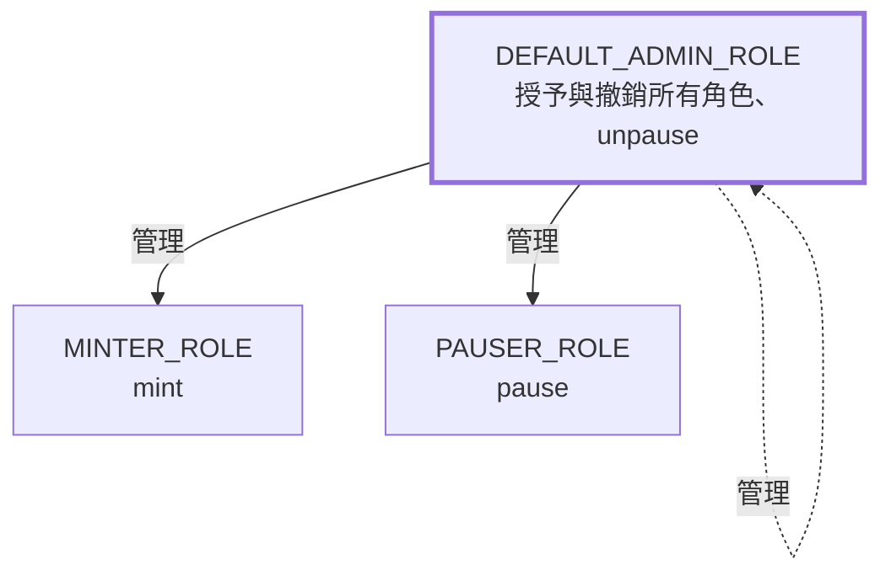

昨天的 `TreasuryToken` 只有建構子會鑄造，`ERC20Capped` 的上限看起來派不上用場。今天要讓它真的能增發、能暫停，於是馬上碰到一個問題：誰可以按這兩個按鈕。

先收掉昨天留下的兩題。

練習二在繼承清單加上 `ERC20Pausable` 之後，編譯器會直接報錯：

```text
Error (4327): Function needs to specify overridden contract "ERC20Pausable".
```

`ERC20Pausable` 也覆寫了 `_update`，所以 `override(...)` 要改成 `override(ERC20, ERC20Capped, ERC20Pausable)`，三個父合約一個都不能少，括號內的順序則不影響結果。至於對外的 `pause()` 應該讓誰呼叫，就是今天的主題。

思考題問的是把兩個檢查的位置對調。我們的「不能轉給代幣合約」移到 `super._update` 之後，結果的正確性不變：檢查失敗一樣 revert，整筆交易的狀態一樣回滾。改變的是成本，revert 前已經做完的餘額與 `totalSupply` 寫入，Gas 照樣要付。`ERC20Capped` 的檢查如果原封不動搬到 `super._update` 之前，改變的就是正確性了：那時讀到的 `totalSupply()` 還是鑄造前的數字，一筆讓總量越過上限的鑄造會順利通過。要放在前面，就得自己算 `totalSupply() + value`。只看參數的檢查可以放前面，要看結果的檢查只能放後面，這是寫 hook 時的基本判斷。

## 1. 今天要保護的三個動作：mint、pause、unpause

今天要加上權限的是這三個動作，先把它們各自做什麼講清楚：

- **mint（鑄造）**：憑空產生新的代幣，加到某個地址的餘額，同時讓 `totalSupply` 跟著增加。它和轉帳不同，轉帳是把餘額從 A 移到 B，總量不變；鑄造沒有來源帳戶，總量直接變大。用 Web2 的帳務系統來比喻，轉帳是兩個帳戶之間記一筆，鑄造是直接替某個帳戶加值，所以是代幣合約裡最需要管控的動作。反向的動作是昨天介紹的銷毀（burn）。
- **pause（暫停）**：讓合約進入暫停狀態。暫停期間，轉帳、鑄造、銷毀一律 revert `EnforcedPause()`；`approve` 只改授權額度、不動餘額，仍然可以呼叫。用途是在發現漏洞或異常時先止血，類似 Web2 服務出事時切到維護模式，或用 feature flag 關掉寫入。
- **unpause（恢復）**：解除暫停，合約回到正常運作。兩者有狀態上的前提：已經暫停時再暫停會 revert `EnforcedPause()`，沒有暫停時呼叫恢復會 revert `ExpectedPause()`。

這三個動作在 OpenZeppelin 裡都只有內部函式：`_mint`、`_pause`、`_unpause`，`ERC20` 和 `ERC20Pausable` 都沒有提供公開的 `mint`、`pause`、`unpause`。原因是標準庫無法替我們決定「誰可以呼叫」。昨天的 `TreasuryToken` 只在建構子呼叫 `_mint`，部署後總量只會因為銷毀而減少；今天要替這三個動作寫公開入口，而每個入口都要先回答同一個問題：誰有權按下這個按鈕。

## 2. 從 Web2 的權限檢查說起

Web2 後端的權限檢查大致長這樣：請求帶著 JWT 進來，middleware 驗簽、解出使用者 ID 與角色，再看這個角色能不能呼叫這支 API。角色定義存在資料庫，管理員可以在後台改；帳號被盜了，可以強制登出、重設密碼、撤銷 token；萬一權限設錯，DBA 還能直接改資料表救回來。

合約裡的權限檢查只剩一個依據：`msg.sender`，也就是這筆呼叫是哪個地址簽出來的。對照起來有幾個差異會直接影響設計：

| 項目             | Web2 後端                         | 智能合約                                     |
|:-----------------|:----------------------------------|:---------------------------------------------|
| 身分             | 帳號密碼、OAuth，可以重設          | 私鑰，遺失就無法找回                         |
| 權限資料存在哪   | 資料庫，管理員可直接改             | 合約 Storage，只能透過合約自己的函式改       |
| 設錯了怎麼辦     | 改資料表、發 hotfix               | 合約沒寫修正路徑，就永遠修不了               |
| 稽核紀錄         | 另外寫 audit log                  | 合約發出的事件，任何人都能查                 |
| 被盜之後         | 撤銷 session、鎖帳號               | 攻擊者和合法管理者在合約眼中是同一個地址     |

最後一列最重要。合約分不出「拿著私鑰的人是不是本人」，它只看地址對不對。所以權限設計要回答的不只是「誰可以做什麼」，還有「這把鑰匙出事的時候，損失能被限制在多大範圍」。

## 3. Ownable：一把鑰匙管全部

最直接的做法是指定一個擁有者，所有管理功能都只給他用。OpenZeppelin 的 `Ownable` 就是這個模型：

```solidity
// src/OwnableTreasuryToken.sol
// SPDX-License-Identifier: MIT
pragma solidity ^0.8.20;

import {ERC20} from "@openzeppelin/contracts/token/ERC20/ERC20.sol";
import {ERC20Burnable} from "@openzeppelin/contracts/token/ERC20/extensions/ERC20Burnable.sol";
import {ERC20Capped} from "@openzeppelin/contracts/token/ERC20/extensions/ERC20Capped.sol";
import {Ownable} from "@openzeppelin/contracts/access/Ownable.sol";

contract OwnableTreasuryToken is ERC20, ERC20Burnable, ERC20Capped, Ownable {
    error TreasuryTokenTransferToTokenContract();

    constructor(uint256 initialSupply, uint256 maxSupply, address initialOwner)
        ERC20("Treasury Token", "TT")
        ERC20Capped(maxSupply)
        Ownable(initialOwner)
    {
        _mint(initialOwner, initialSupply);
    }

    function mint(address to, uint256 amount) external onlyOwner {
        _mint(to, amount);
    }

    function _update(address from, address to, uint256 value) internal override(ERC20, ERC20Capped) {
        if (to == address(this)) {
            revert TreasuryTokenTransferToTokenContract();
        }
        super._update(from, to, value);
    }
}
```

和昨天相比只多了兩處：繼承 `Ownable` 並在建構子傳入 `initialOwner`，以及一個加上 `onlyOwner` 的 `mint`。這個版本先不加暫停，專心看單一擁有者本身的問題。

`onlyOwner` 是一個 modifier，展開後就是一行比較：

```solidity
// lib/openzeppelin-contracts/contracts/access/Ownable.sol（節錄）
modifier onlyOwner() {
    _checkOwner();
    _;
}

function _checkOwner() internal view virtual {
    if (owner() != _msgSender()) {
        revert OwnableUnauthorizedAccount(_msgSender());
    }
}
```

`_;` 代表被修飾的函式本體，modifier 的檢查會在它之前執行。這和 Web2 的 middleware 是同一個概念，差別在於它被編譯進函式裡，每次呼叫都會實際跑一次。

有一個 v4 到 v5 的變化值得注意：v4 的 `Ownable` 建構子不收參數，擁有者自動設成部署者；v5 改成必須明確傳入 `initialOwner`，傳零地址會 revert `OwnableInvalidOwner`。這個改動的用意是逼開發者想清楚擁有者是誰，而不是預設交給那個剛好用來部署的熱錢包。

### 單一擁有者的三種失效方式

`Ownable` 的問題不在程式碼，而在「一把鑰匙」這個模型本身。它有三種失效方式：

- **鑰匙被盜。** 攻擊者拿到擁有者的私鑰，就能呼叫 `mint` 增發。昨天加的 `ERC20Capped` 在這裡變成損害上限：最多只能增發到 `cap`，不會無限印鈔。
- **鑰匙遺失，或主動放棄。** `renounceOwnership()` 會把擁有者設成零地址，此後沒有任何人能呼叫 `onlyOwner` 函式。有些專案會刻意這樣做來證明「不會再增發」，但也意味著永遠不能再增發，就算之後真的需要。私鑰遺失的效果一樣，只是沒有人願意承認是刻意的。
- **轉移給打錯的地址。** `transferOwnership(newOwner)` 一呼叫就生效，不會確認新地址背後有沒有人控制。地址打錯一個字元，權限就交給了一個沒有人有私鑰的地址。

第三種有現成的解法：`Ownable2Step`。它把轉移拆成兩步，舊擁有者呼叫 `transferOwnership` 只是把新地址記在 `pendingOwner`，新擁有者要自己呼叫 `acceptOwnership()` 才算完成。能呼叫 `acceptOwnership` 就證明對方握有私鑰，打錯的地址永遠接不下來。這和 Web2 變更帳號 email 時要點確認信，是同樣的想法。

前兩種則沒有辦法在 `Ownable` 的框架內解決，因為整個合約的管理權就是一個地址。用測試把這三件事寫下來：

```solidity
// test/OwnableTreasuryToken.t.sol
// SPDX-License-Identifier: MIT
pragma solidity ^0.8.20;

import {Test} from "forge-std/Test.sol";
import {Ownable} from "@openzeppelin/contracts/access/Ownable.sol";
import {OwnableTreasuryToken} from "../src/OwnableTreasuryToken.sol";

contract OwnableTreasuryTokenTest is Test {
    OwnableTreasuryToken private token;
    address private alice = makeAddr("alice");
    address private bob = makeAddr("bob");

    function setUp() public {
        token = new OwnableTreasuryToken(1_000_000 ether, 10_000_000 ether, alice);
    }

    function testOwnerCanMint() public {
        vm.prank(alice);
        token.mint(bob, 100 ether);

        assertEq(token.balanceOf(bob), 100 ether);
    }

    function testNonOwnerCannotMint() public {
        vm.prank(bob);
        vm.expectRevert(abi.encodeWithSelector(Ownable.OwnableUnauthorizedAccount.selector, bob));
        token.mint(bob, 100 ether);
    }

    // 單點風險一：轉移給打錯的地址，權限立刻消失
    function testTransferOwnershipToWrongAddressLocksMinting() public {
        address typo = address(0xdead);

        vm.prank(alice);
        token.transferOwnership(typo);

        vm.prank(alice);
        vm.expectRevert(abi.encodeWithSelector(Ownable.OwnableUnauthorizedAccount.selector, alice));
        token.mint(alice, 1 ether);
    }

    // 單點風險二：放棄所有權之後，沒有任何人能再鑄造
    function testRenounceOwnershipDisablesMintingForever() public {
        vm.prank(alice);
        token.renounceOwnership();

        assertEq(token.owner(), address(0));
        vm.prank(alice);
        vm.expectRevert(abi.encodeWithSelector(Ownable.OwnableUnauthorizedAccount.selector, alice));
        token.mint(alice, 1 ether);
    }
}
```

後兩個測試證明的都是「之後再也救不回來」。合約裡沒有任何一個函式能讓 alice 把權限拿回來，這就是 Day 01 說的狀態轉移不可逆，套用在權限上的樣子。

## 4. AccessControl：把權力拆成角色

`Ownable` 的另一個限制是所有權力綁在一起。增發、暫停、改參數都是同一把鑰匙，負責半夜處理事故的值班人員要能暫停，就得拿到能增發的那把鑰匙。

Web2 的做法是 RBAC：定義角色、把權限掛在角色上、再把角色指派給人。`AccessControl` 是同一套模型搬上鏈：

```solidity
// src/TreasuryToken.sol
// SPDX-License-Identifier: MIT
pragma solidity ^0.8.20;

import {ERC20} from "@openzeppelin/contracts/token/ERC20/ERC20.sol";
import {ERC20Burnable} from "@openzeppelin/contracts/token/ERC20/extensions/ERC20Burnable.sol";
import {ERC20Capped} from "@openzeppelin/contracts/token/ERC20/extensions/ERC20Capped.sol";
import {ERC20Pausable} from "@openzeppelin/contracts/token/ERC20/extensions/ERC20Pausable.sol";
import {AccessControl} from "@openzeppelin/contracts/access/AccessControl.sol";

contract TreasuryToken is ERC20, ERC20Burnable, ERC20Capped, ERC20Pausable, AccessControl {
    bytes32 public constant MINTER_ROLE = keccak256("MINTER_ROLE");
    bytes32 public constant PAUSER_ROLE = keccak256("PAUSER_ROLE");

    error TreasuryTokenTransferToTokenContract();
    error TreasuryTokenInvalidAdmin();

    constructor(uint256 initialSupply, uint256 maxSupply, address admin)
        ERC20("Treasury Token", "TT")
        ERC20Capped(maxSupply)
    {
        if (admin == address(0)) {
            revert TreasuryTokenInvalidAdmin();
        }
        _grantRole(DEFAULT_ADMIN_ROLE, admin);
        _mint(admin, initialSupply);
    }

    function mint(address to, uint256 amount) external onlyRole(MINTER_ROLE) {
        _mint(to, amount);
    }

    function pause() external onlyRole(PAUSER_ROLE) {
        _pause();
    }

    function unpause() external onlyRole(DEFAULT_ADMIN_ROLE) {
        _unpause();
    }

    function _update(address from, address to, uint256 value)
        internal
        override(ERC20, ERC20Capped, ERC20Pausable)
    {
        if (to == address(this)) {
            revert TreasuryTokenTransferToTokenContract();
        }
        super._update(from, to, value);
    }
}
```

這是之後 Day 18、28 會沿用的 `TreasuryToken`，建構子從兩個參數變成三個。逐項看設計上的考量。

### 角色是一個 bytes32，管理者也是一個角色

`MINTER_ROLE` 就是字串 `"MINTER_ROLE"` 的 keccak256 雜湊，宣告成 `constant` 不佔 Storage。`AccessControl` 內部用一個 mapping 記錄「哪個角色有哪些地址」，以及「每個角色由哪個角色管理」：

```solidity
// lib/openzeppelin-contracts/contracts/access/AccessControl.sol（節錄）
struct RoleData {
    mapping(address account => bool) hasRole;
    bytes32 adminRole;
}

mapping(bytes32 role => RoleData) private _roles;

bytes32 public constant DEFAULT_ADMIN_ROLE = 0x00;

function grantRole(bytes32 role, address account) public virtual onlyRole(getRoleAdmin(role)) {
    _grantRole(role, account);
}
```

`grantRole` 的權限檢查是 `onlyRole(getRoleAdmin(role))`：要授予某個角色，呼叫者必須持有**那個角色的管理角色**。沒有特別設定時，每個角色的 `adminRole` 都是預設值 `0x00`，也就是 `DEFAULT_ADMIN_ROLE`；而 `DEFAULT_ADMIN_ROLE` 的管理角色也是 `0x00`，它管理它自己。



實線是「可以授予與撤銷」，虛線是 `DEFAULT_ADMIN_ROLE` 管理自己。粗框標出整張圖的頂點：所有權限最終都追溯到它。需要更細的階層時，可以用 `_setRoleAdmin` 讓某個角色改由另一個角色管理，例如設一個 `MINTER_ADMIN_ROLE` 專門管理鑄造者，今天的代幣還用不到。

這張圖也說明了 `AccessControl` 和 `Ownable` 最根本的差異：**管理者能分配權力，但自己不必持有被分配的權力**。`DEFAULT_ADMIN_ROLE` 可以把 `MINTER_ROLE` 授予別人，但它自己呼叫 `mint` 一樣會 revert。管理權和執行權分開，偷到其中一把鑰匙，只能做那把鑰匙能做的事。

### 部署者不必握有任何權限

建構子把 `DEFAULT_ADMIN_ROLE` 授予參數 `admin`，而不是 `msg.sender`。部署合約常用的是一個方便操作的熱錢包，它不該在部署完之後還握著管理權。把管理者明確傳進來，部署者交易送出後就與這個合約無關。

另外注意建構子裡的零地址檢查。`Ownable` 的建構子會自己擋零地址，`AccessControl` 不會：`_grantRole(DEFAULT_ADMIN_ROLE, address(0))` 會正常執行，然後這個合約就再也沒有人能管理。這裡的 `_mint(admin, ...)` 其實也會因為 `ERC20InvalidReceiver` 而擋下零地址，但那是巧合，哪天把初始供給改發給別的地址，這層保護就跟著消失。權限相關的檢查要明確寫出來，不要依賴另一段邏輯的副作用。

建構子裡用的是內部函式 `_grantRole`，不是 `grantRole`。原因是建構子執行時還沒有任何人持有 `DEFAULT_ADMIN_ROLE`，呼叫外部版本會被它自己的權限檢查擋下。OpenZeppelin 的慣例是：底線開頭的內部函式不做權限檢查，由呼叫者負責；公開函式則一定帶著檢查。

### 暫停與恢復交給不同角色

`pause()` 給 `PAUSER_ROLE`，`unpause()` 卻給 `DEFAULT_ADMIN_ROLE`，這是刻意的不對稱。

暫停是事故發生時的第一個動作，要快，所以交給值班人員持有的地址，被盜了最壞情況也只是代幣被停住，資產不會流出。恢復則是在評估完、修正完之後才做的決定，誤判的代價是讓攻擊繼續，所以留給最高權限。Day 33 會把這個順序整理成完整的事故處理流程（暫停、評估、修正、升級、復原）。

`ERC20Pausable` 的 `_update` 帶著 `whenNotPaused`，代表暫停期間不只轉帳，連鑄造與銷毀都會 revert。這是昨天「所有餘額變動都經過 `_update`」帶來的結果：一個檢查涵蓋了三條路徑。

### 鏈上查不到「誰有這個角色」

`hasRole(role, account)` 只能回答「這個地址有沒有這個角色」，不能列出「這個角色有哪些地址」。mapping 在 EVM 上無法迭代，這是 Day 03 談過的 Storage 特性。

要知道目前的成員，有兩條路：一是合約改繼承 `AccessControlEnumerable`，它額外用一個集合記錄成員，代價是每次授予、撤銷都多寫 Storage；二是在鏈下把 `RoleGranted` 與 `RoleRevoked` 事件依序重播一次。這兩個事件的三個參數都是 `indexed`，可以直接用角色或地址篩選，而這正是明天 Day 08 的主題。對機構來說，這份事件紀錄就是權限變更的稽核軌跡，而且沒有人能刪改。

## 5. 測試：誰能做什麼，誰不能

昨天的兩個測試檔先跟著建構子調整。`TreasuryToken.t.sol` 與 `TreasuryTokenSafeguards.t.sol` 的 `setUp` 改成：

```solidity
vm.prank(alice);
token = new TreasuryToken(INITIAL_SUPPLY, MAX_SUPPLY, alice);
```

`testMintingAboveCapReverts` 裡的 `new TreasuryToken(2 ether, 1 ether)` 也補上第三個參數 `alice`。其餘不動，十一個測試照樣要全過，這是確認新加的權限沒有改變既有行為。

接著是角色本身的測試。權限的測試有一個原則：**每一個「可以」都要配一個「不可以」**。只測授權者能呼叫，等於只測了 happy path，而權限漏洞幾乎都發生在「不該能呼叫的人也能呼叫」。

```solidity
// test/TreasuryTokenRoles.t.sol
// SPDX-License-Identifier: MIT
pragma solidity ^0.8.20;

import {Test} from "forge-std/Test.sol";
import {IAccessControl} from "@openzeppelin/contracts/access/IAccessControl.sol";
import {ERC20Capped} from "@openzeppelin/contracts/token/ERC20/extensions/ERC20Capped.sol";
import {Pausable} from "@openzeppelin/contracts/utils/Pausable.sol";
import {TreasuryToken} from "../src/TreasuryToken.sol";

contract TreasuryTokenRolesTest is Test {
    TreasuryToken private token;
    address private deployer = makeAddr("deployer");
    address private admin = makeAddr("admin");
    address private minter = makeAddr("minter");
    address private pauser = makeAddr("pauser");
    address private bob = makeAddr("bob");

    function setUp() public {
        vm.prank(deployer);
        token = new TreasuryToken(1_000_000 ether, 10_000_000 ether, admin);

        vm.startPrank(admin);
        token.grantRole(token.MINTER_ROLE(), minter);
        token.grantRole(token.PAUSER_ROLE(), pauser);
        vm.stopPrank();
    }

    function testDeployerHoldsNoRole() public view {
        assertFalse(token.hasRole(token.DEFAULT_ADMIN_ROLE(), deployer));
        assertTrue(token.hasRole(token.DEFAULT_ADMIN_ROLE(), admin));
    }

    function testZeroAdminIsRejected() public {
        vm.expectRevert(TreasuryToken.TreasuryTokenInvalidAdmin.selector);
        new TreasuryToken(1 ether, 10 ether, address(0));
    }

    function testMinterCanMint() public {
        vm.prank(minter);
        token.mint(bob, 100 ether);

        assertEq(token.balanceOf(bob), 100 ether);
    }

    // 管理者能授權，但自己沒有 MINTER_ROLE 就不能鑄造
    function testAdminCannotMintWithoutMinterRole() public {
        bytes32 minterRole = token.MINTER_ROLE();
        vm.prank(admin);
        vm.expectRevert(
            abi.encodeWithSelector(IAccessControl.AccessControlUnauthorizedAccount.selector, admin, minterRole)
        );
        token.mint(admin, 100 ether);
    }

    // 鑄造者不能把權限再分給別人
    function testMinterCannotGrantRoles() public {
        bytes32 minterRole = token.MINTER_ROLE();
        bytes32 adminRole = token.DEFAULT_ADMIN_ROLE();
        vm.prank(minter);
        vm.expectRevert(
            abi.encodeWithSelector(IAccessControl.AccessControlUnauthorizedAccount.selector, minter, adminRole)
        );
        token.grantRole(minterRole, bob);
    }

    // 鑄造權限被盜時，損害上限是 cap
    function testMinterCannotExceedCap() public {
        vm.prank(minter);
        vm.expectRevert(
            abi.encodeWithSelector(ERC20Capped.ERC20ExceededCap.selector, 10_000_000 ether + 1, 10_000_000 ether)
        );
        token.mint(bob, 9_000_000 ether + 1);
    }

    function testRevokedMinterCannotMint() public {
        bytes32 minterRole = token.MINTER_ROLE();
        vm.prank(admin);
        token.revokeRole(minterRole, minter);

        vm.prank(minter);
        vm.expectRevert(
            abi.encodeWithSelector(IAccessControl.AccessControlUnauthorizedAccount.selector, minter, minterRole)
        );
        token.mint(bob, 1 ether);
    }

    function testPauseBlocksTransfersAndMinting() public {
        vm.prank(pauser);
        token.pause();

        vm.prank(admin);
        vm.expectRevert(Pausable.EnforcedPause.selector);
        token.transfer(bob, 1 ether);

        vm.prank(minter);
        vm.expectRevert(Pausable.EnforcedPause.selector);
        token.mint(bob, 1 ether);
    }

    // 暫停與解除是不對稱的：PAUSER 能停，不能恢復
    function testPauserCannotUnpause() public {
        bytes32 adminRole = token.DEFAULT_ADMIN_ROLE();
        vm.prank(pauser);
        token.pause();

        vm.prank(pauser);
        vm.expectRevert(
            abi.encodeWithSelector(IAccessControl.AccessControlUnauthorizedAccount.selector, pauser, adminRole)
        );
        token.unpause();

        vm.prank(admin);
        token.unpause();
        assertFalse(token.paused());
    }

    // 最上層的管理者放棄權限後，角色結構從此凍結
    function testRenouncingAdminFreezesRoleAssignments() public {
        bytes32 adminRole = token.DEFAULT_ADMIN_ROLE();
        bytes32 minterRole = token.MINTER_ROLE();
        vm.prank(admin);
        token.renounceRole(adminRole, admin);

        vm.prank(admin);
        vm.expectRevert(
            abi.encodeWithSelector(IAccessControl.AccessControlUnauthorizedAccount.selector, admin, adminRole)
        );
        token.grantRole(minterRole, bob);

        vm.prank(minter);
        token.mint(bob, 1 ether);
        assertEq(token.balanceOf(bob), 1 ether);
    }
}
```

幾個測試的寫法要說明一下。

角色常數先存進區域變數，再放進 `vm.prank` 之後的呼叫。`vm.prank` 只作用在**下一個外部呼叫**，而 `token.MINTER_ROLE()` 本身就是一次外部呼叫；如果寫成 `vm.prank(admin); token.grantRole(token.MINTER_ROLE(), bob);`，prank 會被 `MINTER_ROLE()` 這個 getter 用掉，真正的 `grantRole` 反而是測試合約自己送出的。`setUp` 裡用 `vm.startPrank` 就沒有這個問題，它在 `stopPrank` 之前都有效。

`AccessControlUnauthorizedAccount` 帶兩個參數：被拒絕的地址，和它缺少的角色。`testMinterCannotGrantRoles` 斷言缺少的是 `DEFAULT_ADMIN_ROLE` 而不是 `MINTER_ROLE`，這正好驗證了「授予某角色需要的是它的管理角色」這條規則。

`testRenouncingAdminFreezesRoleAssignments` 的結果值得多看一眼：管理者放棄權限後，角色結構凍結了，但**已經授予的角色仍然有效**，minter 照樣能鑄造。之後如果 minter 的私鑰外洩，沒有任何人能撤銷它。`renounceRole` 的第二個參數 `callerConfirmation` 必須等於呼叫者自己，這是 v5 為了防止誤呼叫加的確認，但它擋不住「確定要放棄，只是沒想清楚後果」的情況。

`OwnableTreasuryToken` 的四個測試加上這十個，四個檔案共二十五個測試，`forge test` 全部通過（Forge 1.8.3、solc 0.8.37、OpenZeppelin v5.6.1）。

## 6. 兩者怎麼選

| 項目               | Ownable                           | AccessControl                             |
|:-------------------|:----------------------------------|:------------------------------------------|
| 權限模型           | 單一擁有者擁有所有權限            | 多個角色，每個角色可有多個成員            |
| 管理權與執行權     | 同一個地址                        | 可以分開                                  |
| 轉移防呆           | 需改用 `Ownable2Step`             | 一般角色無；頂層管理者見下一節            |
| 查詢成員           | `owner()` 一個地址                | 只能查單一地址，列舉要靠事件或 Enumerable |
| 稽核事件           | `OwnershipTransferred`            | `RoleGranted`、`RoleRevoked`、`RoleAdminChanged` |
| 介面偵測           | 無                                | 實作 ERC-165，可被查詢是否支援            |

成本方面，用同樣的條件各呼叫一次（鑄造與轉帳給新地址）：

| 呼叫                   | OwnableTreasuryToken | TreasuryToken |
|:-----------------------|---------------------:|--------------:|
| `mint`                 |               54,527 |        57,053 |
| `transfer`             |               52,313 |        54,610 |
| Runtime bytecode 大小  |          5,095 bytes |   7,025 bytes |

兩邊都多了兩千多 Gas，但這筆差距大多不是權限模型造成的。`transfer` 本身沒有權限檢查，多出來的 2,297 Gas 來自 `ERC20Pausable` 每次都要讀一次 `paused` 狀態，冷 Storage 讀取就是 2,100。`mint` 同樣要付這筆暫停檢查；權限檢查的部分，`onlyOwner` 讀 `_owner`、`onlyRole` 讀角色 mapping，兩者都是一次冷讀取，`onlyRole` 只多了算 mapping 位置的雜湊。把 `mint` 的差距扣掉 `transfer` 的差距，兩種權限模型本身只差兩百多 Gas。對一個管理資產的合約來說，這個量級不是決策因素。

實際怎麼選，判斷的問題是：**這個合約有沒有兩種以上、應該交給不同人的權力。**

- 只有一個管理動作，而且擁有者本身就是多簽錢包或治理合約，`Ownable`（最好是 `Ownable2Step`）足夠，也比較好讀。
- 有增發、暫停、調參數這類性質不同的權力，或需要「管理者能分配但不能執行」的分權，用 `AccessControl`。
- 財庫的 Day 29 會有更多角色（提案者、執行者、守護者），屆時會再遇到同一個問題，只是規模更大。

## 7. AccessControl 沒有解決的事

拆成角色之後，回頭看那張角色圖的粗框：所有權力仍然追溯到 `DEFAULT_ADMIN_ROLE`。它可以把 `MINTER_ROLE` 授予自己再去鑄造，只是要多一筆交易。**`AccessControl` 把單點從「每一個權力」縮小到「頂層管理者」，但沒有消除它。** 而一般的 `grantRole(DEFAULT_ADMIN_ROLE, newAdmin)` 和 `Ownable` 一樣一呼叫就生效，沒有兩步確認。

OpenZeppelin 提供了 `AccessControlDefaultAdminRules` 來收緊頂層：同一時間只能有一個預設管理者，轉移要兩步驟，而且接手前要等一段延遲。延遲的作用是讓其他人有時間發現異常的轉移並做出反應，這和 Day 30 的時間鎖是同一個想法。另外 v5 也新增了 `AccessManager`，用一個獨立合約集中管理多個合約的權限，適合合約數量多的系統，Day 29 規劃財庫角色時會一併比較。

但不管用哪一種，最後都會落到同一個問題：頂層那個地址背後是什麼。如果是一個人保管的私鑰，前面所有的分權設計都建立在「這個人的電腦不會被入侵」之上。機構級的答案是讓頂層管理者不是任何一個人：Day 24 的 Safe 多簽讓它需要多人簽署，Day 30 的時間鎖讓它的每個動作都有冷卻期。今天的合約先把角色拆對，那兩層會在之後疊上去。

---

## 今日練習

1. 把 `OwnableTreasuryToken`、新版 `TreasuryToken` 與四個測試檔放進昨天的專案，執行 `forge test` 確認二十五個測試全部通過。
2. 把 `OwnableTreasuryToken` 的 `Ownable` 換成 `Ownable2Step`（建構子仍然呼叫 `Ownable(initialOwner)`，想想為什麼），再改寫 `testTransferOwnershipToWrongAddressLocksMinting`：轉移給 `0xdead` 之後，alice 應該仍然是擁有者、仍然能鑄造，而 `pendingOwner()` 是 `0xdead`。
3. 把 `TreasuryToken` 的 `AccessControl` 換成 `AccessControlDefaultAdminRules`，觀察建構子要多傳什麼參數，以及呼叫 `grantRole(DEFAULT_ADMIN_ROLE, bob)` 會發生什麼事。

## 今日思考題

代幣正處於暫停狀態，而唯一持有 `DEFAULT_ADMIN_ROLE` 的私鑰遺失了。**這時代幣會發生什麼事？在不改變「暫停與恢復交給不同角色」這個原則的前提下，可以怎麼調整設計，讓這種情況不會發生？**

---

*這是 45 天技術轉型紀錄的 Day 07。權限設計回答的不只是誰能做什麼，還有鑰匙出事時，損失會停在哪裡。*

**在 Web2 專案裡設計過 RBAC 的話，有哪些習慣搬到合約上反而會出問題？歡迎在下方留言交流。**

---

明天 Day 08，我們從今天最後提到的 `RoleGranted` 事件出發：事件與日誌在鏈上是怎麼存放的，`indexed` 參數如何變成可篩選的 topic，以及為什麼合約讀不到自己發出的事件。

## Reference

- [Ownable、Ownable2Step 與 AccessControl 的使用方式，以及角色管理與 DEFAULT_ADMIN_ROLE 的說明 — OpenZeppelin Docs, Access Control](https://docs.openzeppelin.com/contracts/5.x/access-control)
- [AccessControlDefaultAdminRules、AccessControlEnumerable 與 AccessManager 的 API — OpenZeppelin Docs, Access API](https://docs.openzeppelin.com/contracts/5.x/api/access)
- [v5 的 Ownable 建構子必須傳入 initialOwner、零地址檢查與 renounceOwnership 的警告 — OpenZeppelin Contracts v5.6.1, Ownable.sol](https://github.com/OpenZeppelin/openzeppelin-contracts/blob/v5.6.1/contracts/access/Ownable.sol)
- [RoleData 結構、grantRole 的 onlyRole(getRoleAdmin(role)) 檢查與 renounceRole 的 callerConfirmation — OpenZeppelin Contracts v5.6.1, AccessControl.sol](https://github.com/OpenZeppelin/openzeppelin-contracts/blob/v5.6.1/contracts/access/AccessControl.sol)
- [ERC20Pausable 不提供公開的 pause／unpause，需自行加上權限控管的說明 — OpenZeppelin Contracts v5.6.1, ERC20Pausable.sol](https://github.com/OpenZeppelin/openzeppelin-contracts/blob/v5.6.1/contracts/token/ERC20/extensions/ERC20Pausable.sol)
- [modifier 的語法與 _; 的展開位置 — Solidity Documentation, Function Modifiers](https://docs.soliditylang.org/en/latest/contracts.html#function-modifiers)
- [冷 Storage 讀取 2,100 Gas 的來源 — EIP-2929: Gas cost increases for state access opcodes](https://eips.ethereum.org/EIPS/eip-2929)
