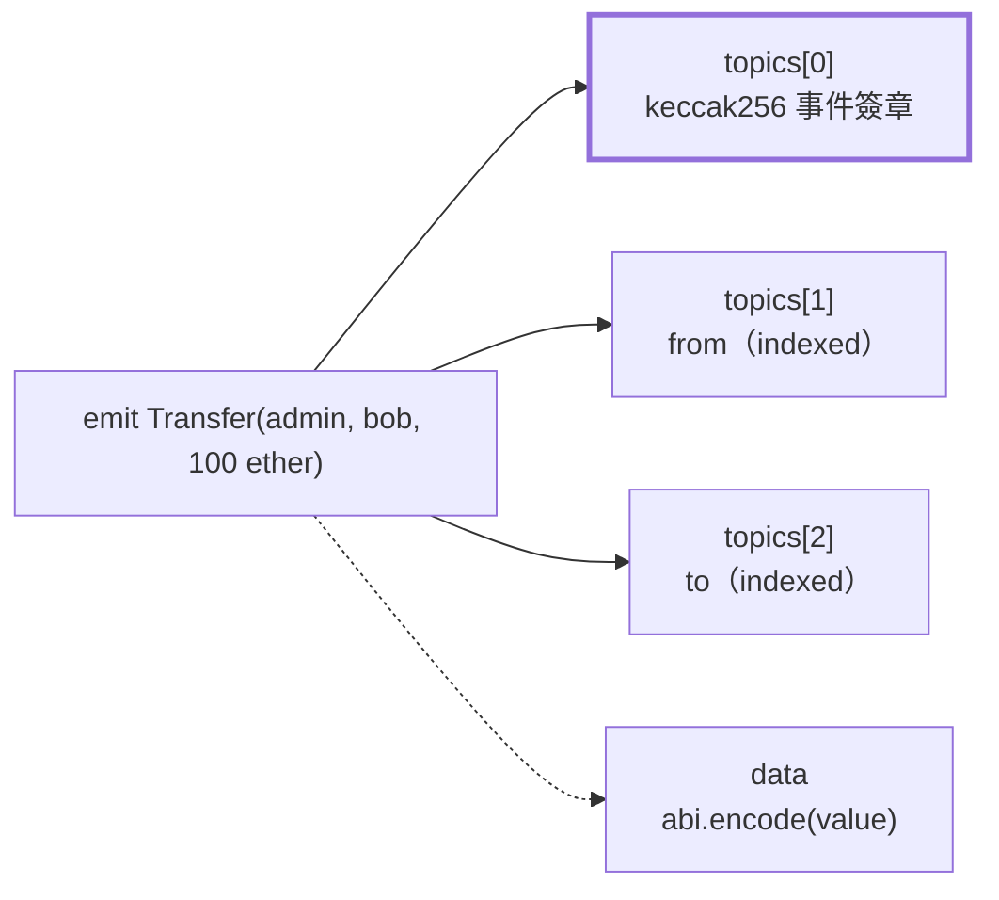
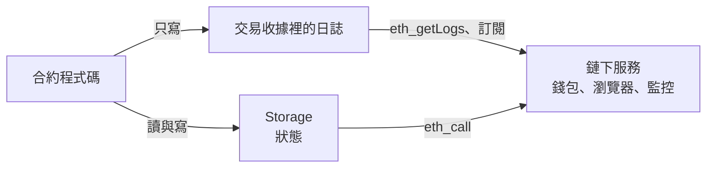

昨天最後留下一個缺口：`hasRole` 只能回答「這個地址有沒有這個角色」，列不出「這個角色有哪些地址」，答案藏在 `RoleGranted` 與 `RoleRevoked` 這兩個事件裡。今天就從事件本身講起：它存在哪裡、怎麼被查詢、要付多少錢，以及它不能拿來做什麼。

先收掉昨天的練習與思考題。

練習二把 `Ownable` 換成 `Ownable2Step` 之後，建構子仍然呼叫 `Ownable(initialOwner)`，原因是 `Ownable2Step` 本身是 `abstract contract Ownable2Step is Ownable`，沒有自己的建構子，擁有者仍然由父合約初始化。轉移給 `0xdead` 之後，`owner()` 還是 alice，`0xdead` 只是被記在 `pendingOwner()`，永遠等不到它來呼叫 `acceptOwnership()`。

練習三換成 `AccessControlDefaultAdminRules` 之後，建構子要多傳兩個參數：`AccessControlDefaultAdminRules(3 days, admin)`，第一個是轉移頂層管理者時要等待的延遲。這裡有個容易踩到的地方：父合約的建構子已經把 `DEFAULT_ADMIN_ROLE` 授予 `admin`，如果保留我們自己那行 `_grantRole(DEFAULT_ADMIN_ROLE, admin)`，部署會直接 revert `AccessControlEnforcedDefaultAdminRules()`，因為這個擴充規定同一時間只能有一個預設管理者。部署之後呼叫 `grantRole(DEFAULT_ADMIN_ROLE, bob)` 也是同一個錯誤，頂層的轉移只能走 `beginDefaultAdminTransfer` 加 `acceptDefaultAdminTransfer` 兩步。

思考題問的是：代幣暫停中，唯一的 `DEFAULT_ADMIN_ROLE` 私鑰遺失了，會發生什麼事。答案是代幣永久凍結。轉帳、鑄造、銷毀都會 revert `EnforcedPause()`，只有 `approve` 還能用，而合約裡沒有任何一條路徑能在沒有 `DEFAULT_ADMIN_ROLE` 的情況下呼叫 `unpause`。要在「暫停與恢復交給不同角色」的前提下避免這件事，關鍵不是把恢復權限下放，而是讓頂層管理者不會因為一把鑰匙遺失就消失：把 `DEFAULT_ADMIN_ROLE` 交給 Day 24 的 Safe 多簽，遺失一個簽署者的私鑰還能由其他人換掉它。另一種做法是讓暫停有最長期限，到期自動恢復，代價是事故還沒修好時保護也會跟著到期，財庫在 Day 33 會再回到這個取捨。

## 1. 從 Web2 的 audit log 說起

Web2 後端有好幾種「發生過什麼事」的紀錄：application log 寫進 ELK 或 CloudWatch，重要的操作另外寫一張 audit log 資料表，要讓其他服務知道狀態變了，就發一則訊息到 Kafka 或 RabbitMQ。這些紀錄有一個共同點：它們是**狀態以外**的資料，主程式的業務邏輯不會回頭讀它們，它們是給人和其他系統看的。

合約的事件扮演的就是這個角色，而且一次身兼三職：

| 用途            | Web2 的做法                      | 合約的做法                                 |
|:----------------|:---------------------------------|:-------------------------------------------|
| 稽核紀錄        | audit log 資料表，DBA 刪得掉      | 事件，跟著區塊一起被所有節點保存，無法刪改 |
| 通知其他系統    | 發訊息到 message queue            | 鏈下服務訂閱事件                           |
| 查詢歷史        | 對資料庫下 `WHERE` 條件           | 用 `eth_getLogs` 依合約地址與 topic 篩選    |
| 主程式能不能讀  | 可以，但通常不這麼做               | **不能**，合約完全讀不到事件               |

最後一列是和 Web2 最大的差別，第 5 節會專門談。先看一個事件在鏈上長什麼樣子。

## 2. 拆開一筆 Transfer

ERC-20 的 `Transfer` 事件定義在 `IERC20` 裡：

```solidity
// lib/openzeppelin-contracts/contracts/token/ERC20/IERC20.sol（節錄）
event Transfer(address indexed from, address indexed to, uint256 value);
```

每次 `_update` 改動餘額，最後都會 `emit Transfer(from, to, value)`。編譯之後，`emit` 會變成 EVM 的 `LOG` 系列 opcode：`LOG0` 到 `LOG4`，數字代表這筆日誌帶幾個 topic。一筆日誌只有三個部分：

- **address**：發出事件的合約地址，由 EVM 自動填入，合約無法偽造。
- **topics**：最多四個 32 bytes 的值，是可以被篩選的欄位。
- **data**：任意長度的 bytes，用 ABI 編碼存放沒有 `indexed` 的參數，不能被篩選。

`topics[0]` 固定是事件簽章的 keccak256 雜湊，`keccak256("Transfer(address,address,uint256)")`，也就是 `0xddf252ad…`。所有 ERC-20 代幣的 `Transfer` 都是這個值，這就是錢包和區塊瀏覽器能辨認任何代幣轉帳的原因。之後的 topic 依序放 `indexed` 參數，剩下的參數編碼進 data。



實線指向的三個 topic 都能當查詢條件，粗框的 `topics[0]` 決定這是哪一種事件；虛線指向的 data 只能在取回之後解碼，不能拿來篩選。

用 Foundry 的 `vm.recordLogs` 把這筆日誌錄下來，逐欄驗證：

```solidity
// test/TreasuryTokenEvents.t.sol（節錄）
function testTransferLogLayout() public {
    vm.recordLogs();
    vm.prank(admin);
    token.transfer(bob, 100 ether);

    Vm.Log[] memory logs = vm.getRecordedLogs();
    assertEq(logs.length, 1);
    assertEq(logs[0].emitter, address(token));
    assertEq(logs[0].topics.length, 3);
    assertEq(logs[0].topics[0], keccak256("Transfer(address,address,uint256)"));
    assertEq(logs[0].topics[0], IERC20.Transfer.selector);
    assertEq(logs[0].topics[1], bytes32(uint256(uint160(admin))));
    assertEq(logs[0].topics[2], bytes32(uint256(uint160(bob))));
    assertEq(logs[0].data, abi.encode(100 ether));
}
```

這段和後面幾段標著「節錄」的測試，都屬於第 6 節的完整測試檔 `TreasuryTokenEvents.t.sol`。單獨貼進其他測試檔時，要記得補上 `import {Test, Vm} from "forge-std/Test.sol";` 與 `import {IERC20} from "@openzeppelin/contracts/token/ERC20/IERC20.sol";`，否則 `Vm.Log` 和 `IERC20.Transfer` 會找不到。

兩點值得注意。地址只有 20 bytes，放進 topic 時會在左邊補零到 32 bytes，所以斷言要先轉成 `uint160` 再轉成 `bytes32`。`IERC20.Transfer.selector` 是 0.8.15 之後可以直接取用的事件選擇子，它就等於 `topics[0]`，不必自己寫簽章字串，也不會因為打錯一個空白而算出不同的雜湊。

## 3. indexed：哪些參數該變成 topic

`indexed` 的作用是把參數放進 topic，讓節點能用它篩選。它有幾條規則：

- 一個事件最多三個 `indexed` 參數，因為 `topics[0]` 已經被事件簽章佔走。宣告成 `anonymous` 的事件不放簽章，可以有四個，代價是無法用簽章辨認事件種類，實務上很少用。
- 值型別（`address`、`uint256`、`bytes32`、`bool`）直接放進 topic，取回後可以還原。
- 動態型別（`string`、`bytes`、陣列、struct）放進 topic 的是它的 **keccak256 雜湊**，原始值不會出現在日誌裡。拿它查詢「名稱等於某字串的事件」可以，想從日誌讀回那個字串則不行。需要兩者兼得時，常見的做法是同一個值在 data 裡再放一份。
- topic 只能做相等比對。可以查「轉給 bob 的所有轉帳」，不能查「金額大於一百萬的轉帳」，範圍條件只能取回之後在鏈下過濾。

所以判斷一個參數要不要 `indexed`，問的是「會不會有人想用它當 `WHERE` 條件」。`Transfer` 的 `from`、`to` 是典型的查詢條件（某個錢包的轉帳紀錄），`value` 則不是，放在 data 裡就好。

OpenZeppelin 自己的事件也不是每個參數都 `indexed`。`AccessControl` 的 `RoleGranted(bytes32 indexed role, address indexed account, address indexed sender)` 三個都是 topic，因為「某個角色的所有授予紀錄」和「某個地址拿過哪些角色」都是常見的查詢；`Pausable` 的 `Paused(address account)` 則一個都沒有，觸發暫停的地址放在 data 裡：

```solidity
// test/TreasuryTokenEvents.t.sol（節錄）
function testPausedAccountIsInData() public {
    vm.recordLogs();
    vm.prank(pauser);
    token.pause();

    Vm.Log[] memory logs = vm.getRecordedLogs();
    assertEq(logs.length, 1);
    assertEq(logs[0].topics.length, 1);
    assertEq(logs[0].topics[0], keccak256("Paused(address)"));
    assertEq(logs[0].data, abi.encode(pauser));
}
```

這個設計合理：一個代幣合約的暫停事件本來就少，篩選條件只要「這個合約的 `Paused`」就夠了，用不到「依暫停者篩選」。

### 節點怎麼找到符合條件的日誌

Web2 的資料庫靠索引加速 `WHERE`，以太坊節點靠的是區塊標頭裡的 **logs bloom**：一個 2048 bits 的 Bloom filter，把這個區塊所有日誌的合約地址與每一個 topic 都加進去。查詢時先用 bloom 判斷「這個區塊可能有」或「一定沒有」，一定沒有的區塊直接跳過，可能有的才去讀交易收據逐筆比對。Bloom filter 會有誤判但不會漏判，所以結果永遠正確，只是有時多讀幾個區塊。

data 不會被加進 bloom，這是「data 不能篩選」在實作層的原因。

## 4. 事件的成本

事件的 Gas 公式在黃皮書裡寫得很清楚：

```text
LOG 的 Gas = 375 + 375 × topic 數 + 8 × data 位元組數 + 記憶體擴張成本
```

對照 Day 04 的數字：寫一個全新的 Storage slot 是 20,000 Gas，加上冷存取的 2,100 就是 22,100。一筆三個 topic、32 bytes data 的事件是 375 + 1,125 + 256 = 1,756 Gas，不到一個 slot 的十分之一。

便宜的原因是事件不進入狀態。Storage 是每個節點都要隨時能讀、會一直留在狀態樹裡的資料；日誌存在交易收據裡，只有收據的雜湊進入區塊標頭，執行合約時完全不需要它。這也直接決定了下一節的限制。

## 5. 事件不是 Storage：合約讀不到自己的事件

EVM 裡沒有任何一個 opcode 能讀日誌，不論是自己發出的還是別的合約發出的。`LOG` 是只寫不讀的。資料流的方向是單向的：



合約和 Storage 之間是雙向的，和日誌之間只有寫入一個方向；日誌唯一的讀者在鏈下。

這帶來兩條設計規則。

第一，**業務邏輯需要的資料一定要存在 Storage**。只發事件不存狀態，等於寫了一筆合約自己永遠看不到的紀錄。昨天 `hasRole` 能運作，是因為角色存在 `_roles` mapping 裡；事件只是同一件事的通知。

第二，**事件要和狀態變化一一對應**。鏈下系統是靠重播事件來重建狀態的，所以「狀態變了卻沒發事件」和「發了事件狀態卻沒變」都會讓鏈下的資料出錯。OpenZeppelin 在這點上很嚴格，`_grantRole` 只在地址原本沒有該角色時才發 `RoleGranted`，重複授予不會留下紀錄：

```solidity
// test/TreasuryTokenEvents.t.sol（節錄）
function testGrantingExistingRoleEmitsNothing() public {
    bytes32 minterRole = token.MINTER_ROLE();

    vm.recordLogs();
    vm.prank(admin);
    token.grantRole(minterRole, minter);

    assertEq(vm.getRecordedLogs().length, 0);
}
```

另外有一個 Web2 沒有的現象：交易 revert 時，它發出的事件會跟著狀態一起消失。Day 06 提過 `ERC20Capped` 的上限檢查在 `super._update` 之後，也就是 `Transfer` 已經 `emit` 了才 revert，但這筆 `Transfer` 不會出現在鏈上。這一點用 `vm.recordLogs` 驗證不了，Foundry 的錄製會把被 revert 的呼叫框裡的事件也記下來，和真實節點的行為不同；要在 anvil 上送一筆真正失敗的交易才看得到，第 7 節會實際做一次。

## 6. 替 TreasuryToken 補上 Minted 事件

回頭看 `TreasuryToken` 目前會發出的事件：`Transfer`、`Approval`、`Paused`、`Unpaused`、`RoleGranted`、`RoleRevoked`、`RoleAdminChanged`，全部來自 OpenZeppelin。看起來夠用了，但用機構稽核的角度問一個問題：**這筆增發是誰按的？**

鑄造時 `_mint` 發出的是 `Transfer(address(0), to, amount)`。從零地址轉出代表這是一筆鑄造，收款人和金額都有，偏偏沒有呼叫者。鏈下能從交易本身拿到 `from`，但那是送出交易的外部帳戶，不一定是呼叫 `mint` 的地址：Day 24 之後持有 `MINTER_ROLE` 的會是 Safe 多簽合約，交易的 `from` 是最後按下執行的那位簽署者，真正的 `msg.sender` 是 Safe。要從交易還原內部呼叫，得用節點的 trace API，多數公開節點不提供，也很昂貴。

所以這個資訊要由合約自己寫進事件：

```solidity
// src/TreasuryToken.sol（節錄，其餘與 Day 07 相同）
contract TreasuryToken is ERC20, ERC20Burnable, ERC20Capped, ERC20Pausable, AccessControl {
    bytes32 public constant MINTER_ROLE = keccak256("MINTER_ROLE");
    bytes32 public constant PAUSER_ROLE = keccak256("PAUSER_ROLE");

    event Minted(address indexed minter, address indexed to, uint256 amount);

    error TreasuryTokenTransferToTokenContract();
    error TreasuryTokenInvalidAdmin();

    // constructor 不變

    function mint(address to, uint256 amount) external onlyRole(MINTER_ROLE) {
        _mint(to, amount);
        emit Minted(msg.sender, to, amount);
    }

    // pause、unpause、_update 不變
}
```

設計上的幾個決定：

- **`minter`、`to` 用 `indexed`，`amount` 不用。** 稽核時會問「這個鑄造者做過哪些鑄造」「這個地址收過哪些增發」，金額則沒有人會拿來做相等比對。
- **事件放在 `_mint` 之後。** 順序上 `Transfer` 先、`Minted` 後，鏈下讀到 `Minted` 時，同一筆交易的餘額變化已經發生。萬一 `_mint` 因為上限 revert，兩個事件一起消失，不會留下「記了鑄造但沒有鑄造」的紀錄。
- **不在事件名稱加 `TreasuryToken` 前綴。** custom error 加前綴是為了避免 revert 資料和其他合約的錯誤混淆；事件已經由 `address` 欄位標明來源合約，OpenZeppelin 的 `Transfer`、`Paused` 也都沒有前綴。
- **建構子不變。** Day 18、28 沿用的三參數建構子不受影響。

成本用和昨天相同的條件量（鑄造與轉帳給新地址）：

| 呼叫                  | Day 07 版本  | 加上 Minted  | 差距    |
|:----------------------|-------------:|-------------:|--------:|
| `mint`                |       57,053 |       59,002 |  +1,949 |
| `transfer`            |       54,610 |       54,610 |       0 |
| Runtime bytecode 大小 |  7,025 bytes |  7,126 bytes | +101 bytes |

多出的 1,949 Gas 裡，1,756 是 `LOG3` 本身，其餘是把參數寫進記憶體與取 `msg.sender` 的開銷。如果改用 Storage 記錄同樣的資訊，兩個地址加一個金額至少要三個新 slot，超過六萬 Gas，而且合約自己根本用不到這份資料。`transfer` 完全不受影響，事件只加在 `mint` 這條路徑上。

測試用 `vm.expectEmit` 斷言兩個事件和它們的順序：

```solidity
// test/TreasuryTokenEvents.t.sol（節錄）
function testMintEmitsTransferThenMinted() public {
    vm.expectEmit(address(token));
    emit IERC20.Transfer(address(0), bob, 100 ether);
    vm.expectEmit(address(token));
    emit TreasuryToken.Minted(minter, bob, 100 ether);

    vm.prank(minter);
    token.mint(bob, 100 ether);
}
```

`vm.expectEmit(address(token))` 會比對所有 topic、data 與發出事件的合約地址。Day 06 用的是 `vm.expectEmit(true, true, false, true, address(token))` 這種舊寫法，四個布林值分別代表要不要比對第一到第三個 indexed 參數與 data；全部都要比對時，只傳地址的版本比較不容易寫錯。`emit IERC20.Transfer(...)` 這種「帶合約名稱的 emit」讓測試合約不必再自己重宣告一次事件。這個語法在 0.8.21 加入，但 0.8.21 在替這類合約產生 NatSpec 時會發生編譯器內部錯誤，實測 `forge test` 會直接失敗，0.8.22 才修正。

完整的測試檔：

```solidity
// test/TreasuryTokenEvents.t.sol
// SPDX-License-Identifier: MIT
pragma solidity ^0.8.22;

import {Test, Vm} from "forge-std/Test.sol";
import {IERC20} from "@openzeppelin/contracts/token/ERC20/IERC20.sol";
import {IAccessControl} from "@openzeppelin/contracts/access/IAccessControl.sol";
import {TreasuryToken} from "../src/TreasuryToken.sol";

contract TreasuryTokenEventsTest is Test {
    TreasuryToken private token;
    address private admin = makeAddr("admin");
    address private minter = makeAddr("minter");
    address private pauser = makeAddr("pauser");
    address private bob = makeAddr("bob");

    function setUp() public {
        token = new TreasuryToken(1_000_000 ether, 10_000_000 ether, admin);

        vm.startPrank(admin);
        token.grantRole(token.MINTER_ROLE(), minter);
        token.grantRole(token.PAUSER_ROLE(), pauser);
        vm.stopPrank();
    }

    // 一筆 Transfer 在日誌裡的樣子：三個 topic 加一段 data
    function testTransferLogLayout() public {
        vm.recordLogs();
        vm.prank(admin);
        token.transfer(bob, 100 ether);

        Vm.Log[] memory logs = vm.getRecordedLogs();
        assertEq(logs.length, 1);
        assertEq(logs[0].emitter, address(token));
        assertEq(logs[0].topics.length, 3);
        assertEq(logs[0].topics[0], keccak256("Transfer(address,address,uint256)"));
        assertEq(logs[0].topics[0], IERC20.Transfer.selector);
        assertEq(logs[0].topics[1], bytes32(uint256(uint160(admin))));
        assertEq(logs[0].topics[2], bytes32(uint256(uint160(bob))));
        assertEq(logs[0].data, abi.encode(100 ether));
    }

    // Transfer 記下餘額怎麼變，Minted 記下是誰按的
    function testMintEmitsTransferThenMinted() public {
        vm.expectEmit(address(token));
        emit IERC20.Transfer(address(0), bob, 100 ether);
        vm.expectEmit(address(token));
        emit TreasuryToken.Minted(minter, bob, 100 ether);

        vm.prank(minter);
        token.mint(bob, 100 ether);
    }

    function testRoleGrantedRecordsWhoGranted() public {
        bytes32 minterRole = token.MINTER_ROLE();

        vm.expectEmit(address(token));
        emit IAccessControl.RoleGranted(minterRole, bob, admin);

        vm.prank(admin);
        token.grantRole(minterRole, bob);
    }

    // 狀態沒變就沒有事件：重複授予同一個角色不會留下紀錄
    function testGrantingExistingRoleEmitsNothing() public {
        bytes32 minterRole = token.MINTER_ROLE();

        vm.recordLogs();
        vm.prank(admin);
        token.grantRole(minterRole, minter);

        assertEq(vm.getRecordedLogs().length, 0);
    }

    // Paused 的參數沒有 indexed：只有一個 topic，地址放在 data
    function testPausedAccountIsInData() public {
        vm.recordLogs();
        vm.prank(pauser);
        token.pause();

        Vm.Log[] memory logs = vm.getRecordedLogs();
        assertEq(logs.length, 1);
        assertEq(logs[0].topics.length, 1);
        assertEq(logs[0].topics[0], keccak256("Paused(address)"));
        assertEq(logs[0].data, abi.encode(pauser));
    }
}
```

`pragma` 寫 `^0.8.22`，原因就是上面那個編譯器錯誤。五個測試加上前幾天的二十五個，五個檔案共三十個測試，`forge test` 全部通過（Forge 1.8.3、solc 0.8.37、OpenZeppelin v5.6.1）。

## 7. 在 anvil 上從事件重建角色成員

測試裡看的是單筆交易，鏈下系統面對的則是整條鏈的歷史。現在把合約部署到本機的 anvil，送幾筆交易，再用 `cast logs` 從事件回答昨天那個問題：`MINTER_ROLE` 現在有哪些成員。

先開一個終端機執行 `anvil`，它會列出十個預先充值的測試帳戶。另一個終端機部署合約，管理者用 anvil 的第一個帳戶：

```bash
export RPC=http://127.0.0.1:8545
export ADMIN_KEY=0xac0974bec39a17e36ba4a6b4d238ff944bacb478cbed5efcae784d7bf4f2ff80
export ADMIN=0xf39Fd6e51aad88F6F4ce6aB8827279cffFb92266

forge create src/TreasuryToken.sol:TreasuryToken \
  --rpc-url $RPC --private-key $ADMIN_KEY --broadcast \
  --constructor-args 1000000ether 10000000ether $ADMIN
```

anvil 第一個帳戶部署的第一個合約，地址固定是 `0x5FbDB2315678afecb367f032d93F642f64180aa3`。部署本身在區塊 1，接著依序送出五筆角色變更：

```bash
export TOKEN=0x5FbDB2315678afecb367f032d93F642f64180aa3
export MINTER=0x70997970C51812dc3A010C7d01b50e0d17dc79C8
export PAUSER=0x3C44CdDdB6a900fa2b585dd299e03d12FA4293BC
export TEMP=0x90F79bf6EB2c4f870365E785982E1f101E93b906
export MINTER_ROLE=$(cast keccak "MINTER_ROLE")
export PAUSER_ROLE=$(cast keccak "PAUSER_ROLE")

cast send $TOKEN "grantRole(bytes32,address)" $MINTER_ROLE $MINTER --rpc-url $RPC --private-key $ADMIN_KEY  # 區塊 2
cast send $TOKEN "grantRole(bytes32,address)" $PAUSER_ROLE $PAUSER --rpc-url $RPC --private-key $ADMIN_KEY  # 區塊 3
cast send $TOKEN "grantRole(bytes32,address)" $MINTER_ROLE $TEMP --rpc-url $RPC --private-key $ADMIN_KEY    # 區塊 4
cast send $TOKEN "revokeRole(bytes32,address)" $MINTER_ROLE $TEMP --rpc-url $RPC --private-key $ADMIN_KEY   # 區塊 5
cast send $TOKEN "grantRole(bytes32,address)" $PAUSER_ROLE $MINTER --rpc-url $RPC --private-key $ADMIN_KEY  # 區塊 6
```

查詢 `MINTER_ROLE` 的授予紀錄。`cast logs` 收事件簽章與各個 topic 的值，簽章後面的第一個值對應 `topics[1]`，也就是 `role`：

```bash
cast logs --rpc-url $RPC --from-block 0 --address $TOKEN \
  "RoleGranted(bytes32 indexed role, address indexed account, address indexed sender)" $MINTER_ROLE
```

```text
- address: 0x5FbDB2315678afecb367f032d93F642f64180aa3
  blockNumber: 2
  data: 0x
  logIndex: 0
  removed: false
  topics: [
  	0x2f8788117e7eff1d82e926ec794901d17c78024a50270940304540a733656f0d
  	0x9f2df0fed2c77648de5860a4cc508cd0818c85b8b8a1ab4ceeef8d981c8956a6
  	0x00000000000000000000000070997970c51812dc3a010c7d01b50e0d17dc79c8
  	0x000000000000000000000000f39fd6e51aad88f6f4ce6ab8827279cfffb92266
  ]
- address: 0x5FbDB2315678afecb367f032d93F642f64180aa3
  blockNumber: 4
  ...
```

（`blockHash`、`transactionHash` 等欄位省略。）三個參數都是 `indexed`，所以 `data` 是空的，`topics[1]` 是角色、`topics[2]` 是被授予的地址、`topics[3]` 是授予者。同樣的指令把簽章換成 `RoleRevoked(...)`，會得到區塊 5 撤銷 `TEMP` 的那一筆。

把兩份結果依 `(blockNumber, logIndex)` 排序後依序重播：

| 區塊 | 事件          | 地址   | 重播後的成員       |
|-----:|:--------------|:-------|:-------------------|
|    2 | `RoleGranted` | MINTER | MINTER             |
|    4 | `RoleGranted` | TEMP   | MINTER、TEMP       |
|    5 | `RoleRevoked` | TEMP   | MINTER             |

`MINTER_ROLE` 目前只有 `MINTER` 一個成員，可以用 `cast call $TOKEN "hasRole(bytes32,address)(bool)" $MINTER_ROLE $TEMP --rpc-url $RPC` 確認 `TEMP` 回傳 `false`。這個重播之所以正確，靠的是第 5 節那條規則：每一次狀態變化恰好對應一個事件，重複授予不會多出紀錄。

反過來查「某個地址拿過哪些角色」，就把 `topics[1]` 留空、改填 `topics[2]`：

```bash
cast logs --rpc-url $RPC --from-block 0 --address $TOKEN \
  "RoleGranted(bytes32 indexed role, address indexed account, address indexed sender)" "" $MINTER
```

結果是區塊 2 的 `MINTER_ROLE`（`0x9f2d…`）與區塊 6 的 `PAUSER_ROLE`（`0x65d7…`）。空字串代表這個位置不設條件，這就是 `eth_getLogs` 的篩選語意：同一個位置可以給多個值做 OR，不同位置之間是 AND。

### 失敗的交易不留事件

最後驗證第 5 節留下的那件事。先正常鑄造一次，再讓 `MINTER` 鑄造一筆會超過上限的數量。`cast send` 預設會先估算 Gas，估算時就發現會 revert 而不送出，所以用 `--gas-limit` 強制把交易送上鏈：

```bash
export MINTER_KEY=0x59c6995e998f97a5a0044966f0945389dc9e86dae88c7a8412f4603b6b78690d
export BOB=0x15d34AAf54267DB7D7c367839AAf71A00a2C6A65

cast send $TOKEN "mint(address,uint256)" $BOB 100ether --rpc-url $RPC --private-key $MINTER_KEY
cast send $TOKEN "mint(address,uint256)" $BOB 9000000ether --rpc-url $RPC --private-key $MINTER_KEY --gas-limit 200000
```

第一筆的收據 `status` 是 `1`，`logs` 有兩筆：`topics[0]` 為 `0xddf252ad…` 的 `Transfer`，以及 `0x9d228d69…` 的 `Minted`，後者的 `topics[1]` 是 `MINTER` 的地址。第二筆的收據 `status` 是 `0`，`gasUsed` 是 40,179，`logs` 是空陣列。執行過程中 `_mint` 確實發出過 `Transfer`，但 revert 之後它和餘額變化一起被丟棄，Gas 照樣要付。

收據裡還有一個欄位值得留意：每筆日誌都帶著 `removed: false`。在真實網路上，區塊可能因為重組（reorg）被換掉，訂閱事件的服務會收到同一筆日誌 `removed: true` 的通知。Web2 的 message queue 送出的訊息不會被收回，鏈上的事件在區塊最終確定之前則可能被收回，Day 35 的鏈下監控要處理這件事。

## 8. 事件設計的檢查清單

把今天的內容收斂成設計事件時要問的幾個問題，Day 34–35 的財庫監控會照這份清單設計事件：

- **每一個改變狀態的對外函式，是否都發了事件？** 鏈下系統只看得到事件，沒有事件的狀態變化對監控來說等於沒發生。
- **事件是否和狀態變化一一對應？** 狀態沒變就不發，revert 的路徑不會留下事件。
- **是否記錄了「誰做的」？** 交易的 `from` 不一定是 `msg.sender`，經過多簽或其他合約時尤其如此。
- **`indexed` 是否給了會被當查詢條件的參數？** 地址、ID、角色通常是；金額、時間戳通常不是。動態型別放進 topic 只剩雜湊。
- **合約邏輯需要的資料有沒有存在 Storage？** 事件只寫不讀，不能拿來做判斷。

---

## 今日練習

1. 在 `TreasuryToken` 加上 `Minted` 事件，把 `TreasuryTokenEvents.t.sol` 放進專案，執行 `forge test` 確認三十個測試全部通過。
2. 照第 7 節在 anvil 上重播一次，最後多送一筆 `grantRole(MINTER_ROLE, MINTER)`（重複授予），確認 `cast logs` 的結果沒有多出一筆，`cast receipt` 看到的收據 `logs` 是空的。
3. 假設要替 `burn` 加一個事件記錄銷毀者，先用第 4 節的公式算出它的 `LOG` 成本，再用 `forge test --gas-report` 比較加事件前後 `burn` 的 Gas，看差距有多少來自 `LOG` 以外的開銷。

## 今日思考題

Day 32 的財庫要限制每日轉出上限。**每一筆轉出都會發出事件，能不能讓合約加總「今天的轉出事件」來判斷是否超過上限？如果不行，合約需要在 Storage 裡記什麼，才能用最少的寫入次數做出這個判斷？**

---

*這是 45 天技術轉型紀錄的 Day 08。事件是寫給鏈下看的紀錄，合約自己的判斷只能依賴 Storage。*

**在 Web2 系統裡用過 audit log 或 CDC 的話，有哪些做法可以直接搬來設計鏈上事件？歡迎在下方留言交流。**

---

明天 Day 09，我們從今天那筆 `status` 為 `0` 的交易出發：`require`、`revert`、`assert` 各自該用在哪裡，custom error 為什麼比錯誤字串省 Gas，以及 0.8 之後的溢位檢查如何變成一個 `Panic` revert。

## Reference

- [LOG0–LOG4 的 Gas 成本（375 基本、每個 topic 375、每 byte data 8）與 logs bloom 的定義 — Ethereum Yellow Paper](https://ethereum.github.io/yellowpaper/paper.pdf)
- [事件的 indexed 參數上限、anonymous 事件、動態型別存放 keccak256 雜湊的規則，以及事件選擇子 .selector — Solidity Documentation, Events](https://docs.soliditylang.org/en/latest/contracts.html#events)
- [事件在 ABI 中的編碼方式：topics[0] 為事件簽章雜湊，非 indexed 參數以 ABI 編碼放入 data — Solidity Documentation, Contract ABI Specification, Events](https://docs.soliditylang.org/en/latest/abi-spec.html#events)
- [可透過合約或介面名稱 emit 事件的版本說明 — Solidity v0.8.21 Release Announcement](https://soliditylang.org/blog/2023/07/19/solidity-0.8.21-release-announcement/)
- [0.8.22 修正「emit 外部合約事件時產生 NatSpec 的內部錯誤」 — Solidity Changelog](https://github.com/ethereum/solidity/blob/develop/Changelog.md)
- [eth_getLogs 的篩選參數：address、topics 的位置比對、OR 與 null 萬用字元 — Ethereum JSON-RPC API](https://ethereum.org/en/developers/docs/apis/json-rpc/#eth_getlogs)
- [RoleGranted、RoleRevoked、RoleAdminChanged 三個 indexed 參數的定義 — OpenZeppelin Contracts v5.6.1, IAccessControl.sol](https://github.com/OpenZeppelin/openzeppelin-contracts/blob/v5.6.1/contracts/access/IAccessControl.sol)
- [_grantRole 只在角色尚未授予時發出 RoleGranted 的實作 — OpenZeppelin Contracts v5.6.1, AccessControl.sol](https://github.com/OpenZeppelin/openzeppelin-contracts/blob/v5.6.1/contracts/access/AccessControl.sol)
- [Paused 與 Unpaused 事件的參數未設 indexed — OpenZeppelin Contracts v5.6.1, Pausable.sol](https://github.com/OpenZeppelin/openzeppelin-contracts/blob/v5.6.1/contracts/utils/Pausable.sol)
- [AccessControlDefaultAdminRules 的建構子參數與 AccessControlEnforcedDefaultAdminRules 的觸發條件 — OpenZeppelin Contracts v5.6.1, AccessControlDefaultAdminRules.sol](https://github.com/OpenZeppelin/openzeppelin-contracts/blob/v5.6.1/contracts/access/extensions/AccessControlDefaultAdminRules.sol)
- [vm.recordLogs、vm.getRecordedLogs 與 Vm.Log 結構 — Foundry Book, Cheatcodes: recordLogs](https://getfoundry.sh/reference/cheatcodes/record-logs)
- [vm.expectEmit 各種多載與比對規則 — Foundry Book, Cheatcodes: expectEmit](https://getfoundry.sh/reference/cheatcodes/expect-emit)
- [cast logs 的參數與 topic 篩選用法 — Foundry Book, cast logs](https://getfoundry.sh/cast/reference/logs)
