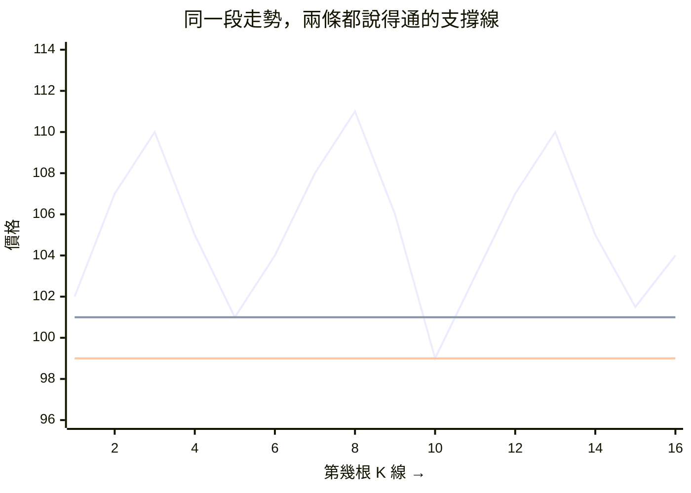
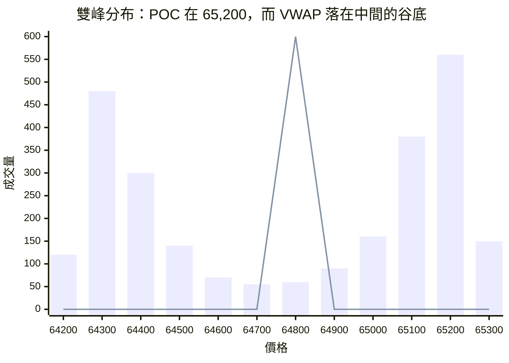
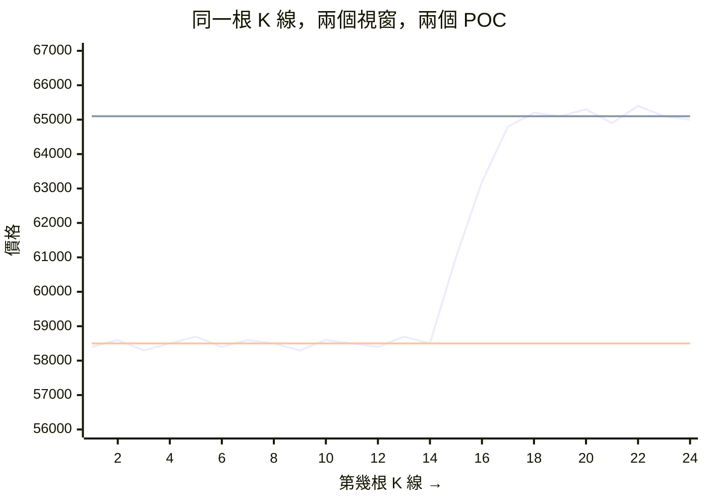
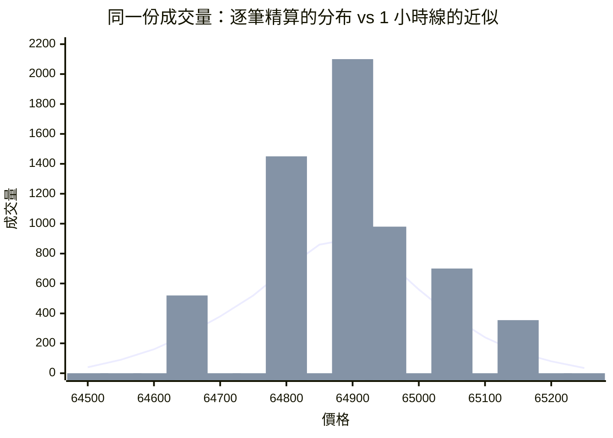

## 換一個軸來看成交量

Day 13 用的是「前 20 根最高價」——時間軸上的極值。它有一個很實際的問題：那個價位是**一根 K 線的高點**，也就是某一個瞬間曾經觸及的價格。價格在那裡待了 0.1 秒還是待了兩個小時，前高完全看不出來。

而「支撐壓力」這件事在意的正是後者。一個價位之所以擋得住價格，不是因為曾經有人在那裡成交過一次，是因為**有很多人在那裡成交**。那些人現在手上有部位，而部位會影響他們的行為。

所以換一個軸來看。到目前為止所有東西的 x 軸都是時間：K 線圖、均線、RSI、OBI，全部都是「時間 → 值」。今天把成交量放在**價格軸**上問一個不同的問題：

> 在 64,500 這個價位上總共成交了多少？65,000 呢？

答案是一張分布，而它的形狀就是籌碼分布。成交量堆積最多的價格是多數人的成本區，那裡自然形成支撐或壓力，而它不需要任何人手畫線。

這是這個階段第三次換軸，值得把三次排在一起看：Day 11 的 VWAP 用成交量當權重，等於把時間軸換成成交量軸；Day 12 的鐘點基準把時間軸摺成 24 格，問「這個時段該有的樣子」；今天乾脆把時間軸整個丟掉，只留價格。每一次換軸都讓一些資訊消失、另一些浮出來——Volume Profile 完全看不出「這些成交是昨天還是上個月發生的」，但它是唯一看得出「價格在哪些位置待得久」的視角。

今天要做兩件事。第一是實作這張分布與從它推導出的關鍵價位。第二件比較有意思：**Day 09 那條逐筆成交的路徑今天第一次真的被用來算特徵**，所以可以直接量「用 K 線近似」跟「用 tick 精算」差多少。這個問題的答案不是「當然要用 tick」，實測結果比那個有趣。

## 交易概念補課

### 支撐與壓力：主觀畫線的問題

「支撐」指價格跌到某個價位附近就停下來、往回走的傾向；「壓力」是反過來，漲到某個價位就上不去。

傳統畫法是在圖上找幾個轉折點，用直尺連起來。這個做法有一個工程上很難接受的性質：**它是主觀的**。同一張圖，十個人畫出十組線，而且沒有辦法驗證誰畫得對。

一段有三次低點的走勢就足以看出這件事：



橫軸一格是一根 K 線，跟 Day 13 一樣把每根簡化成一個價位、用折線串起來。三次低點分別落在第 5 根的 101、第 10 根的 99、第 15 根的 101.5，而兩條水平線是兩種都說得通的畫法：上面那條畫在 101，理由是三次低點有兩次貼著 101，第 10 根那次是插針、不該當基準；下面那條畫在 99，理由是支撐線要涵蓋所有低點，跌破了才算破。

兩條都不算畫錯，而它們在第 10 根給出的訊號剛好相反：以 101 那條看，價格已經跌破支撐；以 99 那條看，支撐守住了。

更麻煩的是它沒有辦法被否證。一條畫錯的支撐線，事後可以說「那是被跌破了」，也可以說「那條線本來就該畫在下面一點」，兩種說法都無法檢驗。任何無法被否證的東西都不能拿來做決策評估——這不是對技術分析的批評，是對「主觀畫線」這個方法的技術性判斷。

所以要把它寫成程式，第一步不是「教電腦畫線」，是換一個不需要主觀判斷的定義。

### 籌碼密集區與 POC

換掉的定義是這樣：如果某個價位上成交了特別多的量，代表有特別多人的成本落在那裡。這種價位叫**籌碼密集區**。

價格回到密集區附近時會發生兩件事，方向相反但都會產生阻力：

- 套在那裡的人（現在虧損）看到接近解套，有出場的動機。
- 在那裡賺到的人（現在獲利）看到接近成本，有保護獲利的動機。

兩邊都在那個價位附近有行動的理由，所以成交量會變大、價格容易停頓。

這個機制值得跟 Day 13 那句「價格傾向往流動性密集的區域移動」接起來看，因為兩者說的是同一件事的兩面。籌碼密集的地方，既是**阻力**（有人想在那裡出場），也是**流動性**（想出大單的人只有在那裡才找得到對手方）。所以價格既容易被那裡擋下來，也容易被吸引過去。這兩個聽起來矛盾的說法可以同時成立，因為它們描述的是同一群掛單的兩種角色。

要強調的是：這是對一群人處境的描述，不是預測。它說的是「那個價位附近有比較多的人有理由行動」，沒有說他們會往哪個方向動。

成交量最大的那一個價位叫 **POC（Point of Control）**。它是這張分布的眾數，也是「多數人的成本」最直接的近似。

### 一張分布，而不是一個平均

Day 11 講 VWAP 時提過一個限制：平均成本是一個統計上的重心，不是任何一個人的成本。真實的持倉分布可能是兩群人——一群買在 65,200，一群買在 64,300——而平均值落在中間那個沒什麼人成交的價位。

Volume Profile 正是那個缺口的補法。它不把分布壓成一個數字，它把整條分布留下來，所以看得出：

- 分布是**單峰**還是**雙峰**。雙峰代表市場在兩個區間各自待過一段時間，中間那段是快速通過的，那個中間帶很可能沒有支撐。
- 峰有多**尖**。尖峰代表成交高度集中在一個窄價帶，那個價位的參考價值高；平坦的分布代表成交散落在整個範圍，POC 就只是一個統計上的最大值，沒什麼結構意義。
- **哪一側比較厚**。POC 之上與之下的量不對稱，代表籌碼分布偏向某一邊。

把這三件事畫成一張分布，數字沿用上面那個例子：



橫軸是價格、縱軸是那個價位上總共成交了多少，時間軸在這張圖上完全不存在。兩個峰分別落在 64,300 與 65,200，而 65,200 那個比較高，所以 POC 是它。紅色那根尖峰不是成交量，它是 VWAP 的位置（64,785，用這張分布加權算出來的）：它落在兩群人之間，而那一桶只成交了 60，是整張圖上最空的一段。

中間那段空洞還有一層意思：價格是快速通過那裡的，所以它既不是支撐也不是壓力。如果之後價格從 65,200 往下走，比較可能停下來的是 64,300 那個峰，而不是中間的 64,785——但一個「回到平均成本就有支撐」的規則會把單子掛在後者。

這些形狀資訊在 VWAP 那個單一數字上完全看不到。用哪一個不是誰比較好的問題：要一個可以進策略、逐根都有值的量，用 VWAP；要理解一段行情的結構，看分布。

### 價值區間，以及那個 70% 是什麼

只有一個 POC 太粗，所以還要一個範圍：從 POC 往兩側擴張，直到涵蓋總成交量的某個比例（慣例是 70%），得到的範圍叫**價值區間（Value Area）**。

它的解讀是：這段區間內是市場「認可」的價格，區間之外是少數人的成交。價格在區間內震盪是常態，跑出區間則代表市場在重新定價。

70% 這個數字跟 RSI 的 14、超買的 70 一樣，是慣例不是定律。它的來源是「常態分布的一個標準差大約涵蓋 68%」這個粗略的類比，而市場的分布並不常態——前面幾天已經量過好幾次厚尾了。所以價值區間**不是**「70% 的機率會落在這裡」那種意義下的機率區間，它就是「涵蓋七成成交量的一段價格」，如此而已。

用它的理由跟 Day 11 用典型價、Day 06 用 14 週期一樣：這是通用的約定，算出來的數字跟別人的圖對得上。

### 籌碼會過期嗎：profile 的時間範圍是一個選擇

還有一個必須自己決定、而且沒有標準答案的東西：**這張分布要涵蓋多長的時間。**

一天的 profile 與一個月的 profile 是兩張很不一樣的圖，而它們背後是一個實質的假設：**三個月前成交的那些量，現在還算籌碼嗎？**

兩個方向都說得通。說算的理由是持倉可以放很久，那些人的成本沒有變。說不算的理由是市場結構會變，而且大部分部位早就換手了。實務上常見的處理有三種：固定區間（每天、每週重算一張）、滾動視窗（往前看固定長度），以及對舊成交打折的加權版本。

把兩種視窗放在同一段走勢上，這個選擇的後果就很具體：



前 14 根關在 58,300 到 58,700 這個窄帶裡，中間兩根快速拉上去，最後 8 根在 65,000 附近整理。兩條水平線都是 POC，差別只在視窗：只算最近 8 根，POC 是 65,100，價格就貼著它；把整段 24 根都算進來，舊區間的成交量壓倒性地多，POC 掉到 58,500。

於是最後那根 K 線的「距離 POC」從不到 1% 變成 +11%，而這個差別完全來自視窗長度，不是來自資料。這是為什麼視窗長度不能當成一個隨手填的參數：它決定這個特徵的量級。

這個系列今天用滾動視窗，理由跟 Day 11 選滾動 VWAP 類似：它不需要人為切日界，而且每一根 K 線都有值，形狀跟其他特徵一致、進得了管線。但這是一個選擇，不是唯一解——而且它跟 Day 12 那個「基準的粒度是一個取捨」是完全同一個問題：視窗越長估計越穩、越短越貼近現在。

## 工程實作

### 今天的程式要做什麼

今天要做的是一張分布、從它推出來的兩個價位、以及一個可以進策略的純量。前半段有兩條路徑要並排，因為今天的主要結論是「它們差多少」。

1. **切價格桶**——用這段資料的最高與最低價，切成 N 個等寬的價格區間。索引用每個桶的中心價，因為那才是那一桶代表的價位。
2. **把成交量分配到桶裡，兩條路徑各做一次**——精算那條，每一筆逐筆成交按自己的價格入桶；近似那條，一根 K 線只有四個價格與一個總量，所以整包放在典型價那個桶。分配的是**成交量**而不是筆數，這兩者是不同的分布。
3. **找 POC**——成交量最大的那一個桶，它是這張分布的眾數。
4. **算價值區間**——從 POC 往兩側擴張，每一步挑相鄰兩側裡量比較大的那一格，直到累積涵蓋七成的總成交量。結果不一定對稱，也不保證是最窄的區間，這是業界通用的算法而不是最佳化。
5. **並排比較兩條路徑**——POC 差多少、價值區間重疊多少。同時檢查兩邊的總成交量必須完全相同，不同就是有一邊算漏了。
6. **算距離 POC**——每一根 K 線各用「它之前那一段時間」的資料重算一次分布，取價格離 POC 的百分比。視窗要**排除當根**，否則就是拿未來算現在。
7. **換三個 timeframe 各跑一次**——1 分鐘、5 分鐘、1 小時，看近似誤差怎麼隨 K 線變粗而放大。
8. **畫圖**——左邊 K 線、右邊橫向的成交量分布，兩格共用同一條價格軸。

第 6 步是這一階段第一個**不能向量化**的東西：每一根的輸入集合都不一樣，所以只能一根一根重算。它慢，但它是離線分析用的，不在即時路徑上。

### 它不是特徵，這件事有實際後果

前面九個東西全部實作 `Feature`，而 Volume Profile 不行。理由不是分類學上的講究：**它不是時間序列。** 它的索引是價格（分桶之後的價格區間），值是那個價位上總共成交了多少，而 `Feature` 的契約是「回傳一條與 K 線等長、index 相同的序列」。

硬塞進管線的後果很具體：`pd.concat` 兩張索引不同的表時，pandas 不會報錯——它會把兩邊的索引聯集起來，然後在對不上的位置填 NaN。一張價格索引與一張時間索引的聯集，交集是空的，於是每一欄都有一半是 NaN，而那看起來很像「暖機期特別長」。

Day 10 訂 `Feature` 協定時把「與 K 線等長、index 相同」寫進契約，今天是那句話第一次擋掉東西。能進管線的是**從這張分布算出來的純量**（距離 POC 多遠、在不在價值區間裡），那是後面一節與 Day 15 的事。

### 價值區間：貪婪擴張，而且它不對稱

```python
# quantbot/domain/values/volume_profile.py
    @property
    def value_area(self) -> tuple[float, float]:
        """價值區間：從 POC 往兩側擴張，直到涵蓋 value_area_fraction 的成交量。

        擴張規則是每一步選「相鄰兩側裡成交量較大的那一格」。這是這個指標的傳統
        算法，而它有一個要知道的性質：**結果不一定對稱**，也不保證是全域最窄的
        區間。它是一個貪婪演算法，不是最佳化。

        用貪婪而不是「找最窄的區間」是刻意的：前者是業界通用的定義，換一個軟體
        算出來的數字對得起來；後者更「正確」但沒有人用，對不上任何人的圖。
        """
        volumes = self.volume_by_price.to_numpy(dtype="float64")
        prices = self.volume_by_price.index.to_numpy(dtype="float64")
        target = self.total_volume * self.value_area_fraction

        peak = int(np.argmax(volumes))
        lower, upper = peak, peak
        accumulated = volumes[peak]

        while accumulated < target and (lower > 0 or upper < len(volumes) - 1):
            below = volumes[lower - 1] if lower > 0 else -1.0
            above = volumes[upper + 1] if upper < len(volumes) - 1 else -1.0
            if above >= below:
                upper += 1
                accumulated += volumes[upper]
            else:
                lower -= 1
                accumulated += volumes[lower]

        return float(prices[lower]), float(prices[upper])
```

這裡有一個工程上值得停一下的選擇。「涵蓋 70% 成交量的最窄區間」是一個定義清楚的最佳化問題，可以解得比貪婪法更好。但業界通用的算法是貪婪法，所有看盤軟體算出來的價值區間都是貪婪法的結果。

選貪婪法的理由不是它比較好，是**它比較有用**：算出來的數字跟別人的圖對得上。一個更「正確」但跟所有人都不一樣的價值區間，在討論時反而是負債。這跟前面說「70% 是約定」是同一個判斷：在一個大家共用術語的領域裡，可比性有時候比最佳性重要。

這個演算法有兩個性質要主動講出來，因為它們會讓人以為程式寫錯了：結果**不一定對稱**（POC 兩側的成交量分布不同），而且**不保證最窄**。兩個都釘成測試——一個用手算得出來的小例子驗擴張方向，另一個驗「不管形狀怎麼樣，涵蓋率至少要達標」，那是這個演算法唯一該保證的事。

### 分桶：一行 histogram，沒有迴圈

分桶用 `np.histogram` 的 `weights` 參數一次完成，七十四萬筆成交丟進去沒有任何迴圈。

`weights` 是這裡的關鍵：不加它，`histogram` 數的是「有幾筆成交落在這個價格區間」；加了它，加總的是「那些成交的量」。兩者是不同的分布——前者是筆數 profile，後者是成交量 profile，而 Day 09 那兩根 K 線已經示範過筆數與量會分家。

有兩個細節值得說明。**桶的邊界由資料的最高最低價決定**，而逐筆成交的極值跟 K 線的高低價其實是同一個東西（K 線的高低價就是那段時間的成交極值），所以兩條路徑分出來的桶邊界會一致，兩張分布才比較得起來。**索引用每個桶的中心價而不是邊界**，因為中心價才是那一桶代表的價位。另外整段只有一個成交價時要特別處理——分布退化成一根柱子，硬分桶會讓邊界重疊。

### 兩條路徑，兩種假設

同一張 profile 有兩種算法，而它們的差別是今天的重點：

- **精算**（from_trades）：每一筆成交都知道自己的價格，直接丟進對應的價格桶。沒有任何自由度。
- **近似**（from_candles）：一根 K 線只有四個價格與一個總量，所以必須假設那個量在某個價格上（或某個範圍內）。假設不同，畫出來的分布就不同。

近似那條用典型價 `(高 + 低 + 收) / 3`，把整根的量放在那一個點上。其他常見的選擇是收盤價、或是把量平均攤在高低之間。三種都會產生不同的分布，而**沒有哪一種能還原真相**——真相在逐筆成交裡。

那為什麼還要有近似法？因為量級差得太多。Day 09 量到逐筆成交一天 739,547 列，一年是 2.7 億列；而一年的 1 分鐘 K 線是 525,600 根，差了 500 倍。所以近似法一定會被用，問題只是用的人知不知道自己放棄了什麼——而「放棄了多少」正是等一下要量的東西。

### 距離 POC：能進管線的那個純量

分布進不了管線，但從它算出來的距離可以：現在的價格離 POC 多遠，以 POC 的百分比表示。

滾動視窗的部分要小心，而錯法是老朋友了：每一根 K 線的 POC 都必須只用**那根之前**的資料算。用整段資料算一個 POC 再套到每一根上，就是 Day 12 那個鐘點基準的錯誤換一種形狀——在 2025 年 3 月那一根上，POC 裡含著 2026 年的成交。

```python
# quantbot/domain/features/distance_to_point_of_control.py
    def _distance_at(
        self,
        candles: CandleSeries,
        moment: pd.Timestamp,
        window: pd.Timedelta,
        close: float,
    ) -> float:
        """這一根的距離。視窗是 [moment − window, moment)，**右端開區間排除當根**。"""
        times = candles.open_times
        selected = (times >= moment - window) & (times < moment)
        history = candles.frame.loc[selected]
        if history.empty:
            return float("nan")

        profile = self._service.from_candles(CandleSeries(candles.instrument, history))
        point_of_control = profile.point_of_control
        return (close - point_of_control) / point_of_control
```

測試用一段很極端的資料讓錯誤版本無處可躲：前 24 小時都成交在 100，第 25 根跳到 200。第 25 根的距離必須是 +100%（相對於它之前的 POC 100），而不是 0%（相對於含它自己的 POC）。

代價是它算得慢：每一根都要重算一次分布。這是這一階段第一個**不能向量化**的特徵，而理由跟 Day 05 的 EMA 不同，值得分清楚：

- EMA 是**遞迴**：第 i 個值依賴第 i−1 個值。這種情況有 `ewm()` 這類專門的向量化實作，或者用 Numba（Day 26）。
- 這裡是**每一步的輸入集合都不同**：第 i 根要對「第 i 根之前一天的所有 K 線」做一次分桶。這不是遞迴，也沒有哪個 pandas 函式做得到，因為 `rolling().apply()` 也是逐窗呼叫。

判準還是全系列那一條：這個迴圈跑幾次、有沒有向量化的替代品。這裡沒有替代品，而且它是離線分析用的特徵、不在即時路徑上，所以慢是可以接受的。視窗因此用「天」而不是「根」來表達，預設值也刻意保守。

## 陷阱與驗證：近似到底差多少

這是今天最有價值的一節，因為它回答一個實際的取捨問題，而答案跟直覺不同。

```bash
uv run python -m quantbot.entrypoints.volume_profile_command \
    --symbol BTC/USDT --market spot --start 2026-07-15 --end 2026-07-16
```

```
spot_BTCUSDT：K 線 1,440 根、逐筆成交 739,547 列，100 個價格桶

[逐筆精算]
  POC                65,003.48
  價值區間上緣       65,126.12
  價值區間下緣       64,579.77
  總成交量          18,401.897 BTC

[K 線近似]
  POC                65,018.58
  價值區間上緣       65,114.06
  價值區間下緣       64,562.40
  總成交量          18,401.897 BTC

兩者差距
  POC 相差             0.0232%
  價值區間重疊          97.79%
```

先看一個健康檢查：**兩邊的總成交量完全一樣**（18,401.897 BTC）。這是應該的——同一段時間的成交量就是那麼多，只是被分配到不同的價格桶。如果這兩個數字不一樣，那不是近似誤差，是有一邊算漏了。這種「必然相等、否則就是有 bug」的量，跟 Day 11 那個「價格在 VWAP 之上應該接近 50%」是同一類檢查。

然後是真正的結果：**POC 只差 0.0232%（15.1 USDT），價值區間重疊 97.79%。**

「重疊」這個數字要知道它的定義才讀得懂：它是兩個價值區間的**交集有多寬，佔精算那個區間的多少**。精算是對照組，所以拿它當分母。100% 代表近似完全落在精算的區間裡，0% 代表兩段完全不相交。

這跟直覺不太一樣。近似法把整根 K 線的成交量塞在一個價格上，聽起來很粗暴，而它的結果幾乎跟精算一樣。

原因值得寫成一條可以推廣的原則：**分桶會吸收掉比桶寬小的假設誤差。** 一根 1 分鐘 K 線的高低範圍在 BTC 上通常是十幾二十 USDT，所以「把量放在典型價」這個假設的誤差最多就是那個寬度；而一整天的價格範圍是好幾百，分成 100 個桶之後每個桶也是好幾 USDT。假設誤差與桶寬量級相當，於是誤差大多落在同一個桶裡，看不出來。

這個解釋馬上給出一個可以驗證的預測：**K 線越粗，假設誤差越大，而桶寬不變，所以近似會越差。** 換 timeframe 跑三次：

| timeframe | K 線根數 | POC 相差 | 價值區間重疊 |
|---|---|---|---|
| 1m | 1,440 | 0.0232% | 97.79% |
| 5m | 288 | 0.0712% | 89.71% |
| 1h | 24 | 0.2956% | 52.74% |

三次都用同一天、同一份逐筆成交當對照組，只換 K 線的粒度。誤差單調增加，而 1 小時線的價值區間**只重疊一半**。

所以今天的實務結論不是「一定要用 tick」，是一句更有用的話：

> 用 1 分鐘 K 線做 Volume Profile 夠準；用小時線不夠。

這件事的價值在於它把一個「要不要花力氣處理兩億列資料」的問題，變成一個有數字支撐的決定。如果 1 分鐘的近似誤差是 0.02%，那 500 倍的資料量換到的東西太少。

反過來也要講清楚**什麼時候需要精算**：

- 粒度只有小時線可用的時候（重疊率 52.74%，那不是誤差，是另一張圖）。
- 需要「筆數 profile」而不是「成交量 profile」的時候——K 線的 12 欄有 `trade_count`，但那是整根的總數，沒辦法按價格拆開。
- 需要區分主動買與主動賣的 profile（有時候叫 delta profile）的時候。K 線的 `taker_buy_base_volume` 同樣是整根的總量。

也就是說近似法的限制不在「準不準」，在**它只能算成交量這一個維度**。要拆維度就得回到逐筆成交，而那條路徑 Day 09 已經鋪好了。

兩條路徑的差異也釘成一個小測試，用最極端的情況讓差距明顯：一根 K 線裡九成的量成交在 90，但典型價是 100，於是近似法把 POC 放在 100——一個實際上只成交了一筆的價位；而精算的 POC 落在那群 90 所在的桶，桶心是 92。這是那 0.0232% 在最壞情況下的樣子，而它在真實資料上被大量 K 線平均掉了。

### 距離 POC 的實際數字

同一天的滾動 1 天 POC：

```
距離 POC（滾動 1 天，可用 1,439 根）
  最後一根            -0.4034%
  絕對值中位數         0.1776%
```

絕對值中位數 0.1776% 的意思是：一半的時間裡，價格離籌碼密集區不到 0.18%。這個數字本身就說明了 POC 是一個「價格會回來」的價位——不是因為它有魔力，是因為那裡本來就是成交最集中的地方，而成交集中的地方價格待得久。這句話有一點循環的味道，而那個循環是真的：POC 的定義與它的解釋指的是同一件事，這也是為什麼它是描述而不是預測。

還有一件事要順手做：**這個特徵的值很小。** 0.18% 對照 Day 10 算的手續費（來回 20 個基點 = 0.2%），量級相當。一個「離 POC 超過 0.18% 就進場」的規則，抓到的幅度跟成本一樣大。這種比較 Day 20 會系統性地做一次，今天先建立習慣：算出一個特徵的典型幅度之後，順手跟成本比一下。

## 視覺化：橫的長條圖不只是好看

左邊 K 線、右邊橫向的成交量分布，兩格共用同一條價格軸（`shared_yaxes=True`）。

橫向長條圖是這個指標的傳統畫法，而它不只是美觀：**分布的 y 軸就是 K 線的 y 軸**，所以「POC 在哪個價位」可以直接用眼睛連到左邊的 K 線上。畫成一般的直立長條圖（x 軸是價格）就得在腦中轉九十度，而那一步很容易看錯。

兩張 profile 疊在同一格：精算的實心、近似的外框。要看的是它們的**形狀差異**，分成兩格就得靠眼睛在兩邊來回對價位。三條水平線（POC 與價值區間上下緣）畫在 K 線那一格而不是分布那一格，因為那三個才是要拿去用的價位。

打開產出的 html，把 1 分鐘那張跟 1 小時那張並排開兩個分頁：1 分鐘那張的兩條分布幾乎完全重合；1 小時那張的近似分布會出現幾根很突出的柱子，而精算那張是平滑的。那幾根突出的柱子就是「24 根 K 線的量各自被塞在一個價格上」的樣子——一天只有 24 個典型價，所以分布最多只有 24 個非零的桶，而精算那張有將近一百個。

1 小時那張的長相大概是這樣（桶數與根數都簡化過，只留形狀）：



鉛筆色那條平滑的線是逐筆精算的分布，紅色的柱子是 1 小時線的近似。兩者的總成交量完全相同（就是上一節那個健康檢查），所以非零的桶變少之後，剩下的桶一定變高——2,100 那根柱子不代表那個價位真的成交了那麼多，它是一整根 K 線的量被塞在同一個典型價上的結果。

這個形狀也是「近似法放棄了什麼」最直觀的呈現：它不是把分布算得偏一點，是把一條連續的分布打散成幾根釘子。前面那條「分桶吸收假設誤差」的原則在這裡就失效了——當非零的桶只剩 24 個，桶寬已經不是誤差的主要來源，資料點的稀疏才是。

## 今日交付物

```
quantbot/
├── domain/
│   ├── values/volume_profile.py                今天：POC ＋ 價值區間（不是 Feature）
│   ├── services/volume_profile_service.py      今天：精算與近似兩條路徑
│   ├── features/
│   │   └── distance_to_point_of_control.py     今天：能進管線的那個純量
│   └── dto/volume_profile_report.py            今天：兩張並排的差距
├── application/
│   └── compare_volume_profiles_application.py  今天
├── infrastructure/charting/
│   └── plotly_volume_profile_chart_renderer.py 今天
├── entrypoints/volume_profile_command.py       今天
└── tests/
    ├── domain/services/test_volume_profile_service.py          今天
    └── domain/features/test_distance_to_point_of_control.py    今天
```

### 驗收標準

七項全過才算完成：

1. `uv run pytest tests/domain/services/test_volume_profile_service.py` 全綠，包含價值區間的貪婪擴張（用手算得出來的小例子驗擴張方向與不對稱）、涵蓋率下限、單一成交價的退化情況、以及兩條路徑不一致那個測試（精算 POC 在 92、近似在 100）。
2. `uv run pytest tests/domain/features/test_distance_to_point_of_control.py` 全綠，尤其「視窗排除當根」那一個：前 24 小時成交在 100、第 25 根跳到 200，最後一根的距離要是 +100%。
3. 手上有 2026-07-15 的逐筆成交（Day 09 補過）之後，`uv run python -m quantbot.entrypoints.volume_profile_command --symbol BTC/USDT --market spot --start 2026-07-15 --end 2026-07-16` 印出兩張 profile 的關鍵價位與差距。
4. **兩條路徑的總成交量必須完全相同。** 不一樣的話不是近似誤差，是有一邊算漏了資料。
5. 換 `--timeframe 5m` 與 `--timeframe 1h` 再各跑一次：價值區間重疊率要單調下降（實測 97.79% → 89.71% → 52.74%）。這個趨勢是這一天的主要結論，換一段資料方向應該不變。
6. 打開 `notebooks/day14-spot_BTCUSDT_1m-profile.html`：右邊的分布與左邊的 K 線共用價格軸，POC 那條實線穿過分布最寬的位置；1 小時那張的近似分布明顯變成幾根釘子。
7. `uv run mypy quantbot` 與 `uv run lint-imports` 全過。

第 5 項是今天真正的產出。單一個「差 0.02%」只是一個數字，三個粒度排起來才是一個可以拿去做決定的關係。

> 免責聲明：本文為程式與資料工程的技術分享，所有數字皆為教學範例，不構成投資建議；POC 與價值區間是對已發生成交的描述，不預測後續走勢。

## 明天

第二階段到今天為止，攤開來有十三個名字：Day 04–06 的三個指標（SMA、EMA、RSI），加上這一階段的 OBI、VWAP 與偏離度、活躍度與 ATR、前高與突破與流動性擺盪、以及今天的 Volume Profile 與距離 POC。

它們現在的狀態很像一個工具箱被翻倒在地上：每一個都能用，但要一起用得自己動手串。而它們的形狀差異比看起來大：

- 有的只吃 K 線，有的要逐筆成交，有的三種都要。
- 暖機期從 0 到「window × 一天幾根」都有，而且有兩個特徵算不出精確的暖機根數。
- 有的是連續值，有的是 0 與 1 的事件。
- 有一個根本不是時間序列（Volume Profile），只有從它算出來的純量能用。

明天 Day 15 把它們收成一條管線：一份設定就能算出所有特徵、暖機期自動處理、缺原料在載入設定時就報錯、同一份資料同樣參數不重算。

這一天的產出會直接變成第三階段的原料——Day 16 的策略積木會用字串去特徵註冊表取東西，使用者寫設定檔時才不必碰 Python。所以介面要在明天訂死，再往後改成本很高。

## Reference

- [`np.histogram` 的 `weights` 參數：不加是數筆數，加了是加總權重 — NumPy documentation, `numpy.histogram`](https://numpy.org/doc/stable/reference/generated/numpy.histogram.html)
- [官方 K 線的 12 個欄位（`trade_count` 與 `taker_buy_base_volume` 都是整根的總量，無法按價格拆開） — Binance Spot API Documentation, Market Data Endpoints](https://developers.binance.com/docs/binance-spot-api-docs/rest-api/market-data-endpoints)
- [`pd.concat` 在索引對不上時會取聯集並填 NaN，而不是報錯 — pandas documentation, Merge, join, concatenate](https://pandas.pydata.org/docs/user_guide/merging.html)
- [`make_subplots` 的 `shared_yaxes`，讓兩格共用價格軸 — Plotly documentation, Subplots](https://plotly.com/python/subplots/)
